# Prototype to Flutter migration

The Google AI Studio prototype in `src/` is the source of truth. This folder
tracks what has crossed over into the Flutter app in `app/`, with a picture of
every screen so it can be reviewed without a phone.

Founder direction, 2026-09-18: rebuild `app/` from zero against the prototype,
and migrate the tabs in the prototype's own order.

**`coverage-audit.md` in this folder is the authoritative gap list**, written
2026-09-18 on founder direction ("check everything, make sure we migrate
everything"). The table below says which TAB is done. That file says which
FEATURE and which piece of CONTENT is done, file by file across
`src/components`, `src/utils` and `src/data`, and it is the one to read before
picking up the next batch. It exists because the Academy shipped with six
courses I invented while the prototype's real thirty two sat unread in
`src/data/academyData.ts`.

## Migration order

The prototype's tab order, finished one tab at a time including its modals.

| # | Tab | Prototype source | Status |
|---|-----|------------------|--------|
| 1 | Home | `Header`, `HeroPanel`, `BudgetPulseCard`, `QuickActions`, reminders banner, `DebtBeamCard`, `ComingUpCard`, `LatestTransactions`, `PanFloatingButton` | Built to match the prototype |
| 1b | Home's sheets | `SafeToSpendModal`, `AddDebtModal`, `BankAmortizationTable`, `TaxCalculatorModal`, `BusinessTaxSimulatorModal`, the category manager | Built and reachable from Home |
| 2 | Activity (Ledger) | `LedgerScreen`, `LogSheet`, `TransactionDetailModal` | Done. List, detail and the Log write path, with quick parse and a date picker |
| 3 | Reports | `ReportsScreen` | Position, Performance and Cash flow built. Reconciliation, the one that writes, is its own step |
| 4 | Plan | `PlanScreen`, `AcademyView`, `CalculatorLibrary`, trackers | All eight segments built, Academy carrying the real 32-course curriculum. The three long-form startup guides get their own pass |
| 5 | Accounts | `AccountsScreen`, `BankCard`, `InvestmentsView` | Screen, cards, groups and the add and edit write path built. `InvestmentsView`, the holdings tracker, is its own step |

"Built" in the column above means the tab's own screens exist and read the real
engines. It does NOT mean every section of the prototype's screen crossed over.
Reports is missing its Reconciliation tab and five smaller views, Activity is
missing the correction write path, and Plan is missing the three long-form
Academy guides. `coverage-audit.md` section 3 lists each one with the prototype
line number, so a batch can be picked up without re-deriving the gap.

Screens that hang off several tabs (Safe to Spend, Health Check, Pan chat,
Collaboration, the business guides) migrate with the tab that opens them.

## Screens

Dark first, because that is what the founder uses.

### Home

Rebuilt against the founder's own prototype screenshots, 2026-09-18. The card
order is App.tsx's: hero, budget pulse, quick actions, reminders, debts,
coming up, latest.

Full page, the whole scroll in one image:

| Gabi (dark) | Hapon (light) |
|---|---|
| 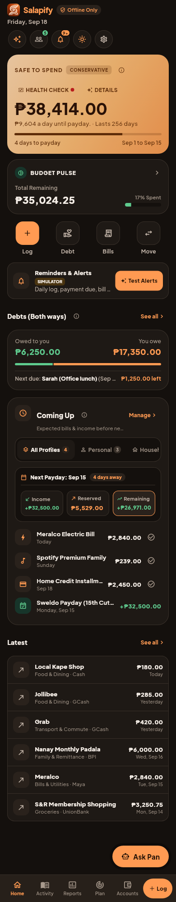 | 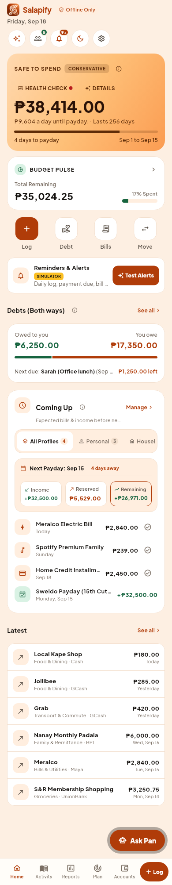 |

Phone sized, what actually fits on a 390dp screen:

| Gabi (dark) | Hapon (light) |
|---|---|
| 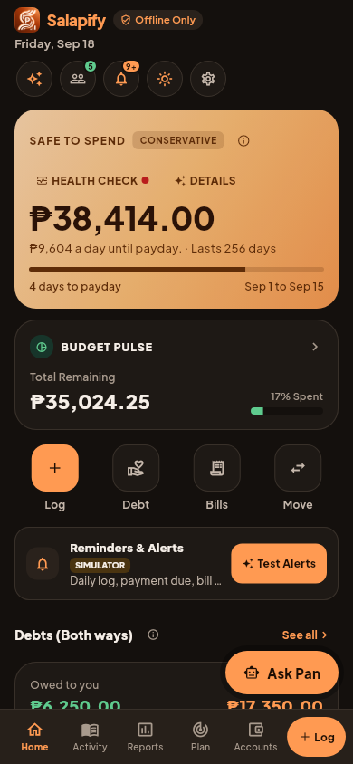 | 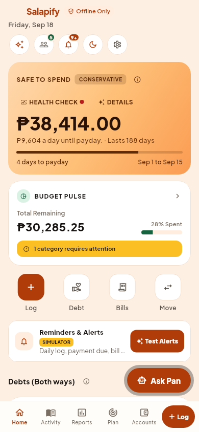 |

### Activity

The entries half of tab 2, built 2026-09-18. Search, status and account
filters, the summary card, the type tabs, and the list grouped by day.

| Gabi (dark) | Hapon (light) |
|---|---|
| 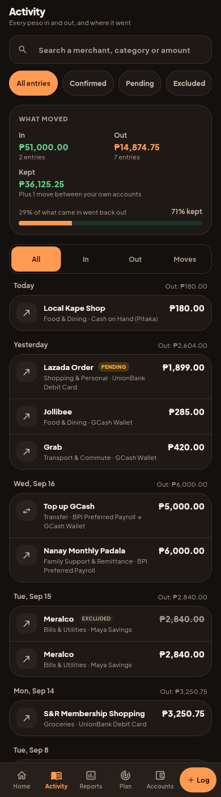 | 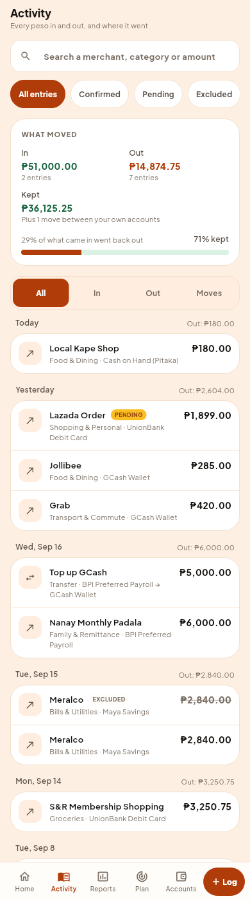 |

Three rows were added to the fixture so this screen can be REVIEWED rather than
merely rendered: a pending card authorisation, a transfer, and a duplicate
Meralco charge marked excluded. Without them every entry is a plain confirmed
expense and the status chips, the struck-through amount and the rule that keeps
excluded money out of the totals are all invisible in a screenshot.

Look at Sep 15 in the render. Two identical Meralco rows, one struck through
and badged EXCLUDED, and the day header says `Out: ₱2,840.00`, counting one of
them. That is the rule doing its job where a person can see it.

Every figure on the card was checked independently of the code that drew it:

| On screen | Adds up to |
|---|---|
| Out ₱14,874.75, 7 entries | 180 + 1,899 + 285 + 420 + 6,000 + 2,840 + 3,250.75, with the excluded 2,840 left out |
| In ₱51,000.00 | 32,500 + 18,500 |
| Kept ₱36,125.25 | 51,000 less 14,874.75 |
| 29% out, 71% kept | 14,874.75 / 51,000 |

Tapping any row opens its detail. The render below deliberately opens the
EXCLUDED one, because that is the state most likely to confuse somebody
reconciling against a bank statement: the amount is struck through, and a
sentence underneath says in plain words why it is not in the totals. The date
appears twice, friendly and as the stored ISO value, because "Yesterday" stops
being useful the moment you are comparing against a statement.

| Transaction detail (Gabi) |
|---|
| 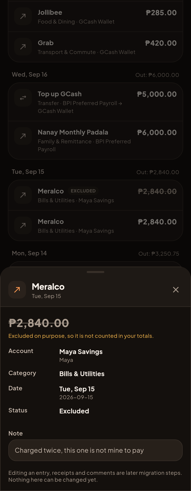 |

The detail is the VIEW half only. The prototype's modal also edits an entry and
carries a collaboration thread: comments, mentions, approvals and receipt
attachments. Those need a collaboration system and a storage layer that `app/`
does not have, and a comment box that cannot save a comment is worse than no
comment box. The sheet says so at the bottom rather than implying otherwise.

### Logging an entry

The write path, reachable from the Log button in the tab bar and the Log quick
action on Home.

| Log sheet (Gabi) |
|---|
| 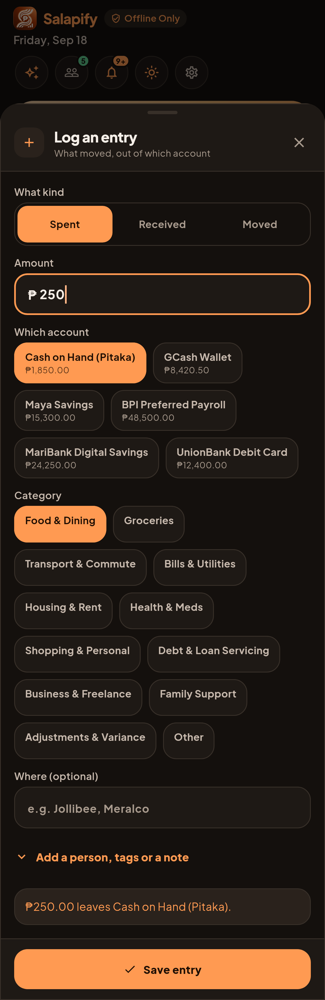 |

Saving MOVES MONEY: the account balance changes, exactly as the prototype's
`addTransaction` does, and a transfer debits one account and credits the other
so net worth is unchanged. The balance arithmetic lives in `applyToBalances`
and is locked to vectors generated from the prototype's own code.

**Type it in one line.** Founder request, 2026-09-18. The line at the top of
the sheet takes "Jollibee 500 gcash" and works out that this is a 500 peso
expense at Jollibee, out of the GCash wallet, filed under Food & Dining. It is
the prototype's own parser from `src/utils/fastlog.ts`, 145 keywords, ported
with vectors, and it understands Taglish because that is how people write a
note to themselves: "padala kay nanay 8000 palawan" becomes an 8,000
remittance to Nanay under Family Support & Remittance.

It reads five things out of one line: the amount (250, 250.50, 2,500), the
account (gcash, maya, cash, a bank, a card), the person ("kay nanay", "ni
kuya"), the type (sweldo and client mean money coming in, lipat means a
transfer), and the category.

It FILLS THE FORM rather than saving. A parser is a good guess, and a guess
about money should be visible before it is committed, so it reads back what it
understood and everything lands in the controls below where it can be
corrected. Save is the same button it always was.

**And it says when it does not know.** Founder finding on the emulator,
2026-09-18: typing "Electricity" selected Food & Dining. The prototype's
parser falls back to `'Food & Dining'` for any word it has never seen, so it
answers confidently instead of not answering. Measured before fixing: 37 of 60
common English money words did this, including `hospital`, `pharmacy`,
`mortgage` and `groceries`.

| The parser admitting it does not know |
|---|
| 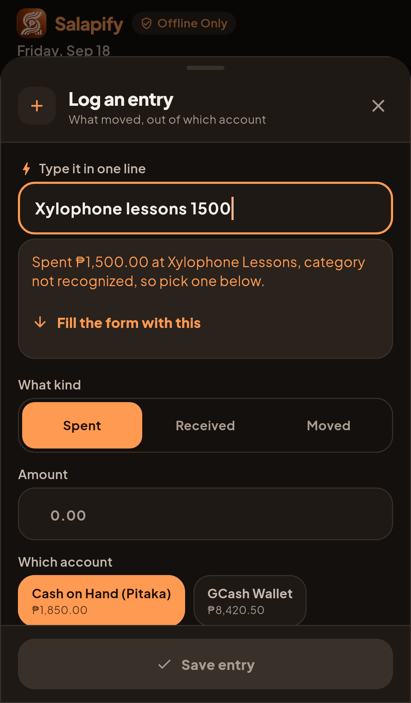 |

Two changes, and the split between them is deliberate:

1. **The engine** now reports whether anything actually DECIDED the category,
   alongside the category itself. It still computes exactly what the prototype
   computes, so every ported vector is untouched.
2. **The sheet** applies the category only when something decided it, and the
   read-back says "category not recognized, so pick one below" instead of
   naming the fallback. An unrecognised line now leaves the picker exactly
   where the person left it.

The keyword map also gained the plain English words an English-first app needs.
That block is kept separate from the prototype's own 145 and labelled as ours,
so a future re-extraction of the prototype's list cannot silently delete it.

Seven words are left out ON PURPOSE, because guessing is the defect being
fixed and these cannot be read without context: `bill` (a restaurant bill and
an electricity bill are both "the bill"), `payment`, `credit` (already an
account hint), `phone` (the monthly bill, or the handset), `power` (the
utility, or a power bank), `game`, and `refund`. Each falls through to "not
recognized", which is the honest answer.

**When it happened.** Founder request, 2026-09-18. The When row defaults to
today and says so in words, and Change opens the calendar. A day that is not
today is drawn in the accent so it cannot be missed, and the sheet adds one
sentence: "The balance changes now, even though the entry is dated earlier."

| Backdated to Sep 15 | The picker |
|---|---|
| 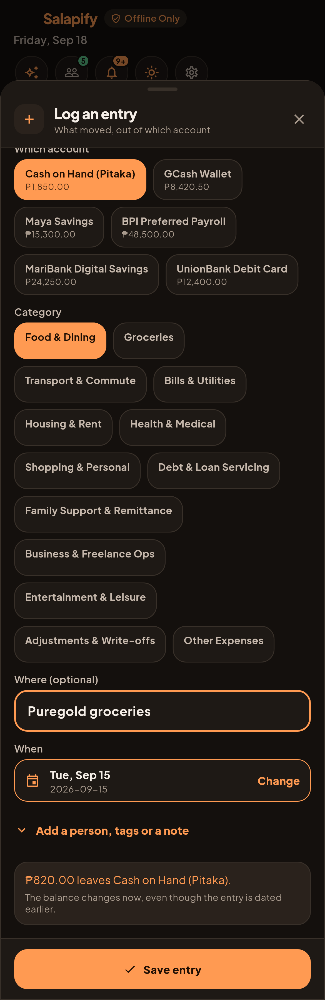 | 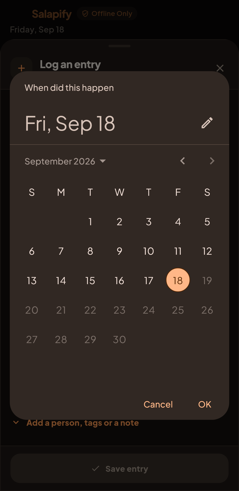 |

The future is deliberately not offered, and the greyed-out days after the 18th
in that picture are that rule. Logging moves the balance IMMEDIATELY, so a
future dated expense would take the money out today and file the entry under a
day that has not happened; the account and the ledger would then disagree until
it arrived. The prototype allows it. This is a named divergence rather than an
oversight, and it is the one place the two differ on dates.

Backdating also changed the confirmation AFTER saving. The Activity list groups
by day, newest first, so a backdated entry is not at the top: you land on a
screen whose first rows are today's, which reads exactly like it did not save.
The snackbar now says which day it went under, and only when that is not today.

Three things this sheet does deliberately:

1. **It says what it is about to do before you do it.** With an amount and an
   account chosen it reads "₱250.00 leaves Cash on Hand (Pitaka)." A transfer
   adds "Your net worth does not change."
2. **It says out loud that nothing is saved to the phone yet**, at the moment
   you save, rather than letting you find out tomorrow. There is no storage
   layer in `app/` yet.
3. **Saving lands you on Activity**, where the entry now is. Being left on a
   screen that does not show what you just saved is how somebody concludes it
   did not save.

**A quirk preserved and then made unreachable.** The prototype's
`addTransaction` debits the source of a transfer and credits the destination.
If the destination id matches no account, it debits and credits nobody, so
money disappears from net worth. The engine reproduces that faithfully, because
changing a number nobody decided to change is the worse error, and a vector
locks it. The defence is in the UI: the destination is picked from a list that
excludes the source, and Save refuses a destination that is not a real account.

Not migrated with it, named rather than implied: the foreign currency
converter, the cash denomination counter, receipt attachment, and quick-add for
categories. Each needs something `app/` does not have yet (an FX rate source, a
camera, a writable category store).

### Reports

The third tab, from `src/components/ReportsScreen.tsx`. Three sub-tabs, each
answering one question, and each shown here in both themes.

| Position, Gabi | Position, Hapon |
|---|---|
| 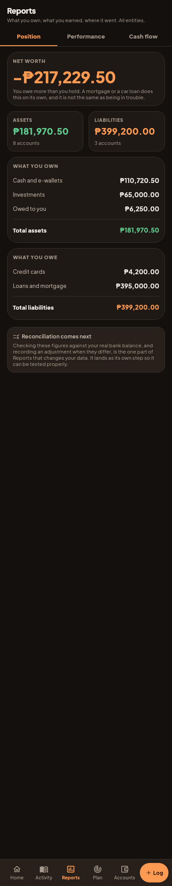 | 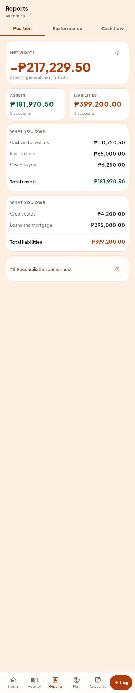 |

| Performance, Gabi | Performance, Hapon |
|---|---|
| 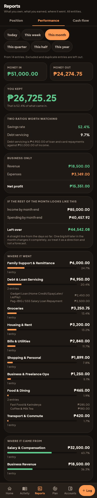 | 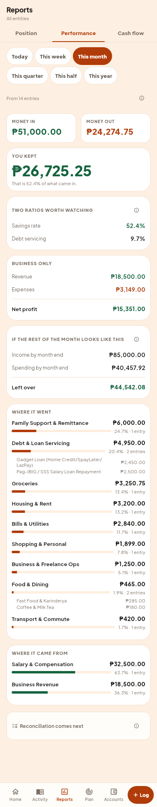 |

| Cash flow, Gabi | Cash flow, Hapon |
|---|---|
| 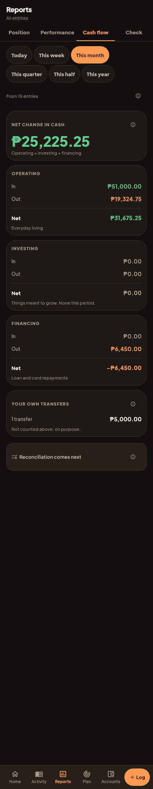 | 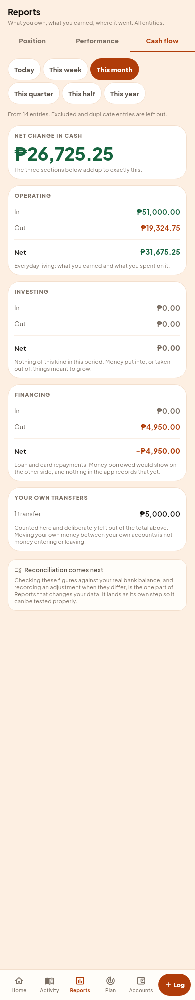 |

**POSITION** is the balance sheet: what you own, what you owe, and the
difference. It takes no period on purpose, and the period picker is hidden
there rather than shown and ignored. A balance sheet is what you hold NOW;
offering "this week" beside it would promise last week's net worth, which needs
history the app does not keep.

**PERFORMANCE** is the income statement over a period, plus two ratios and a
month-end run rate. The run rate appears on the monthly view only, because the
prototype divides by the day of the MONTH whatever period is selected, so on
"this year" it would project a year's income onto a month and print a confident
nonsense figure.

**CASH FLOW** sorts the same money into operating, investing and financing.
Transfers are counted and then deliberately left out of the total, and the
screen says so: moving your own money between your own accounts is not cash
entering or leaving anything you own, and a 5,000 transfer that changes no
total reads like money the report lost.

**RECONCILIATION, the prototype's fourth tab, is not here yet**, and the screen
says so rather than leaving a gap somebody has to guess about. It is the only
one of the four that WRITES: it creates an adjustment transaction to force the
app's balance to match a real bank balance, and it changes a transaction's
status. A write path needs both halves tested, so it lands as its own step.

**The screens carry figures, the dot carries the explanation.** Founder
direction on reviewing the first build of this tab: "it seems too wordy,
instead we can put the explanation in the 'i' icon so the screens are still
neat looking". Every card that has something to teach now has a circled "i" in
its header, costing no vertical space, and the teaching lives there.

| The explainer behind a dot |
|---|
| 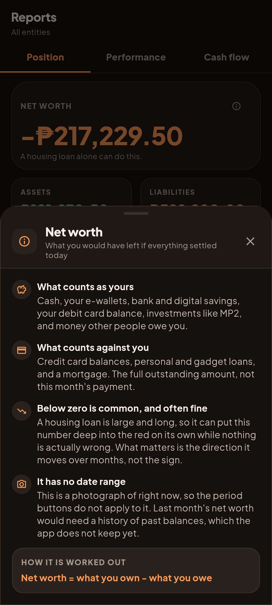 |

The rule, now recorded in `CLAUDE.md` so it governs Plan and Accounts too: a
figure and the one short line needed to READ it stay on the screen, everything
that TEACHES goes behind the dot. The exception is anything a person needs to
avoid a wrong conclusion. Two lines survived the cut on that test: "A housing
loan alone can do this." under a net worth of minus two hundred thousand, and
"Not counted above, on purpose." under a transfer that moves no total.

The mechanism is ported from the prototype's own `SectionInfoModal.tsx`. It
also filled a gap: two dots on Home showed a "coming soon" toast, which is
worse than no dot because it costs a tap and teaches that the dots do nothing.
Both now open real explainers.

Two defects this screen found, both worth recording because of HOW they were
found:

1. **A negative net worth rendered identically to a positive one.**
   `formatPeso` returns the absolute value by design, leaving the sign to the
   caller, and this screen was not adding it. A debt of 217,229.50 and savings
   of 217,229.50 were the same characters, separated only by colour, which
   fails for roughly one man in twelve and for any screenshot or printout.
   Caught by a widget test written before the screen was looked at.
2. **The period picker stacked into six full-width rows**, eating a third of
   the screen. A `Container` given an `alignment` and no width expands to its
   maximum constraint. Every test passed the whole time: the labels were
   present, the taps worked, the figures were right. **Caught only by looking
   at the render**, which is the entire reason that rule exists. There is now a
   test that measures whether the first two pills share a row.

Also not ported with it: CSV export (nothing in `app/` can write a file yet)
and the comparison toggle (previous period, budget, forecast), which needs
period-over-period history the app does not keep.

### Plan

The fourth tab, from `src/components/PlanScreen.tsx`. A HUB rather than a
screen: eight segments reached from a grid of tiles, which is the prototype's
own shape and the right one, because the eight have little to do with each
other beyond all being about the future.

| The hub | Budgets |
|---|---|
| 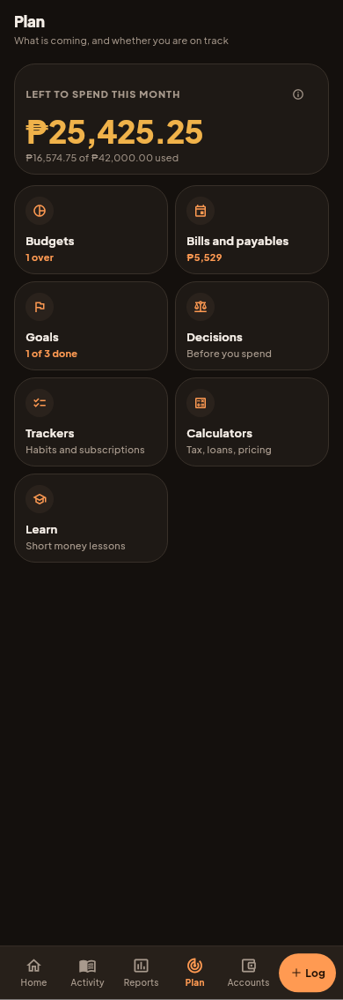 | 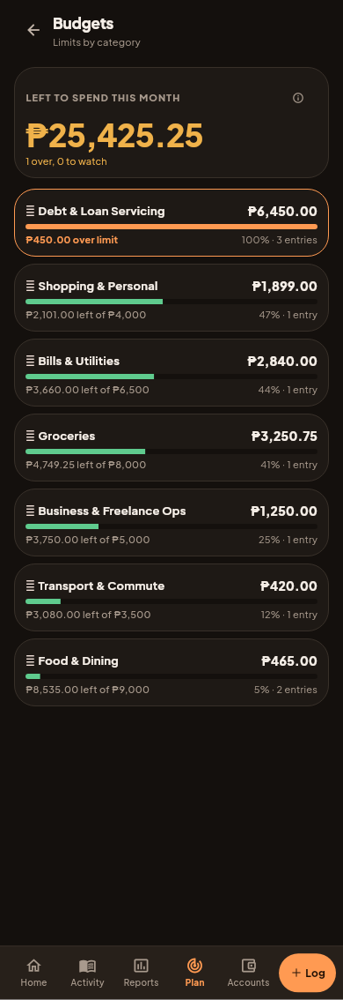 |

The hub carries the 13th month and bonus allocator, shown above in the state
somebody first meets: an empty box and five quick amounts. Everything the
feature actually does only appears once a figure is in it, so the second
picture is the one to review. It uses 120,000 deliberately, because that is
the one quick amount that goes OVER the 90,000 TRAIN ceiling and therefore
draws the tax rows and the caution about them being approximate.

| The allocator, with a figure in it |
|---|
| 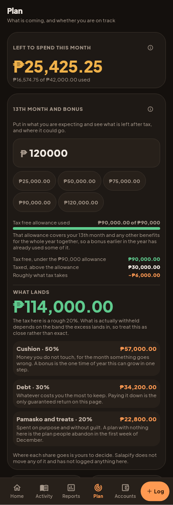 |

| Goals | Bills and payables |
|---|---|
| 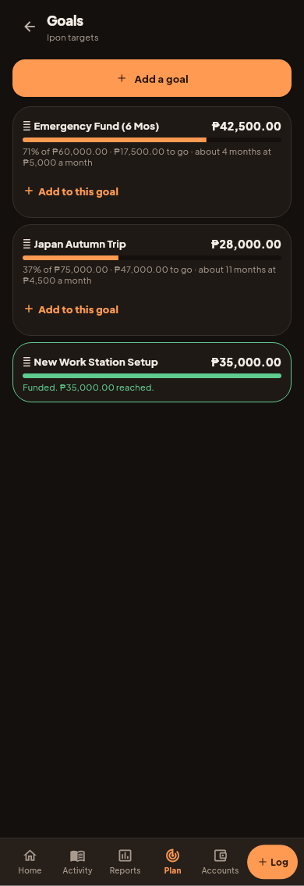 | 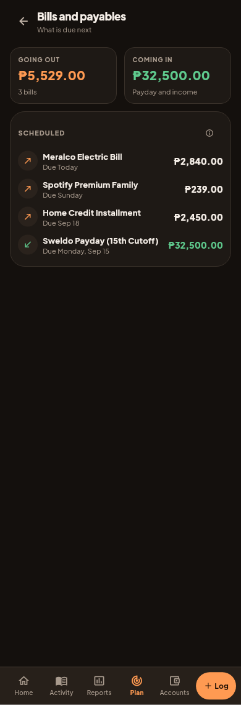 |

**All eight segments are built**, at founder direction: Budgets, Bills and
payables, Goals, Decisions, Trackers, Calculators and Learn, plus the hub. Each
tile carries a live figure rather than being one of eight identical doors.

**Four write paths**, each of which says what it is about to do before it does
it: change a budget limit, add a goal, contribute to a goal, add an income
stream.

#### Two money changes, decided by the founder rather than taken quietly

Both were put to the founder with the actual figures before anything was
built.

**1. Budgets count THIS MONTH and ignore excluded entries.** The prototype
sums every matching expense ever logged, whatever its status. With the current
data that put Bills & Utilities at ₱5,680 of ₱6,500 and into "watch closely",
because it counted the duplicate Meralco charge marked *"charged twice, this
one is not mine to pay"*. It now reads ₱2,840, which is the truth. The second
half matters more over time: a limit that never resets is not a limit.

**2. Payday is not a bill.** The prototype's headline sums every upcoming row
under the label "Total Scheduled Bills", so the ₱32,500 payday is counted as
a bill and the figure reads ₱38,029 when the bills come to ₱5,529. Both
figures are now shown, side by side, and nothing stored changed.

#### Three defects found while building it

1. **A false claim in my own copy, caught by a test written to prove it.** The
   Add income stream sheet said the stream raises your Safe to Spend. It does
   not: `computeSafeToSpend` works out expected inflow and then never uses it,
   deriving the headline from liquid cash less reserves alone. That is the
   prototype's behaviour and the engine is vector-locked to it, so the copy was
   corrected rather than the arithmetic changed. **Whether expected income
   SHOULD raise Safe to Spend is an open question for the founder.**
2. **Safe to Spend read the frozen seed list.** A new income stream would have
   been stored, listed on Plan, and invisible to the one figure it feeds. Found
   while wiring the write path, before it could ship.
3. **A hardcoded subscription total that does not add up.** The prototype
   prints ₱3,288 beside a list that comes to ₱5,236.17 a month once an annual
   plan is divided by twelve. Computed here instead.

#### Salapify Academy

| Academy |
|---|
|  |

**Two things were wrong here on the first pass, and the founder caught both
from a screenshot of their own prototype.**

It was renamed to "Learn". That was not mine to do: "Salapify Academy" is the
product's own name for this, it is on the screen in the prototype, and a
rename nobody asked for is a change to the brand dressed up as tidying.

Worse, it shipped with **six courses I wrote myself**, because I never looked
in `src/data/` where the prototype's **thirty-two** actually live. That is a
straight breach of the rule this whole migration runs on: `src/` is the source
of truth, and content gets ported, not invented.

It now carries the real curriculum: **32 courses, 96 lesson sections, 24
knowledge checks, 9 categories**, extracted from `src/data/academyData.ts` by
`app/tool/extract_academy.ts` and generated into Dart by
`app/tool/gen_academy_dart.py`. Nothing was retyped, for the same reason the
fast-log keyword map was not: a hand-copied list that long is a list with a
typo in it.

`test/data/academy_integrity_test.dart` now asserts the counts, that no course
is a stub, that every quiz points at an option that exists, and that every icon
name resolves to a real glyph. Proved by dropping a course and watching it
report `Expected: <32> / Actual: <31>`.

The screen matches the prototype's: the progress track, the educational-only
notice, the startup guide roadmap card, the search box, and the nine category
chips. The disclaimer is deliberately NOT behind an info dot, which is the
exception the dot rule names: somebody who takes a lesson on investing for
licensed advice has drawn a wrong conclusion, and a wrong conclusion never goes
one tap away.

Still to come: the three long-form guides behind that roadmap card (Philippine
business registration, the SaaS and app store guide, the digital product
checklist), about 3,200 lines of written guidance between them. The card says
so rather than offering a button that opens nothing.

#### Check, the reconciliation tab

Reports' fourth tab, built 2026-09-18, and the only one that WRITES. Every
other report reads; this one puts Salapify's number next to the bank's and
asks what to do when they differ.

| Gabi (dark) | Hapon (light) |
|---|---|
| 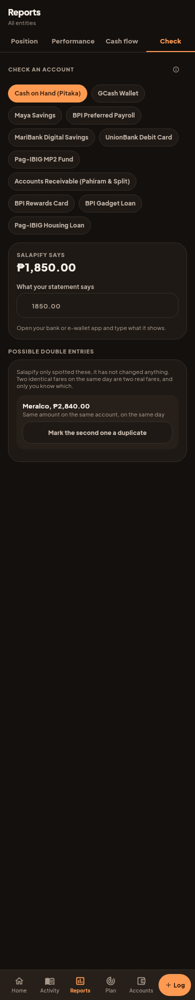 | 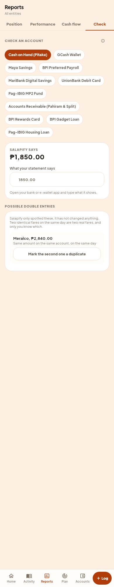 |

And with a gap on it, which is the state worth reviewing:

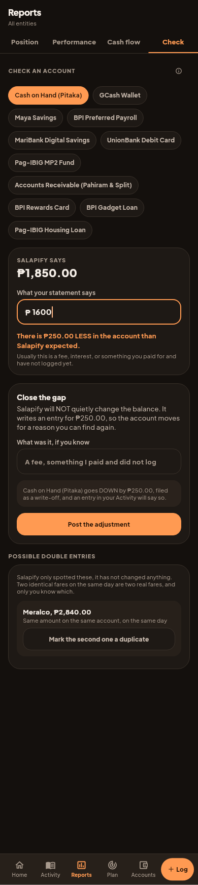

**It never quietly changes the balance.** A gap is closed by posting a
traceable entry, so the account moves for a reason that appears in Activity
and can be found again in a year. Setting the number to match the statement
would leave an account whose own history does not add up to its balance,
which for anybody who keeps books is worse than the discrepancy they started
with. A journey test walks to Activity afterwards and asserts the entry is
genuinely there.

A positive gap is filed as found cash and a negative one as a write-off. Both
categories already existed in the app's list, so an adjustment lands somewhere
Reports and Budgets can see it.

The duplicate finder is a SUGGESTION and never an action. It says so on the
card, before the button: two identical jeepney fares on one day are two real
fares, and only the person who spent the money knows which. Marking one is
the Activity correction path, and it changes what the entry MEANS to every
total without moving a peso.

Not ported with it: the prototype's CSV export, which needs a file-writing
layer `app/` does not have.

### Accounts

The fifth and last tab, built 2026-09-18 from `src/components/AccountsScreen.tsx`
and `BankCard.tsx`. Every tab in the prototype now has a real screen in `app/`.

Net worth, the entity the figures are scoped to, the four view filters, then
the wallet itself: e-wallets, bank accounts, cash, investments and receivables
on the asset side, credit cards, loans and mortgages on the other, each group
collapsible with its own subtotal. Debit and credit accounts are drawn as
plastic; everything else is a row, because a screen made entirely of cards is
one you have to scroll to count your wallets.

| Gabi (dark) | Hapon (light) |
|---|---|
| 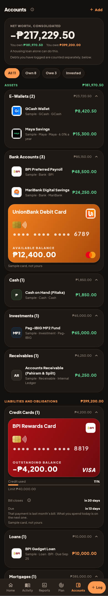 | 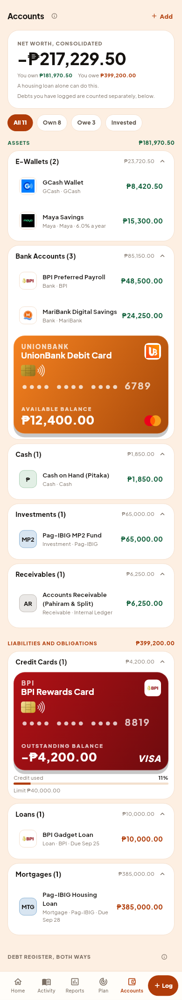 |

The three narrower views. Own, Owe, and Invested:

| Own | Owe | Invested |
|---|---|---|
| 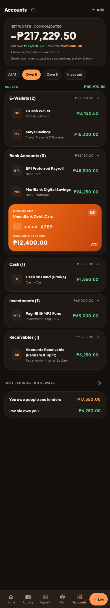 | 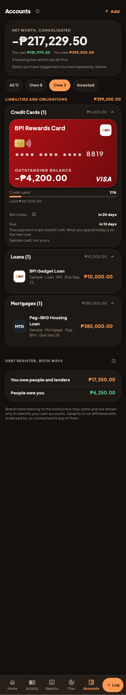 | 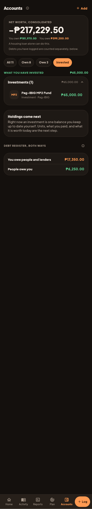 |
| 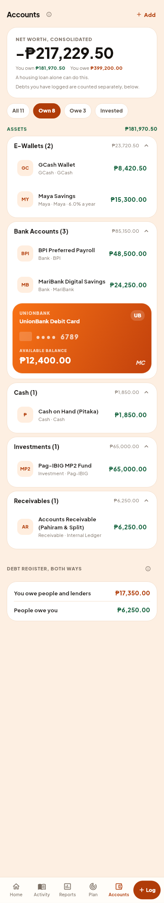 | 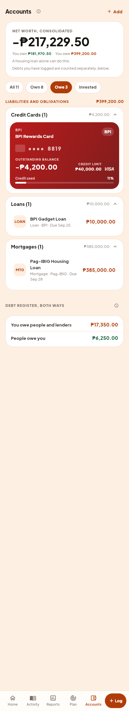 | 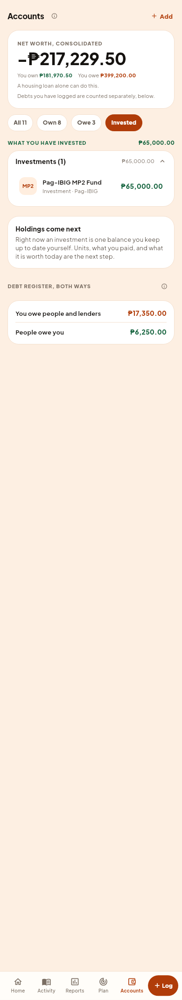 |

Adding an account, plain and in its card shape. The card shape adds the last
four digits, the scheme, the tier, the limit and the due date:

| Plain | Credit card |
|---|---|
| 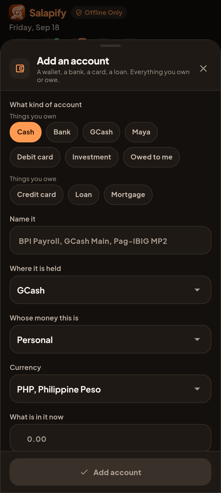 | 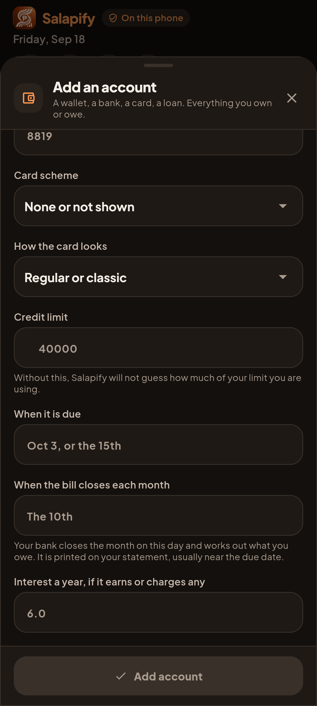 |

And a FOREIGN balance, which no seeded account has. Adding one to the fixture
would move every reports vector, so this render builds its own store instead.
It is here because the conversion path would otherwise ship having been tested
and never once looked at:

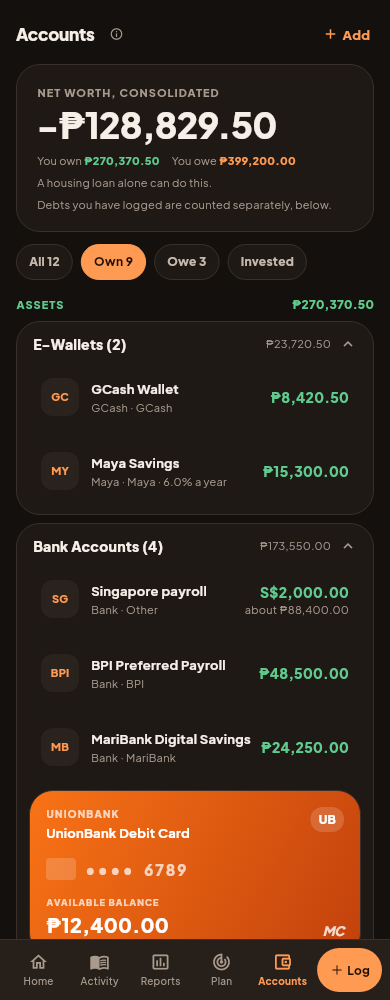

The peso line says "about" on purpose. Salapify works offline, so the rate is
compiled in and stale by construction, and a converted figure is a sense of
scale rather than a number to decide on.

Two things this screen does NOT do, named rather than left to be discovered:

- **No delete.** Deleting an account is user data deletion, which CLAUDE.md
  reserves for the founder, and it is the one action here that retyping cannot
  undo. It also orphans things, since transactions carry an account id. The
  proposal is in `docs/reviews/accounts-tab.md`. Until then a mistake is fixed
  by editing, which loses nothing.
- **No holdings tracker.** The prototype's Investments filter opens
  `InvestmentsView.tsx`, 1,114 lines of units, cost basis, valuations and
  market data adapters. That is its own batch. The filter here shows the
  investment ACCOUNTS, which are real, and says in one line what the tracker
  will add.

### Debts

Built 2026-09-18 from `src/components/DebtScreen.tsx`. Not a tab: it is pushed
over the tabs from the beam on Home and from the register card on Accounts,
the same way the prototype reaches it.

Debt here means BOTH directions, which is the product's own definition. The
beam shows the two totals with the net stated as a sentence underneath, then
the direction picker, then the debts themselves with their instalment count,
due date, progress and the two actions.

| Gabi (dark) | Hapon (light) |
|---|---|
|  |  |
|  | 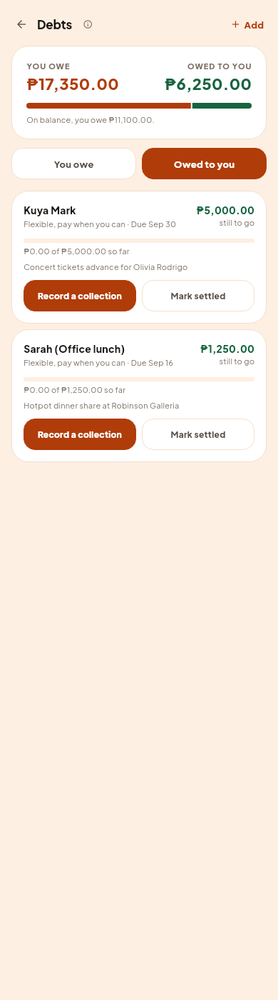 |

The payment sheet, which is where the money actually moves. It states the
consequence BEFORE the button: what will still be owed, which account moves
and by how much, and that an entry will appear in Activity explaining it.

Two buttons that look similar and do deliberately different things:

- **Record a payment** says money moved. It writes a ledger entry, so the
  account balance moves down the ordinary path and the payment is visible in
  Activity, in Reports and against the Debt and Loan Servicing budget.
- **Mark settled** says the books were wrong and the debt is actually clear.
  It writes NO entry, because inventing a payment out of an account that never
  lost the money would leave the account and the ledger disagreeing by exactly
  that amount.

"No account, just the debt" is a real third option rather than an escape
hatch, for somebody who settled in cash they never logged. The sheet says
plainly that nothing will appear in Activity if they pick it.

#### Work it out, the nine calculators

The second half of the screen, built the same day from
`src/components/DebtCalculatorsView.tsx`. Pag-IBIG housing, bank housing, car,
SSS and Pag-IBIG salary, personal and digital lenders, the credit card
minimum trap, consolidation, snowball against avalanche, and an affordability
check.

Every figure comes out of `core/money/loan.dart`, `loan_products.dart` or
`debt_strategy.dart`, all ported and vector-locked in earlier batches. The
screen does no arithmetic at all: it collects numbers, calls an engine and
lays the answer out. That is why nine calculators landed in one pass without a
single new money decision, and why its tests compute their expectations by
calling the same engine rather than by writing figures out by hand.

Each opens with the prototype's own defaults already filled in, so it answers
something the moment it is opened instead of showing a page of empty boxes.

| Pag-IBIG housing | Car loan |
|---|---|
| 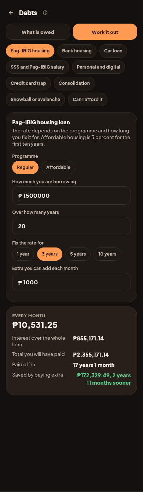 | 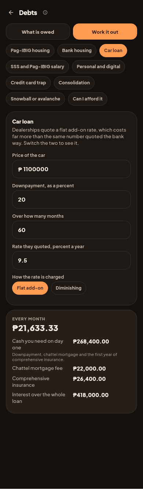 |

| The credit card trap | Snowball against avalanche |
|---|---|
|  | 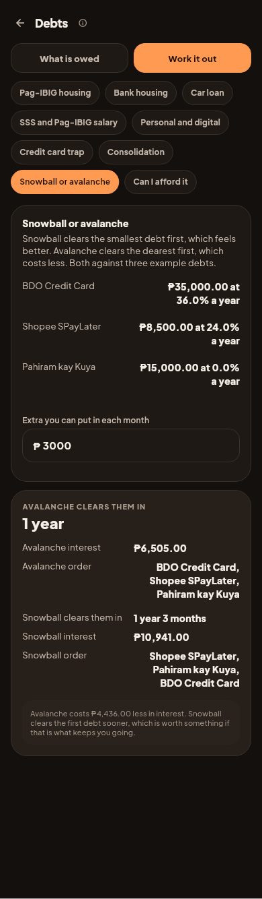 |

#### Plans, the instalment register

The third section, from `src/components/InstallmentsView.tsx`. A plan is a
CONTRACT rather than a running balance, so the screen is built around that:
how far through it you are, what the rate really works out to over a year,
what is left, and how much of what is left is interest a prepayment could
still remove.

| Gabi (dark) | Hapon (light) |
|---|---|
| 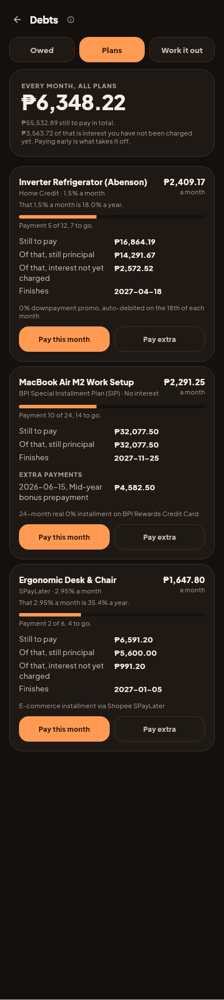 | 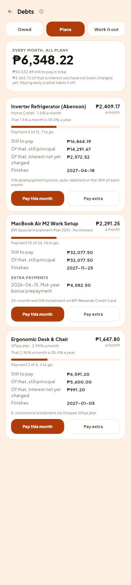 |

The two payment sheets. A scheduled instalment is a fixed amount that advances
the counter; an extra payment is any amount that comes off the principal and
shortens the plan:

| Scheduled | Extra |
|---|---|
| 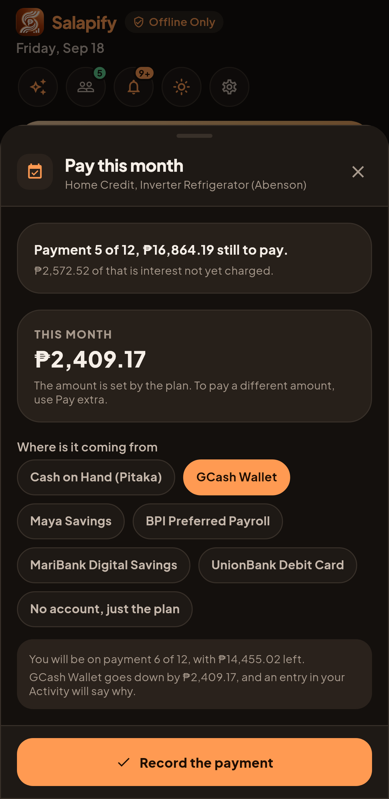 | 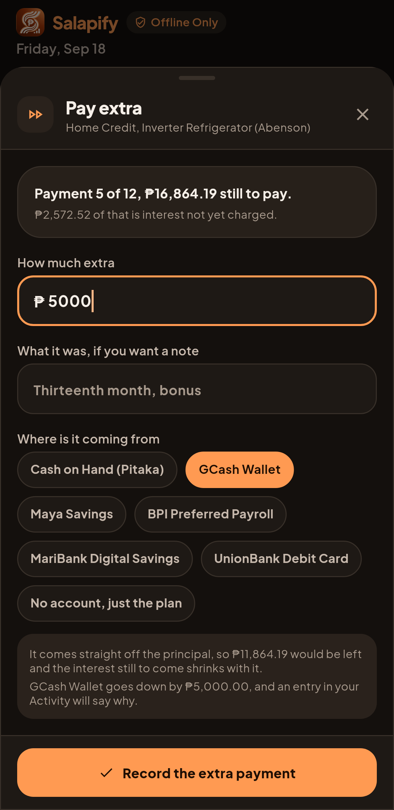 |

`InstallmentPlan` held four fields until this batch, a name and an amount,
because Safe to Spend was the only thing reading it. The coverage audit did
not catch that: it compared RECORD COUNTS, three against three, and three
stubs count the same as three plans. All twenty two fields are ported now.

Not built: the prototype's row-by-row amortisation TABLE, whose engine
(`generateInstallmentAmortization`) is the one piece of `loanCalculators.ts`
still unported. A schedule is a different job from "where am I and what should
I do", so it is noted in the audit rather than half-built.

### Sheets

Ported from `src/components/`, 2026-09-18. Every one is opened through its real
route, so what is pictured is the modal as it actually appears over Home: same
grab handle, same 92% height, same dimmed app behind it. Dark only, which is
what the founder uses.

The tiny grey squares beside a category name are emoji. The render sandbox has
no emoji font; they draw correctly on the phone and are deliberately not
"fixed", because category icons are the user's own choice.

| Philippine Toolkit | Safe to Spend Details |
|---|---|
| 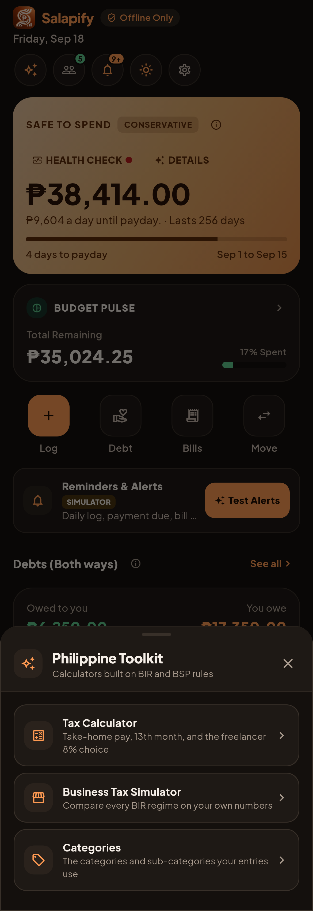 | 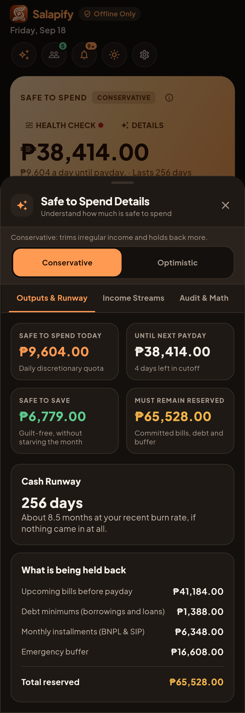 |

| Add a debt | Add a debt, with the schedule |
|---|---|
| 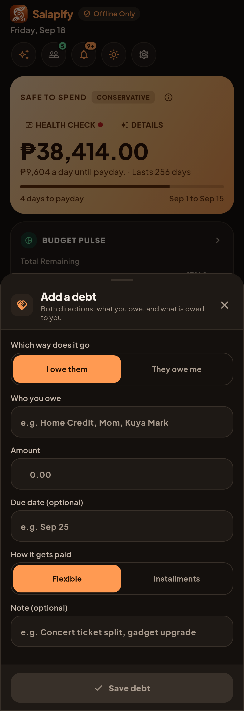 | 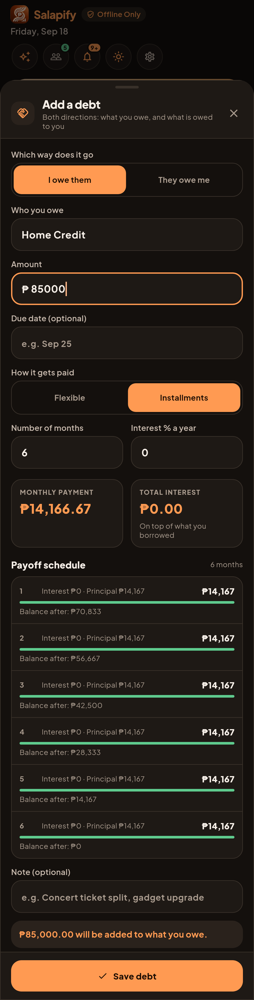 |

| Tax Calculator | Business Tax Simulator |
|---|---|
| 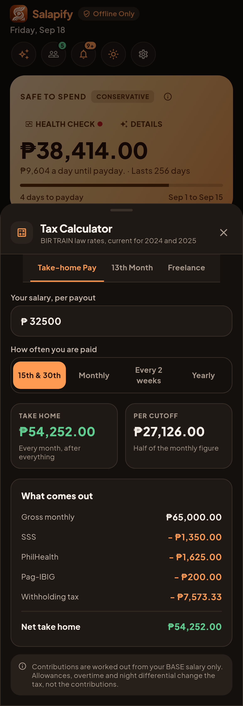 | 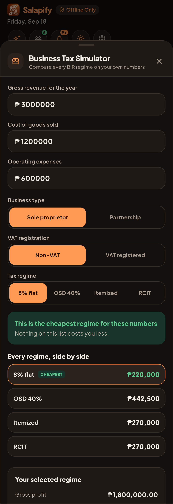 |

| Categories | |
|---|---|
| 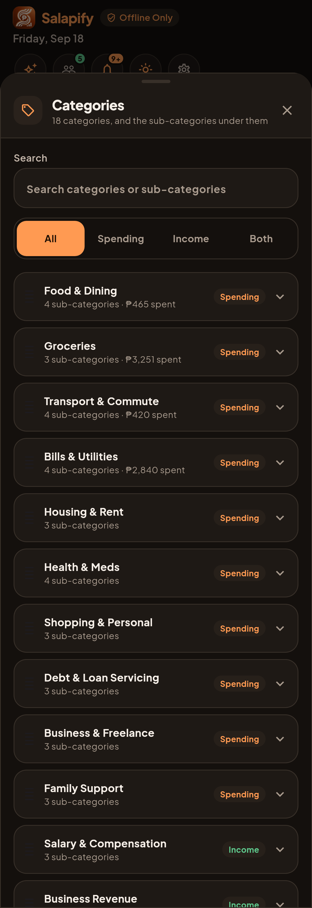 | |

**A saved debt does not survive a restart yet.** There is no storage layer in
`app/` at all: the store is seeded in memory and every write on it, the debt
included, is gone on the next cold start. The sheet says so in plain words when
it saves rather than letting somebody find out the next morning. Local storage
is its own migration step and lands with the Activity tab.

Where each one hangs off Home:

| Control on Home | Opens |
|---|---|
| The sparkle in the header | Philippine Toolkit, and the three tools behind it |
| DETAILS, or the info dot, on the Safe to Spend hero | Safe to Spend Details |
| The Debt quick action | Add a debt |

Rendered by `app/test/shots/screens_shot.dart`. To regenerate:

    cd app
    flutter test test/shots/screens_shot.dart --update-goldens

## How the money math is verified

Every ported calculation is locked to vectors produced by running the
prototype's OWN TypeScript, not by working the numbers out by hand:

    bun run <a script that imports src/utils/<engine>.ts>

Those figures become expectations in `app/test/engine/`. If a Dart figure ever
disagrees with the prototype, the port is wrong and the vector stands.

Covered so far: `safeToSpendEngine.ts`, locked by
`app/test/engine/safe_to_spend_golden_test.dart` across three vectors
(conservative, optimistic, and with recent spending).

## Money engines

Ported into `app/lib/core/money/`, locked by vectors in `app/test/core/money/`.

Every vector was produced by RUNNING the prototype's own TypeScript under bun
against the prototype's own inputs, never by working the formula out by hand
and never by reading the Dart back. If a Dart figure ever disagrees with the
prototype, the port is wrong and the vector stands.

| Prototype source | Dart | Covers | Tests |
|---|---|---|---|
| `safeToSpendEngine.ts` | `safe_to_spend.dart` | Safe to Spend, reserves, buffer, cash runway, payday cadence | 11 |
| `philippineFinances.ts` | `ph_tax.dart` | SSS, PhilHealth, Pag-IBIG, TRAIN withholding, 13th month and its 90k exemption, freelance 8% vs graduated | 24 |
| `businessTaxes.ts` | `business_tax.dart` | Sole prop and partnership, 8% / OSD / itemized / RCIT, VAT vs percentage tax, BIR form list | 14 |
| `loanCalculators.ts` | `loan.dart` | Diminishing and flat add-on amortization, extra payments, balloons, DSR against the BSP bands | 18 |
| `loanCalculators.ts` | `loan_products.dart` | Pag-IBIG, bank housing with its repricing stress test, car, salary, personal, business, debt consolidation | 16 |
| `loanCalculators.ts` | `debt_strategy.dart` | The credit card minimum payment trap under the BSP 3% cap, snowball against avalanche | 12 |
| `financialTruthEngine.ts` | `financial_truth.dart` | The control centre alerts, and the digital twin across eight shocks | 18 |

### Not ported yet, and named rather than implied

- `financialTruthEngine.ts`: `analyzeScamRisk` and
  `buildFinancialTruthMetadata`. Scam risk is keyword analysis over message
  TEXT rather than money math, so it has no vectors to lock and nothing to
  disagree with the ledger about. It migrates with the Health Check screen.
- `philippineFinances.ts` helpers: remittance fee estimation, cash
  denomination counting, and the Taglish reminder text.
- `generateInstallmentAmortization`: a two-line adapter that turns a stored
  installment plan into a schedule. It needs the InstallmentPlan model the
  Plan tab will bring, and `calculateAmortization` underneath it is already
  locked.

### Quirks preserved on purpose

Three places where the prototype does something surprising and the port keeps
it, because changing a number nobody decided to change is the worse error:

1. A **balloon payment overruns the stated term.** 900,000 at 8% over 36
   months with a 200,000 balloon runs 45 months, because the schedule keeps
   amortising to zero instead of stopping and charging the balloon.
2. **VAT contributes nothing.** A VAT registered business shows zero business
   tax, because the engine treats VAT as pure pass-through. That is a
   cash-flow view, not a filing figure.
3. **The 13th month gross is rounded in one function and not the other.**
   `calculateEmployeeTaxDeductions` rounds it, `calculate13thMonthPay` does
   not. Making them agree would move a figure on a screen.
4. **Job loss makes the runway look BETTER.** Survival mode cuts spending by a
   quarter, and the runway only reads cash against spending, so it rises from
   3.95 months to 5.27. The damage is in the buffer impact and net worth. Any
   screen showing this scenario must not lead with the runway, or it will tell
   somebody who just lost their job that things improved.
5. **The credit card payoff schedule is thinned after month 36**, keeping every
   sixth month, and `monthsToPayoff` is read off the last row KEPT. Once
   thinning starts it can under-report by up to five months, so a screen should
   say "about".
6. **Consolidation compares against a flat 18 month estimate** of the existing
   debts' interest, not a real payoff simulation, which flatters consolidation
   whenever those debts would have cleared sooner.

## Brand mark

The founder supplied the logo on 2026-09-18: a ribbon "S" wrapped around a peso
coin, with a small bar chart, on a teal and navy plate. The artwork is theirs
and is unchanged. Only the COLOUR was brought onto the Salapify palette, since
teal sits on the opposite side of the wheel from Hapon and Gabi.

Recoloured by mapping LUMINANCE onto real palette colours rather than tinting.
The mark has three tonal layers (dark plate, mid ghost strokes, near-white
ribbons) and a tint flattens them into mud; a ramp keeps every offset stroke,
every anti-aliased edge, and the plate's own diagonal gradient.

| | |
|---|---|
| Original, then rust, Gabi and hero variants | 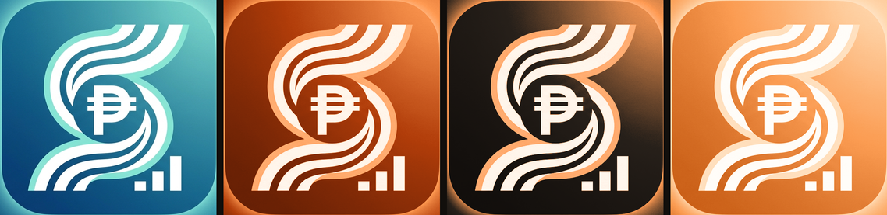 |
| The shipped icon on both theme backgrounds |  |

**Rust ships.** It carries Hapon's accent `#B03C09`, and it holds the most
contrast between plate and ribbon, which is what decides whether an icon still
reads at 48dp. The Gabi variant is the closest runner-up. The hero variant is
the weakest: cream ribbons on amber lose contrast at small sizes.

Where it is used:

    android/.../mipmap-*/ic_launcher.png     the launcher icon, five densities
    android/.../drawable-*/launch_image.png  the launch screen, five densities
    app/assets/brand/salapify_logo.png       in app, currently the Home header

The launch screen also stopped being white. It now uses Salapify's own
background, resolved per theme through `values/colors.xml` and
`values-night/colors.xml`, so opening the app at night no longer starts with a
white flash.

---

## Storage: the ledger now survives closing the app

Before this, `app/` held everything in memory. Close it and every account,
entry, payment and budget was gone. This is the step that makes the rest of
the migration mean something.

One file, `salapify_data.json`, in the app's own documents directory. The top
level keys are the prototype's own, from `handleExportData` in
`src/components/SettingsModal.tsx`, so a file written here opens in the
prototype and a backup exported from the prototype opens here.

### It carries more than the prototype's backup does

The prototype's own export covers **nine of the thirty four things it stores**.
It leaves out instalment plans, reconciliation history, bills, income streams,
investments and all the collaboration data. Worse than dropping them: its
importer does not clear those keys either, so a restored phone falls back to
the demo instalment plans and a **demo reconciliation history**, mixed in with
the user's real restored transactions, with no notice. A reconciliation record
is a written claim that somebody checked an account on a date.

That is not ported. This file carries everything `app/` holds.

### What happens when it goes wrong

| What happened | What the app does |
|---|---|
| No file | Seed data, saving ON, the first entry creates the file |
| A good file | It replaces the seed, saving ON |
| The file is torn or half written | Opens the **previous generation**, saving ON, and says the last change is missing |
| Both generations unreadable | Shows the seed, **saving OFF**, and says so. The file is left exactly as it was |
| A file from a newer build | Refused, not half read and saved back down |
| The save itself fails | Says the entry is on screen but not stored, and does not retry in a loop |

The rule the tests exist to hold is the fourth row: **an unreadable file is
never written over.** There is no server and no second copy, so the difference
between "we cannot read this today" and "this is gone forever" is entirely
whether some code decided to save seed data on top of it.

Every save keeps the copy it replaced as `salapify_data.json.prev`. The worst
case stops being "six months of entries are gone" and becomes "the last change
is gone".

### Two things that were nearly wrong, and are worth knowing

**The enum spellings.** `src/types.ts` writes `side_hustle`, `i_owe`,
`owed_to_me`, `weekly_income`. Dart's own names are `sideHustle`, `iOwe` and so
on, so the obvious `.name` would have written something the prototype does not
recognise, and a side hustle silently read back as personal is money filed in
the wrong books. Every enum has an explicit two way map and a test that walks
all of them.

**Keys this build does not model are kept.** The prototype's `Transaction`
carries `changeHistory`, `comments`, `approval`, `splitId`, `originalAmount`
and more, none of which Salapify 3 models. Reading one, dropping them and
saving would destroy them on a device with no second copy. Every unread key,
at the record level and the document level, is stashed on load and written back
on save.

### The Check tab with no accounts on the phone

This state used to crash in `initState` and take the whole Reports tab white.
It was unreachable while the seed always had eleven accounts, and became real
the moment a ledger could come off the disk.

| | |
|---|---|
| Nothing to check yet | 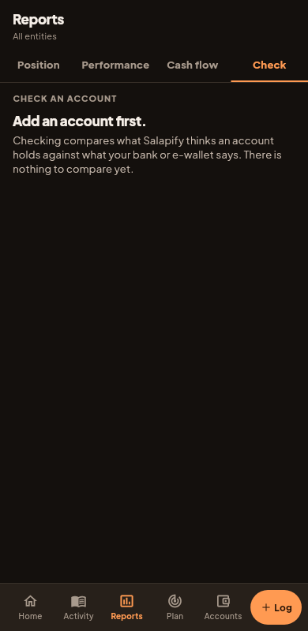 |

---

## Plan, Calculators, Debt and loan: the door was wired to the wrong room

Founder report, 2026-09-19, comparing the prototype against this build: under
Plan, Calculators, Debt & Loan the prototype has three sections, personal
debts, instalments and the loan calculators, and they could not find them here.

**All three were built.** So were all nine calculators, one for one with
`src/components/DebtCalculatorsView.tsx`: Pag-IBIG housing, bank housing, car,
SSS and Pag-IBIG salary, personal and digital, the credit card trap,
consolidation, snowball or avalanche, and the affordability check.

The **tile** was wrong. `plan_screen.dart` pointed the "Loan and payoff" tile
at `AddDebtSheet`, so somebody who tapped a tile promising what a loan costs
and when it ends was handed a form asking who they owe and how much. The
prototype's own handler for that tile is `handleOpenDebt`, the same one Home
and Accounts call, so all three doors lead to the same register.

A feature can be complete and still be unreachable, and no test noticed
because every existing test of the calculators reached them the other way,
from Home. `test/widgets/plan_calculators_journey_test.dart` now walks the
founder's own path instead, and four of its five assertions go red when the
old wiring is put back.

| | |
|---|---|
| Plan, Calculators | 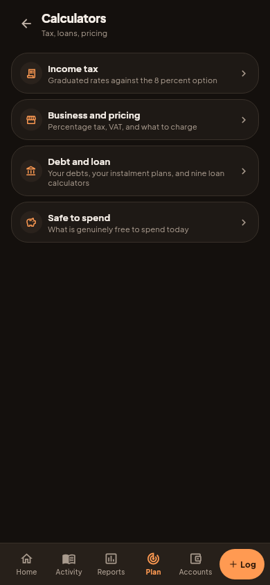 |
| The register it opens, on Work it out | 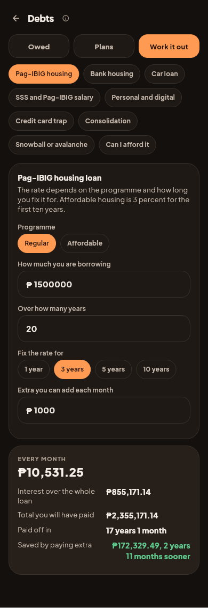 |

Two genuine gaps remain in this area, both already on the list:

- **The amortisation schedule**, the prototype's row-by-row table behind "View
  Amortization Schedule" on an instalment plan. Deferred in `app-c24`; its
  engine, `generateInstallmentAmortization`, is the one piece of
  `loanCalculators.ts` still unported.
- **The savings and investment planner**, which is the prototype's fourth
  library tile. This build shows Safe to spend in that slot instead.

---

## Real institution marks, and cards that look like cards

Founder direction, 2026-09-19: "Use the real logos of the banks and other
services, build freely. Also improve the skin of the physical card for both
debit and credit cards so it would look like near the real bank physical cards
depend of their scheme."

### The marks are bundled, not fetched

The prototype resolves every logo from the internet, through
`https://www.google.com/s2/favicons?domain=...` (`src/utils/logos.ts`). That is
NOT ported, for two reasons that both outrank the pixels:

1. It is a network call, and the app says **Offline Only** on its own header. A
   logo that needs signal is a logo that vanishes on the MRT.
2. It tells Google which banks somebody keeps their money at, one request per
   institution, every time the screen draws. That is a person's financial
   relationships leaking to a third party in exchange for a favicon.

So eleven marks ship inside the app: GCash, Maya, BPI, BDO, UnionBank,
MariBank, GoTyme, Metrobank, Security Bank, Tonik and RCBC. They draw
instantly, they work in a basement, and nothing leaves the phone. Another
thirteen institutions are known by their brand colour and carry a clean
monogram, which for a government fund with a seal rather than a logo reads
better at 40dp than a blurry crest would.

`brandDisclaimer` is on the Accounts screen, on the screen rather than behind
the info dot, and says these marks belong to the institutions they name.

### The card

Four cues do the work, all of them from the real object:

- the **ISO/IEC 7810 ID-1 proportion**, 85.60 by 53.98 mm, so it is the shape
  of a card and not of a banner;
- the **issuer's own mark**, printed on a white plate the way it is on plastic;
- a **drawn EMV chip** with its contact pattern, and contactless arcs. Painted
  rather than shipped as images, because a chip is six gold contacts and
  bundling a bitmap to say so would cost APK size and gain nothing;
- the **scheme's own mark** in its own colours: Visa's italic wordmark,
  Mastercard's two interlocking circles with the darker overlap, the Amex blue
  box, JCB's three bars. This is how two cards from the same bank are told
  apart in a wallet.

The tier decides the **finish**, the way it does on real plastic: gold, brushed
platinum, matte black, each with a diagonal sheen because a flat fill reads as
paper. The tier overrides the issuer's palette, since somebody who recorded a
card as Platinum is describing the object in their hand.

Credit utilisation **moved off the plastic** rather than being dropped. Real
cards do not print how much of the limit you have spent, and squeezing it
inside would have cost the card its proportions. It sits underneath, where it
can use the palette's own warning colour.

| | |
|---|---|
| Accounts, dark |  |
| Accounts, light |  |

### The render could not show the logos, and passed anyway

Worth writing down, because it is the exact failure mode `CLAUDE.md` warns
about: a fixture that cannot show the defect.

`Image.asset` resolves asynchronously, and `testWidgets` runs on a fake clock
where that never completes, so every logo plate rendered **blank**. The dark
renders showed the marks only because the light ones ran first and warmed the
global image cache: correct by accident, and silently wrong the moment the
order changed. The first review render of this work was therefore proof of
nothing.

`settleImages` in the shot harness now precaches every `Image` inside
`runAsync` before the golden is taken.

### Not done, and why

**The prototype's FX converter is a live network call.** Its "Live Foreign
Exchange Converter" fetches `https://open.er-api.com/v6/latest/PHP`
(`PhilippineFeaturesModal.tsx`). Building that would make the app's own
"Offline Only" badge false, and `main.dart`'s "no network call anywhere in this
app" with it, and it is a Play data-safety declaration. It is a founder
decision, not an engineering one, so it is raised rather than built. Salapify
already has offline conversion in `core/money/currencies.dart`, vector-locked
to the prototype's own arithmetic, so the converter itself can be built without
the live refresh whenever the founder wants it.

The rest of that modal, Notes Calc, Mindset and Treats, is still unported and
stays on the list.

---

## The amortisation statement, and why so much was missing

Founder, 2026-09-19, two things at once: build the schedule and the CSV
export, and **"Why do there are a lot of missing details from prototype to the
current build... Know the root cause and apply to solution to all moving
forward."**

The second question is the important one, so it goes first.

### Root cause: every audit so far measured the wrong thing

Four failures, one mistake underneath all of them.

| What happened | What was measured |
|---|---|
| The Academy shipped six invented courses while 32 real ones sat in `src/data/academyData.ts` | The component tree. Nobody opened the data directory |
| `InstallmentPlan` was "ported" holding 4 of its 22 fields | Record COUNTS, three against three |
| Plan → Calculators → Debt & Loan opened the add-a-debt form | Nothing. No test walked that route |
| `BankAmortizationTable.tsx`, 691 lines, was never counted as missing | The screen that renders it was ticked off as done |

Every one of those measured **my** unit of work: files, engines, records,
plans. None measured **the user's** unit: a thing they can see and tap. And
"deferred, written down" was allowed to count as a finished state, which is
how a dozen individually reasonable notes add up to an app that looks half
built to the person holding it.

### The fix is a tool, not a promise

`app/tool/surface_audit.py` extracts every button, tab, heading and label from
the prototype's own source and checks whether each one exists anywhere in
`app/lib`. It cannot be satisfied by a plan or a note.

    python3 tool/surface_audit.py            # per screen
    python3 tool/surface_audit.py --missing  # every label with no match

The first run said **40%**. That is the honest number, and it should have been
on the table weeks ago. It is a SIGNAL rather than a gate, because wording
legitimately differs, but its job is to stop the migration being declared done
by the person doing it. It runs from now on before any batch is called
finished.

### The statement itself

"Work it out" is now **Amortization**, and six of the nine calculators carry a
full statement: Pag-IBIG housing, bank housing, auto, SSS and Pag-IBIG salary,
personal and digital, and consolidation. The three that answer a question
rather than repay a loan (the card trap, snowball or avalanche, the
affordability check) deliberately do not, and a test asserts that too.

Each statement has the prototype's own four totals, the prepayment saving, a
**Monthly schedule** and **Annual summary** toggle, 24 rows a page with a
pager, and a footnote naming how that lender computes.

**Export CSV** writes the file and hands it to the phone's own share sheet, so
it reaches Gmail, Drive or Files without Salapify asking for storage
permission. **Copy** puts the same CSV on the clipboard. The file is the
prototype's format column for column, including the cumulative principal and
interest columns, because the point of a statement is opening it in a
spreadsheet beside the one the bank sent.

| | |
|---|---|
| Pag-IBIG, with its statement | 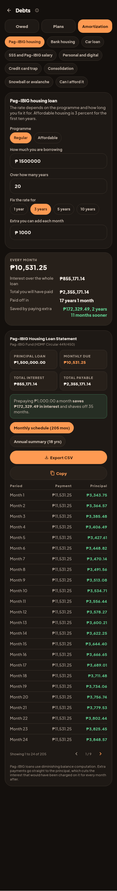 |

Every figure matches the prototype exactly: ₱10,531.25 a month, ₱855,171.14
interest, ₱2,355,171.14 total, ₱172,329.49 saved by prepaying, 205 months,
month 1 principal ₱3,343.75.

## The card turns over

Founder direction, 2026-09-19: "For the card we can apply animation, like by
tapping the card it will turn back and the other details are there."

Tapping a debit or credit card rotates it about its own vertical axis, with a
little perspective so it reads as a physical object turning rather than a
picture being swapped. The back carries the magnetic stripe, the signature
panel, and every detail that has no room on the front: the number, the payment
due and statement dates, the interest rate, the credit limit, the currency on a
foreign account, and which entity it belongs to.

| Front | Back |
|---|---|
| 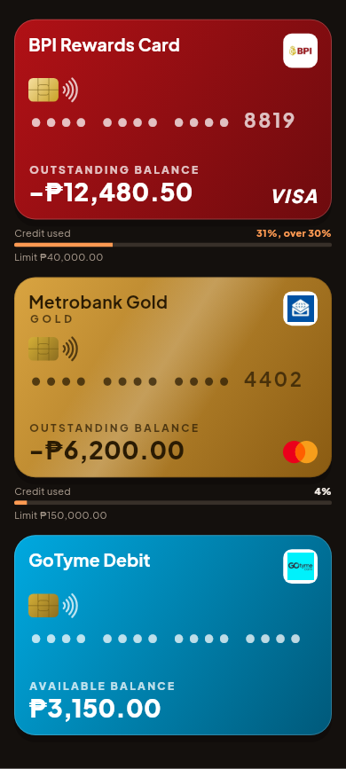 | 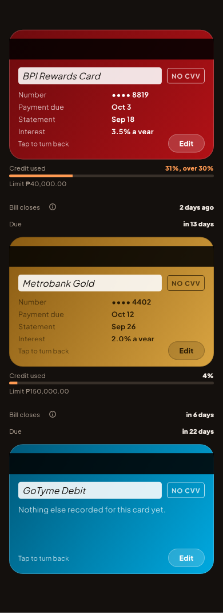 |

Four decisions worth writing down, because each one is the sort a later change
would undo without noticing:

**Editing moved to the back.** The tap used to open the edit sheet, and the
flip took that gesture. So the back carries an Edit button. Without it the
feature would have quietly removed the only way to change an account, which is
a regression dressed as an animation, and a test asserts the button is there.

**The back says NO CVV rather than leaving a blank.** A real card has three
digits there, and drawing an empty box in that position invites somebody to
write theirs into the account notes. Salapify does not store one and does not
want one, so the card says so where the digits would be.

**A field with nothing in it is left out, not shown blank.** A back listing
"Payment due: —" four times reads as an app that lost something. A card with
nothing else recorded says exactly that, in one line.

**The number is masked on BOTH faces, by one shared function.** This one is a
defect that got as far as a render. The front has masked to the last four since
it was written, for the reason in its own comment: this screen gets opened in
public. The back, added with the flip, listed the stored string directly, so a
card recorded in full printed all sixteen digits, under the NO CVV badge.
Twenty five green tests had nothing to say about it and the first screenshot
showed it instantly. Both faces now call `maskedTail`, because two faces that
mask independently will drift apart again and one function cannot.

That is the second defect this batch that only the picture could find, and it
is the argument for the founder's own rule: a feature reported as finished with
no picture anybody opened is not finished, however green the tests are.

---

## The bell, the badge, the wipe and Pan (2026-09-19)

Four things the founder asked for in one batch, rendered here so they can be
reviewed before anything is called done. Dark only, which is what the founder
uses.

### Reminders, which now exist

The bell used to open a "coming soon" message while the header carried a badge
reading **12**, from a seed constant, on a phone that had never been reminded of
anything. The engine is ported from the prototype's own `evaluateReminders`, and
locked to vectors generated by running that TypeScript under bun.

Two divergences from the prototype, both deliberate and both pinned by a test.
Its rule is `days >= 0`, so a **missed due date makes it go silent** about the
one thing that matters most; Salapify says how late it is instead. And its
payment-plan rule measures days until `startDate`, so a plan reminds in its
first days and then **never again for the rest of its term**; the next date is
derived from the start plus the payments already made.

| Alerts | Rules |
|---|---|
| 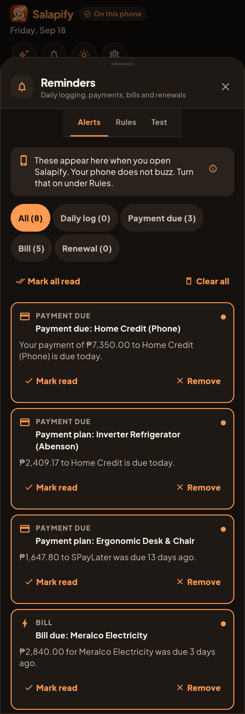 | 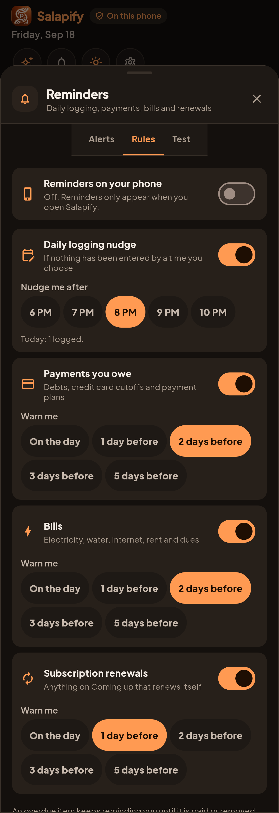 |

Phone reminders are the switch at the top of Rules, off until it is turned on:
Android's permission dialog has no second chance, so asking before somebody has
seen what the app does collects a permanent no.

### The badge tells the truth now

It read **Offline Only** beside the wordmark, under a shield, and had been false
since the currency converter started asking a public service for rates. On
founder direction it reads **On this phone**, which is true of the ledger
without qualification, and it taps through to a receipt that names the one
request that does leave.

| Home | The receipt behind the badge |
|---|---|
| 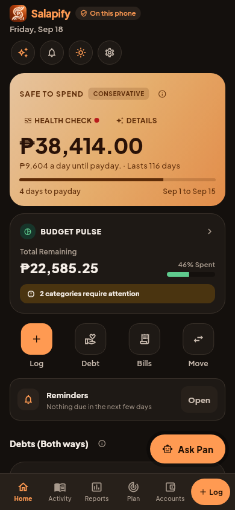 | 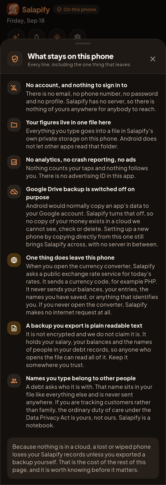 |

The receipt also says the two things somebody could be caught out by: an
exported backup is plain readable text, and it holds the names of people in
their debt records.

### Ask Pan

Offline by construction rather than by policy: it is a pure function of the
question and a snapshot of the ledger, with no clock, no network and no
storage. It knows the person's own figures, and it knows eighteen features of
the app including what happens to an entry after it is saved.

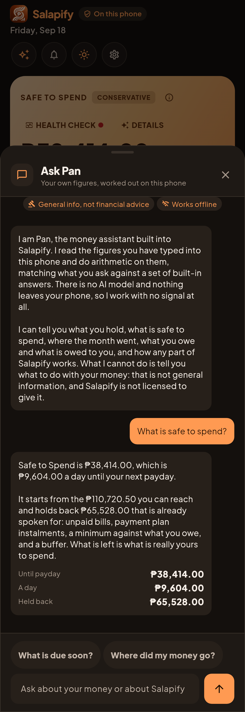

It is never called AI, because there is no model and nothing leaves the phone.
Asking it what to DO with money gets the boundary: the answerable part in full,
the line named once, why in terms of what Pan cannot see, and something to do
at the end rather than a refusal.

## Health Check, five questions with an honest dot (2026-09-20)

The HEALTH CHECK button on the hero card opened a "coming soon" note. It now
runs a five question diagnostic against what the person has actually recorded,
in one fixed order, each with a reading, a supporting figure and a tone.

| Lived in | Ten seconds after installing |
|---|---|
| 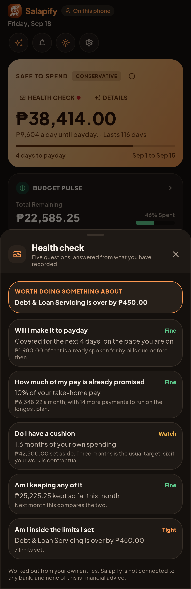 | 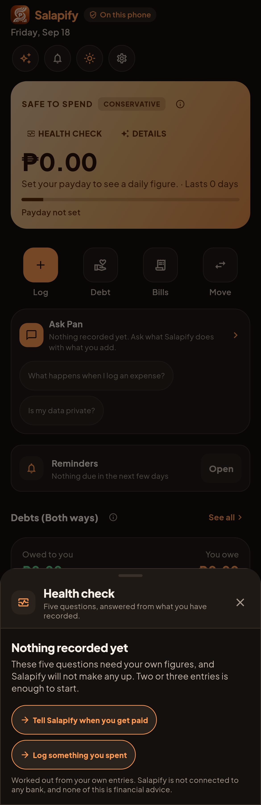 |

The five, in the order they are asked: **will I make it to payday**, **how
much of my pay is already promised**, **do I have a cushion**, **am I keeping
any of it**, **am I inside the limits I set**. The banner at the top is the
tightest one, in priority order rather than merely the worst, because two
indicators at Tight means the liquidity one is the answer: it is the one
happening soonest.

### It refuses to answer what it cannot measure

An indicator with no inputs says what is missing and offers the tap that fixes
it, rather than printing a zero. A daily pace needs five separate DAYS of
logged spending before it is a measurement rather than a guess, because a pace
is a rate over a period and five receipts from one Saturday say nothing about
a month.

Two thresholds are deliberately proportional rather than peso figures. The
buffer is comfortable at three days of the person's own spending, not the
prototype's flat 5,000, which cannot mean the same thing on an 18,000 salary
and an 80,000 one. And the debt share brackets say whose rule of thumb they
are: no regulator fixes a debt service ratio for individuals, and the
prototype presents one as "safe banking guidelines".

### Three defects the empty render found, that no test could

The right hand picture is the reason the working rules say to look at the
screen. All three were invisible to a green suite.

**The sweep left the demo salary behind.** `removeSampleData` filters every
collection on `isSample`, and `IncomeStream` carries the same flag and was
simply missing from the list. Safe to Spend reads the income streams, so an
app with no accounts, no transactions and no payday still showed a
five figure safe to spend.

**The screen was not redrawing at all.** The rebuild on a store change was
wired only in `main.dart`, so the app on a phone was always right and the
render harness and every journey test, which pump `AppShell` themselves, sat
frozen on the frame before the change. Every shot taken after a store write
had this flaw. The shell listens to its own store now, and
`test/widgets/shell_redraw_test.dart` fails if that is ever unwired.

**The dot was an alarm that was always on.** It was a hardcoded dark red with
a comment admitting it, so a brand new install showed a warning over a sheet
that opens on "Nothing recorded yet". It is the health check's own verdict
now: red for Tight, amber for Watch, and nothing at all when everything is
fine OR when nothing is known. Those last two look the same on purpose, since
a dot means go and look and there is nothing to look at. It carries a label as
well as a colour, because eight pixels of red says nothing to a screen reader
and red against amber says nothing to somebody who cannot separate them.

### "Lasts 0 days" is not a measurement (2026-09-20)

Founder, on the Health Check empty render: fix the Lasts 0 days wording.

The cash runway is liquid cash divided by a daily burn rate. Under 5,000
logged in thirty days the engine measures nothing and stands in 28,000 a
month, which the prototype does and a golden vector locks. So on a phone ten
seconds old the hero card divided zero by an invented figure and stated
**Lasts 0 days** under a zero balance. Both sides of that division were
placeholders, and the sentence reads as a verdict on the person.

**The engine is untouched.** `cashRunwayDays` still returns exactly what its
vectors say. What changed is which surfaces are willing to state it flatly.

| Home, nothing recorded | The same figure's detail screen |
|---|---|
|  | 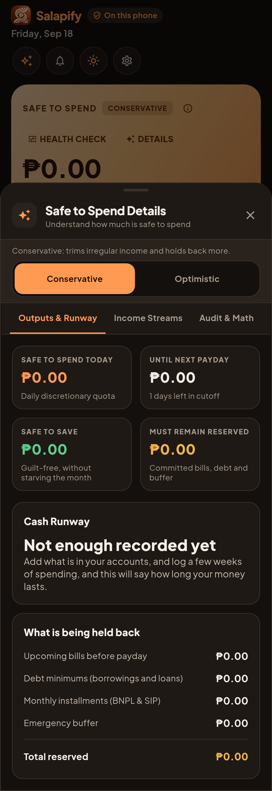 |

The hero card now earns its two clauses separately. No per-day figure without
a payday, which was already the rule, and now no runway clause without a
measured pace. A lived-in phone is unchanged and still reads "₱9,604 a day
until payday. · Lasts 116 days".

The Safe to Spend sheet is the second reader of the same number, and it is
where the figure is allowed to appear, because it carries the caption naming
which of the two burn rates produced it. One case survived that caption: no
measured pace AND no cash recorded, where "0 days" is set in the card's
largest type and there is genuinely nothing to divide. That reads **Not
enough recorded yet**.

Both halves of the condition are load-bearing, and the second is the one worth
guarding. A measured zero, somebody who logs their spending and has actually
run their accounts down, still says **0 days** out loud. Silencing on the cash
alone would have taken the most important sentence in the app away from the
one person it is for. `test/widgets/runway_sheet_test.dart` fails if that
happens.
