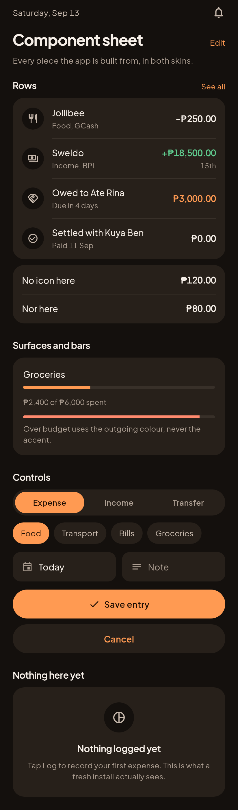
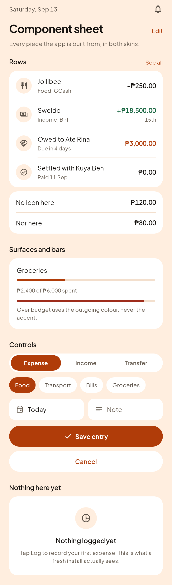
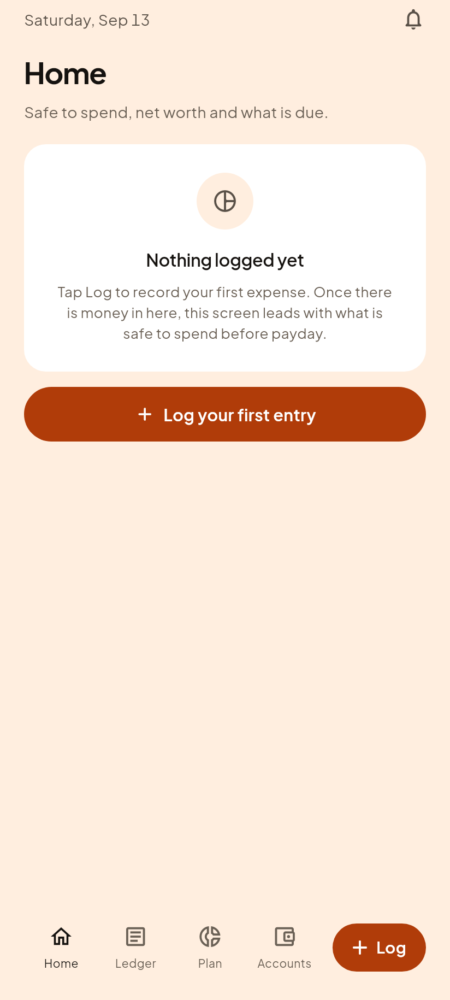
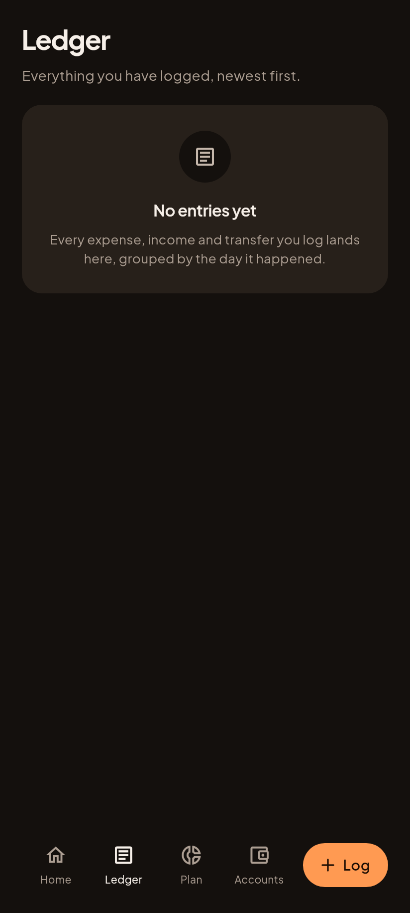
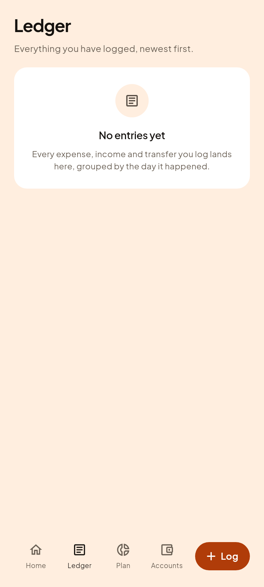
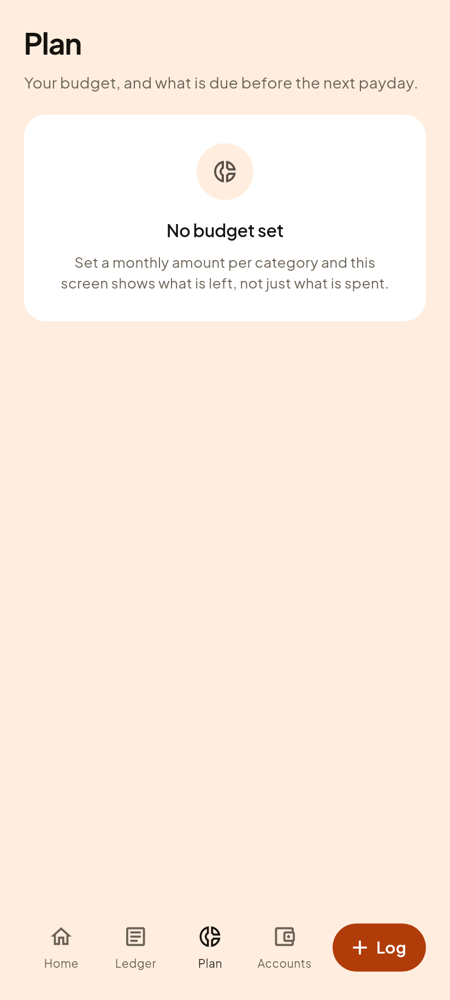
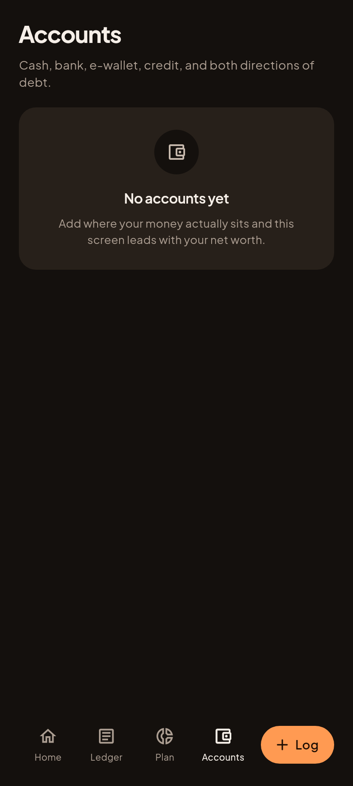
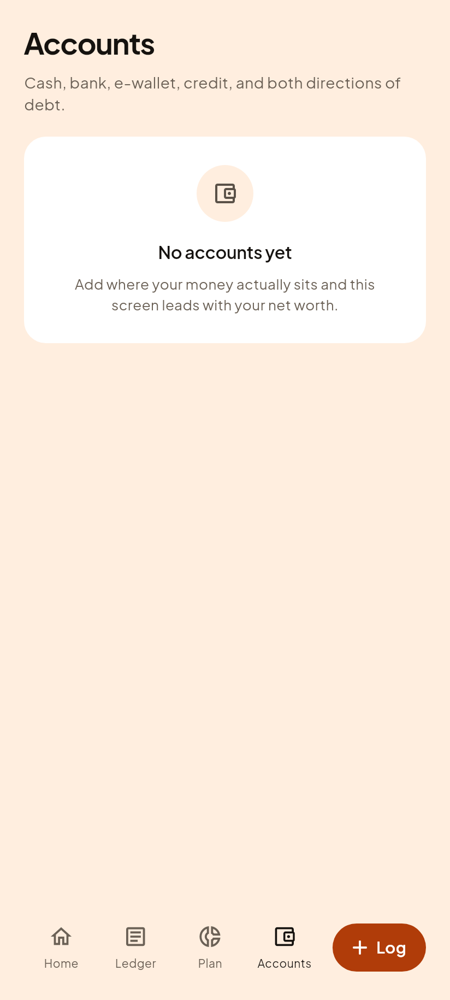
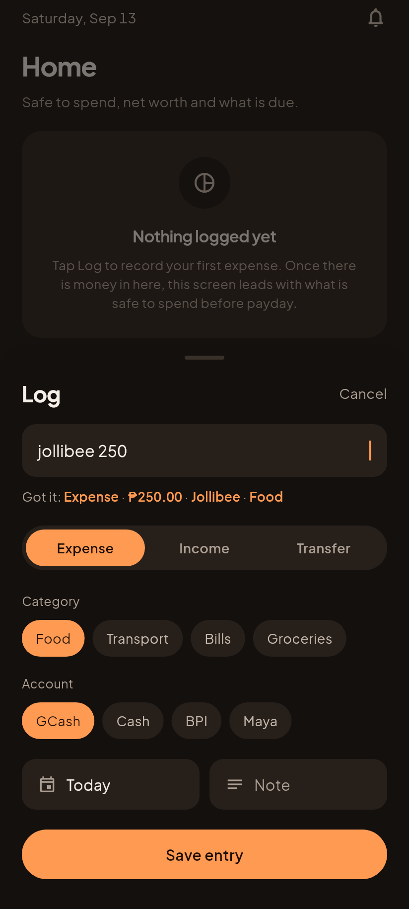
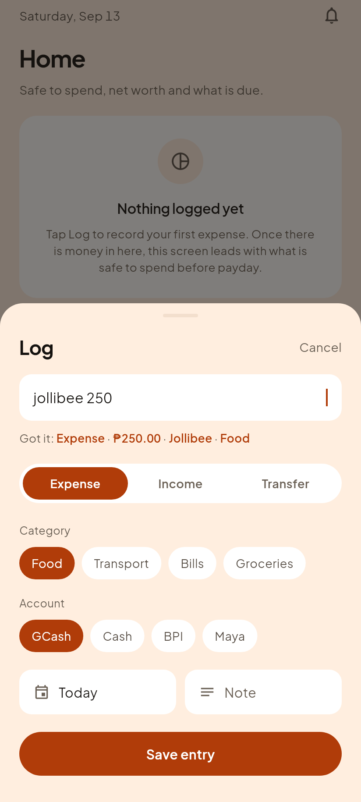

# Phase B3, the design system running as real code

Everything on this page came out of `app/`, the rebuild, rather than out of a
preview project. That is the difference between this batch and the 24 renders
one folder up: those were a design proposal drawn in a throwaway Flutter app,
and these are the actual `MaterialApp.router` the founder's phone will run,
photographed at 412 by 915 logical pixels with Plus Jakarta Sans and the
Material icon font really loaded.

The tab screens were captured by TAPPING the tab bar, not by pushing routes, so
each picture is also proof that navigation works.

Gabi (dark) is on the left because that is what the founder uses. Both come out
of identical layout code, so the only thing that differs across a row is
colour. Anything else that differs is a bug.

## The component sheet

Every piece the app is built from, in one picture. This is the vocabulary
every screen in Phase C has to be assembled from: if a screen needs something
that is not here, that is a conversation, not a quiet new widget.

Worth looking at closely:

- **Colour on an amount means DIRECTION, never emphasis.** Green is money
  coming to you, orange is what you owe, and everything else is plain ink. If
  every amount were coloured, colour would mean nothing.
- **The hairline between rows**, and where it starts: inset past the icon disc
  when there is one, full width when there is not.
- **The struck-through row**, for something settled.
- **Both bar states**: a budget in hand, and one over.
- **The empty state**, which is what a fresh install actually shows.

| Gabi, dark | Hapon, light |
|---|---|
|  |  |

## The four tabs

Real screens with real titles and a designed empty state. They are empty
because Phase C is what connects them to the ledger; the design is not a
placeholder and neither is the copy.

### Home

| Gabi, dark | Hapon, light |
|---|---|
|  |  |

### Ledger

| Gabi, dark | Hapon, light |
|---|---|
|  |  |

### Plan

| Gabi, dark | Hapon, light |
|---|---|
|  |  |

### Accounts

| Gabi, dark | Hapon, light |
|---|---|
|  |  |

## The Log sheet

Rendered OVER Home, scrim and all, because that is how it is actually seen. The
sheet is a non-opaque route, so the screen behind it stays mounted and visible
through the dim, and tapping the dim is what closes it.

The "Got it: Expense, P250.00, Jollibee, Food" line under the field is a
picture of a feature THAT DOES NOT EXIST YET, in either app. `01-vision.md`
principle 1 says so out loud. It stays in the design because it is the right
target, and building it is Phase C.

| Gabi, dark | Hapon, light |
|---|---|
|  |  |

## One thing worth the founder's eye

On the component sheet, look at the two bars under **Groceries**. The lower one
is "over budget" and uses the outgoing colour. In both skins it sits close
enough to the accent that at a glance they can read as the same colour: 10.5
degrees of hue apart in Hapon, 13.4 in Gabi. Nothing is broken and both clear
their contrast bars, but if the founder wants over-budget to be unmistakably a
different colour, now is the cheap moment to say so. It is one token.

## How these are made

    cd app
    flutter test test/shots/screens_shot.dart --update-goldens

The PNGs land in `app/test/shots/out`, which is gitignored, and the reviewed
ones are copied here. Two routes on purpose: a folder of images in git is
storage, and this README is the thing GitHub actually renders.

CI runs the same command on every push, so if the harness ever stops rendering
the build says so instead of the pictures quietly going stale.
