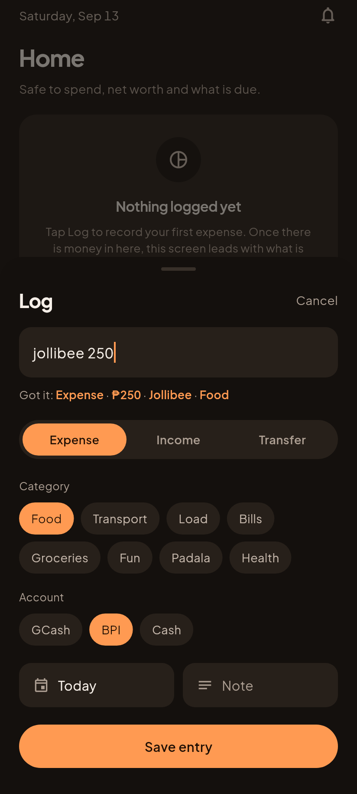
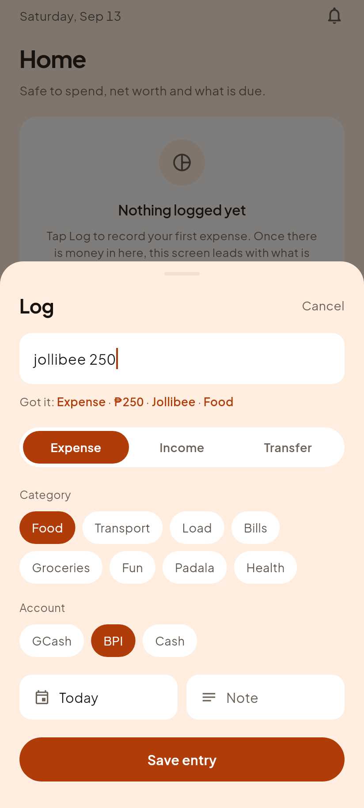
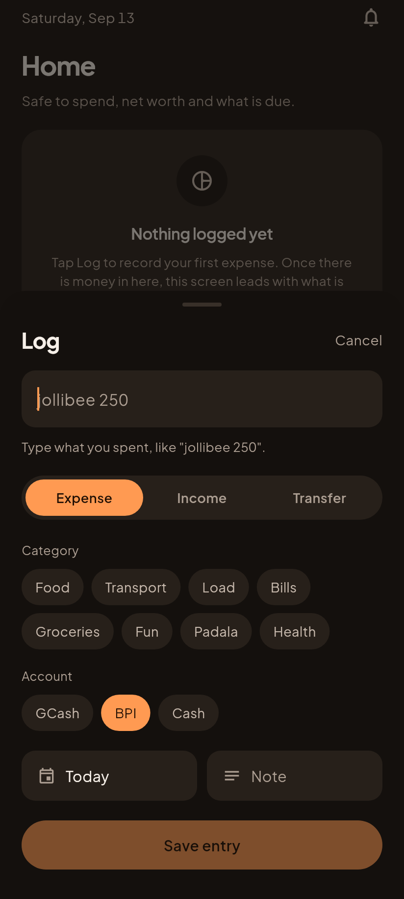
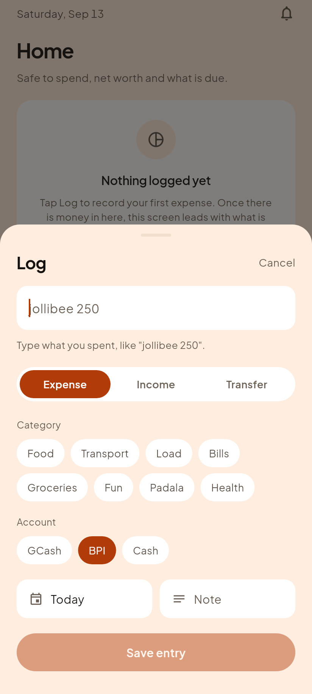
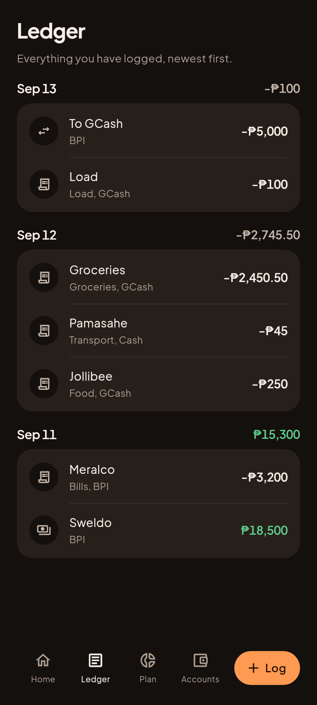
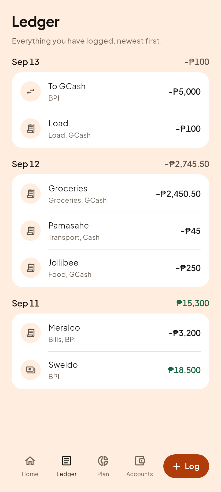
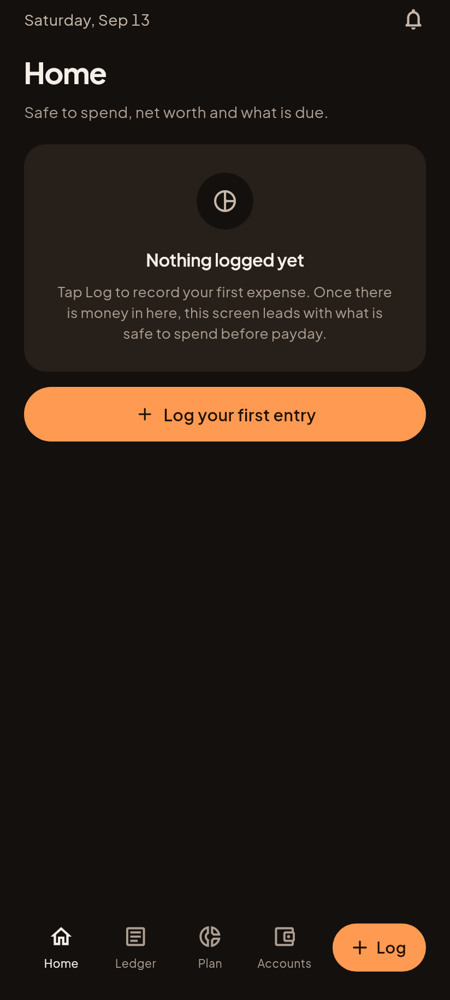
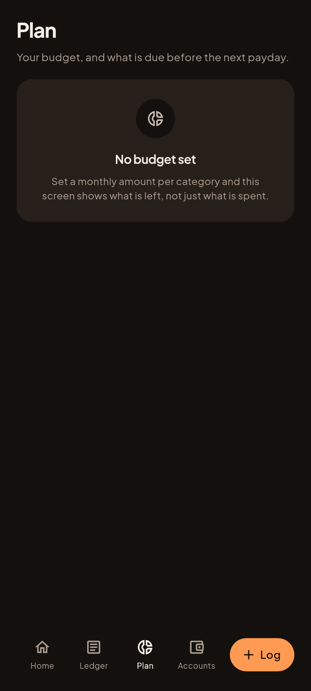
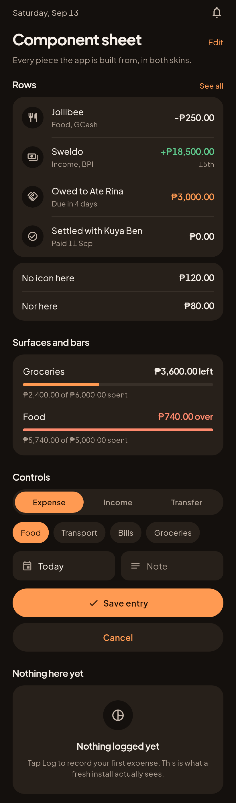
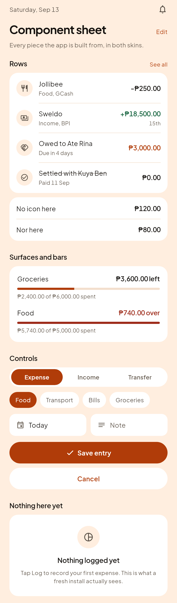

# Phase C1, the app actually saves money now

Everything here came out of `app/` driving its real router over a real
`LedgerStore`, with a lived-in ledger behind it: three accounts, seven entries,
three days. Not an empty first-run screen and not a mockup.

The tab screens were captured by TAPPING the tab bar, and the Log sheet by
tapping the Log pill and typing into the field, so each picture is also proof
that the thing works.

Gabi (dark) on the left, because that is what the founder uses.

## The Log sheet, mid-type

This is the feature. Type one line, and before you commit anything the app says
back what it understood. "jollibee 250" becomes an expense of P250 labelled
Jollibee in the Food category, and the Food chip lights up to match.

Get it wrong and you tap a different chip. The guess never wins over a tap.

| Gabi, dark | Hapon, light |
|---|---|
|  |  |

And the same sheet before anything is typed, which is the state it opens in:

| Gabi, dark | Hapon, light |
|---|---|
|  |  |

## The Ledger, with real entries

Grouped by day, newest first, with a total on each day heading.

**Two defects were caught by looking at this exact picture, and neither showed
up in 362 passing tests.**

The first: Sep 13 originally read **-P5,100** on a day that spent P100. A
P5,000 transfer from BPI to GCash was being counted as money gone. Moving your
own money between your own accounts leaves you with exactly as much as before,
so transfers are now excluded from a day total. The transfer row is still in
the list, still showing that BPI fell by P5,000, because that account really
did fall. A row is about one account; a day total is about you.

The second: every day total was drawn in the accent orange, including Sep 11,
where the founder EARNED P18,500. Colour in this app means direction, so a
number in the accent is a number lying about which way it went. Day totals now
take a direction colour, and Sep 11 is green.

| Gabi, dark | Hapon, light |
|---|---|
|  |  |

## The other three tabs

Still empty, and still honest about it: Home, Plan and Accounts are wired to
the design system but not yet to the ledger. That is the roadmap's order, steps
3 to 5 of Phase 3.

| | Gabi, dark | Hapon, light |
|---|---|---|
| Home |  |  |
| Plan |  |  |
| Accounts |  |  |

## The component sheet, corrected

The B3 version of this stacked two progress bars 14dp apart with generic labels
and no figures. The founder looked at it and reasonably asked whether the "over
budget" colour was distinguishable from the accent.

That review surface was the problem. It was the only place in the whole product
where those two colours sit adjacent with the words stripped out; on the real
Plan screen every row carries a figure and a caption, so the state is spoken in
words before colour gets a vote. The bars here now carry what they carry on the
real screen: "P3,600.00 left" against "P740.00 over".

The full analysis, including why no change of hex value would have fixed it and
what is actually being done instead, is D16 in `../../07-decisions.md`. One part
of it is still the founder's call.

| Gabi, dark | Hapon, light |
|---|---|
|  |  |

## One small difference from the approved mockup

The mockup's "Got it" line read `P250.00`. The real one reads `P250`, because
it goes through `formatMoney`, the app's single peso formatter, which drops
centavos when there are none. The mockup text was hand typed into a preview;
`formatMoney` is the code every screen shares. Principle 3 says two places
showing a peso differently is the bug, so the shared formatter wins.

## How these are made

    cd app
    flutter test test/shots/screens_shot.dart --update-goldens

CI runs the same command on every push, so if the harness ever stops rendering
the build says so instead of the pictures quietly going stale.
