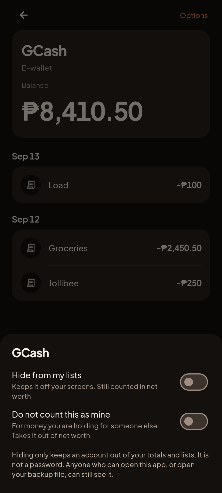
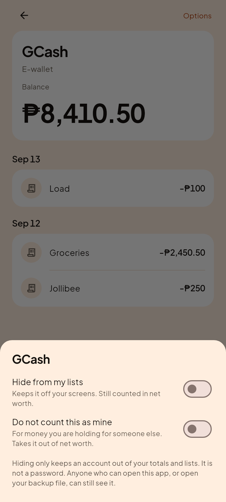
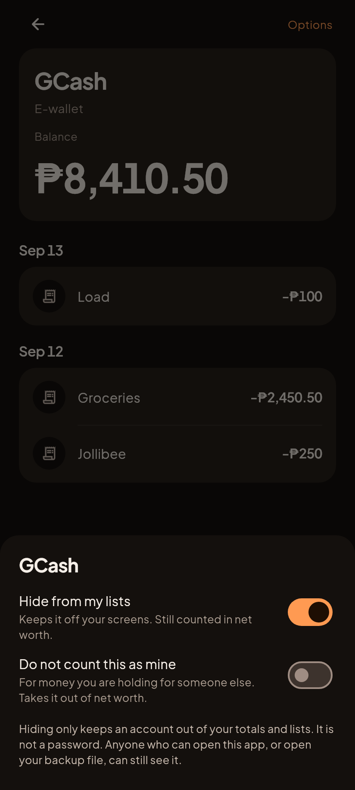
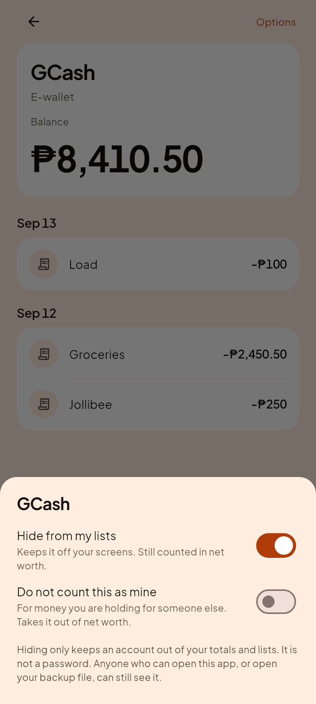
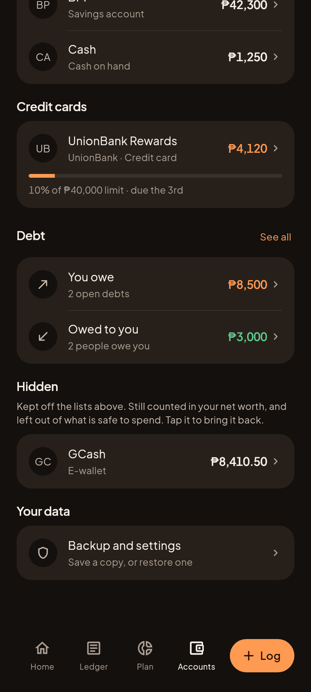
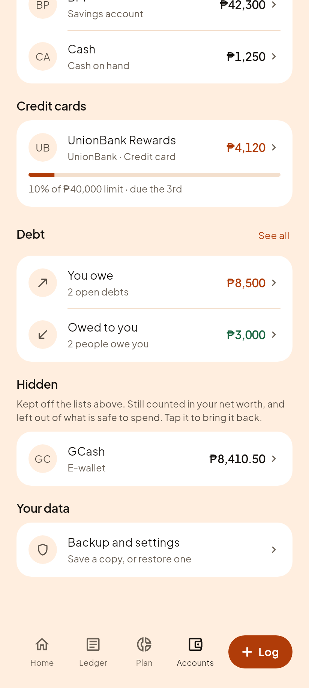
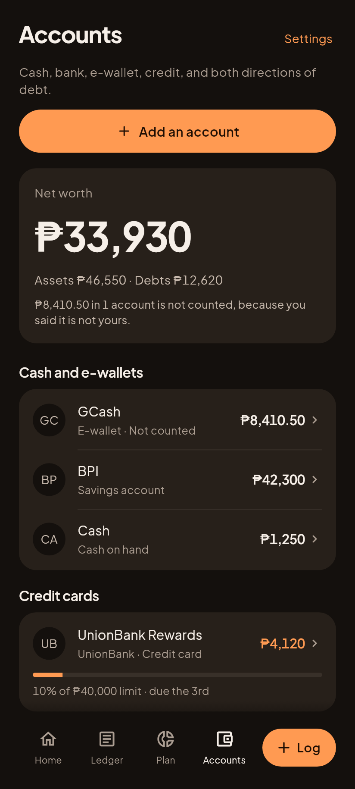
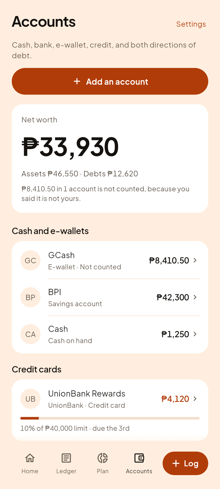

# C10, Hidden accounts

Founder direction, 2026-09-15: "Lets have a hidden account where users can
opted to use. Use experts to make the rules about it. For me i think 2 rules
when the account is hidden first it hidden account does not include in the
total account, or the hiddent account amount can still be included in the total
amount."

Those two rules are not two settings for one switch. They are two different
NUMBERS, and each of the founder's rules is right about one of them.

- **Net worth is what you OWN.** A fact. Hiding a row from a list does not
  change who owns the money, so hidden money stays in it.
- **Safe to spend is what you can TOUCH this fortnight.** A decision. Money
  deliberately put out of sight leaves it.

The asymmetry settles it: a safe-to-spend figure that is too high makes people
overspend, and one that is too low only makes them slightly cautious.

So there are two switches, not one, and three states between them. No field was
added to stored data: both flags already exist and already mean this.

| Flag | What it means |
|---|---|
| `isArchived: true` | Hide from my lists. Still counted in net worth. |
| `includeInNetWorth: false` | Not mine. Money held for somebody else. |
| both | Closed. |

## The switches

Behind Options on an account, not on the screen. Hiding an account costs
neither money nor data, it is reversible from the same place, and the screen's
actual job is showing that account's history.

| Gabi (dark) | Hapon (light) |
|---|---|
|  |  |

The paragraph at the bottom is there because people will reach for "hide" as a
way to keep a balance off the screen when somebody else can see their phone. It
is not that, and saying so is the difference between a view preference and a
false sense of safety.

## Hidden, and switched on

| Gabi (dark) | Hapon (light) |
|---|---|
|  |  |

## Where a hidden account goes

Nothing is both invisible and unreachable. A hidden account leaves the everyday
sections and appears under its own heading at the bottom of Accounts, because
an account nobody can find again is an account nobody can un-hide, and a one
way door on somebody's own money is not a view preference.

| Gabi (dark) | Hapon (light) |
|---|---|
|  |  |

The sentence under the heading is the only thing on the screen explaining why
the rows no longer add up to the number at the top of it. Money that silently
vanishes from a total is indistinguishable from money the app lost, and on an
offline app with no support channel there is nobody to ask.

## Money you are holding for somebody else

The paluwagan case: this month's pot is sitting in your GCash and it leaves on a
fixed date. Counting it as your wealth is a lie with a deadline.

| Gabi (dark) | Hapon (light) |
|---|---|
|  |  |

This is the only screen in the app where the big number is smaller than the rows
under it add up to, so two things say why: the sentence in the hero names the
amount, and the row itself carries "Not counted".

The row mark was added after looking at the first render. Without it the hero
said "8,410.50 in 1 account is not counted" and three ordinary looking rows sat
underneath with no way to tell which one it meant.
