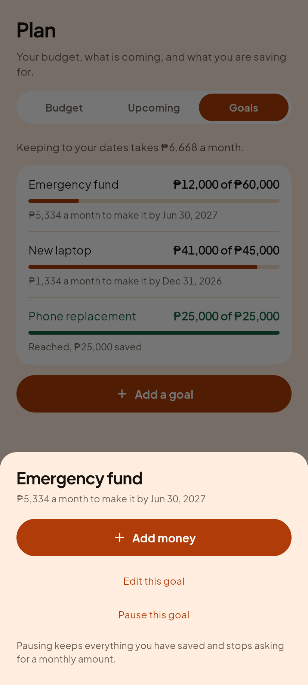

# C11, Goals

Roadmap step 8 of Phase 3. What you are saving for, and whether you will make
it.

## The one thing to understand about goals

A goal's money is a **number you track, not a balance.**

The 12,000 saved toward an emergency fund is already sitting in BPI. It is
counted once there, in net worth and in safe to spend, and described a second
time here as progress toward a target. Nothing on this screen is an asset,
nothing here is subtracted from anything, and adding to a goal moves no peso
between accounts.

That rule is the engine's own, stated at the top of `core/money/goal_plan.dart`
and obeyed by the shipped app. It is why there is no "which account did this
come from" picker: a debt payment needs one because money genuinely leaves an
account, and a goal is an intention about money you already have.

## The list

| Gabi (dark) | Hapon (light) |
|---|---|
|  |  |

Three goals in three different states on purpose. A screenshot of three healthy
goals photographs one row three times and says nothing about the state that is
hardest to get right, which is the finished one.

A reached goal clears like a settled debt, in green, without the strike
through. A paid debt is finished with; a reached goal is an achievement.

The bar turning green came out of looking at this render. The name and the
amount both went green and the bar underneath stayed accent, so the one
finished row was drawn in two colours arguing with each other.

## Tapping a goal

| Gabi (dark) | Hapon (light) |
|---|---|
|  |  |

Adding money stays offered on a reached goal. People overshoot on purpose, and
an app that refuses the last deposit because its own arithmetic says you are
finished is arguing with somebody about their own savings.

Pausing, not deleting. Nothing deletes a goal yet, deliberately: a goal carries
its whole contribution history and there is no undo for losing it.

## Adding money

| Gabi (dark) | Hapon (light) |
|---|---|
|  |  |

The sentence under the field is the most important copy on the feature.
Everybody who has used an envelope app expects this to debit an account.
Discovering later, from a balance that did not change, that it never did reads
as the app being broken.

A test holds the same line from the other side: adding to a goal must leave net
worth, safe to spend and every account balance exactly as they were. Breaking
it deliberately printed `Expected: <42340.5> / Actual: <39840.5>`, which is the
double count that rule exists to prevent.
