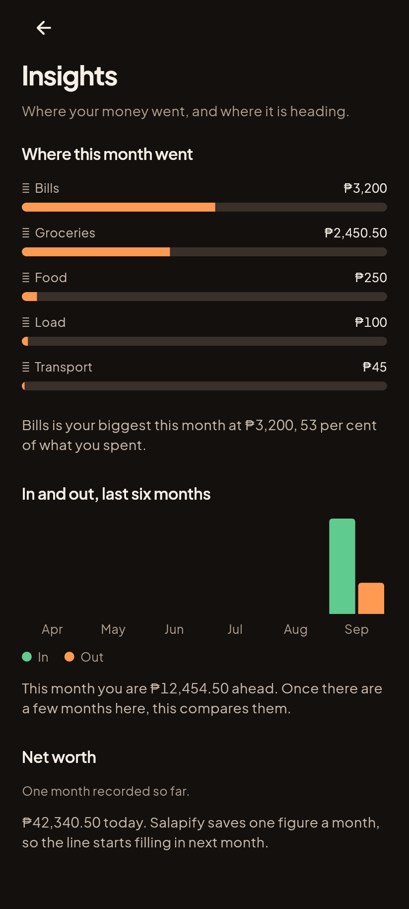
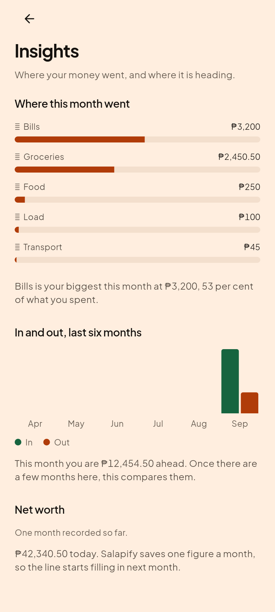
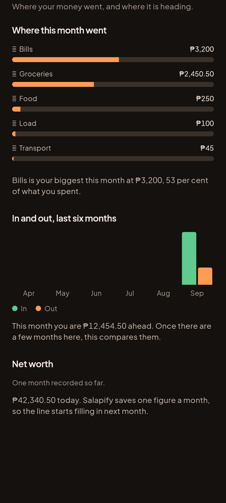
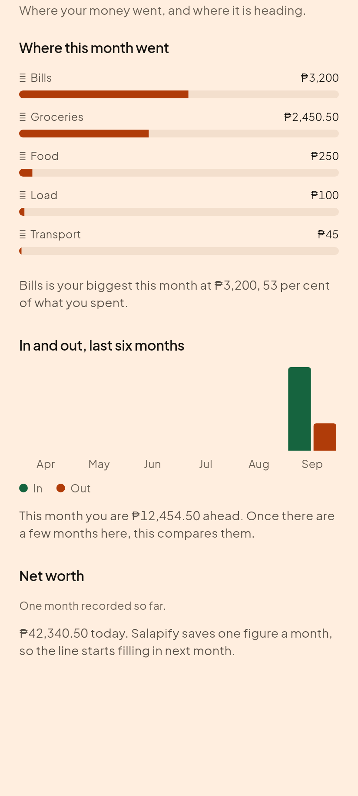
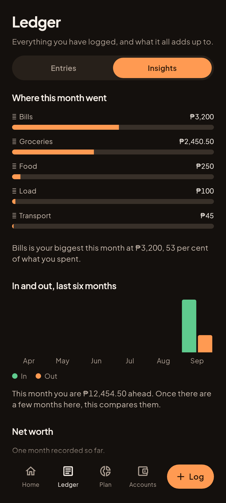
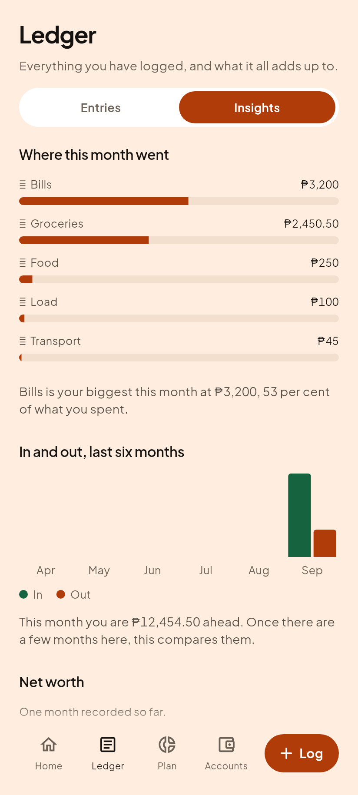
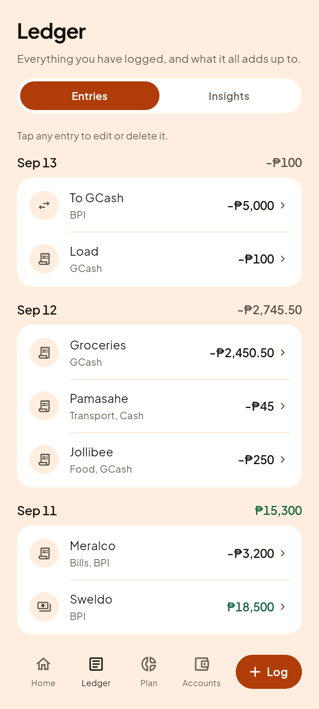

# C12, Insights

Roadmap step 9 of Phase 3. Question 5 of the five in 01-vision.md: where is
this going?

## The grammar

04-screens.md: "Three to five charts, each drawn in border, positive and accent
under one grammar, each with a sentence under it that contains a number. No
cards; a section label per chart."

**No cards**, deliberately, and it is the only screen in the app like that.
Everything else is rows inside cards because everything else is a list of
things. A chart is not a thing in a list, and a card around each one makes the
page read as three unrelated widgets rather than one argument about somebody's
money.

**Every chart carries a sentence.** A chart shows a shape; a person acts on a
claim. "Your spending is up" is a shape. "Bills is your biggest this month at
₱3,200, 53 per cent of what you spent" is something somebody can do something
about.

| Gabi (dark) | Hapon (light) |
|---|---|
|  |  |

## The whole page

| Gabi (dark) | Hapon (light) |
|---|---|
|  |  |

## What the first render caught

The in-and-out sentence read:

> So far this month you have spent ₱6,045.50 more than your usual month.

The ledger has one month in it. The five months behind it are empty, they
averaged to zero, and the screen turned that into a comparison. A brand new
user has no usual month, so this was not a rounding error: it was a confident
claim about a history that does not exist, phrased as an accusation.

It now compares only against months that actually happened, and says so when
there are none. The net worth chart three sections down already refused to make
that kind of claim; this is the same honesty applied one chart up.

## Three charts, not four

The spec lists a fourth, daily spending against the safe-to-spend line. It is
deferred deliberately rather than forgotten: no engine produces a per-day
series, so building it means writing new money derivation, and the comparison
line it needs ("what should I have spent by today") is a pace figure the app
states exactly once, on Home. Two places stating a pace is the defect
`financial_state.dart` exists to prevent, so this waits until the engine owns
the series rather than a chart inventing it.

## Two invariants held by tests

- **The category bars add up to the month Plan shows.** This chart derives its
  own totals and Plan reads `budgetSummary`. Two screens quoting one month is
  exactly the shape that produced the Home versus Plan contradiction.
- **The line ends where the Accounts hero ends.** The last point is the LIVE
  figure, computed off `ownedOnly` exactly as that hero is, so somebody who
  marked an account as not theirs does not see a chart finishing somewhere the
  rest of the app disagrees with.

## Where it lives, after D23

Insights is the **second segment of the Ledger tab**, not a fifth tab and not
a sentence at the bottom of Home.

| Gabi (dark) | Hapon (light) |
|---|---|
|  |  |

The reason is an information-architecture one rather than a convenience: Home
is now, Plan is the future, Accounts is the stock, and **Ledger is the past.**
Insights is the past, shaped, so it belongs beside the raw version of itself.

| Gabi, Entries | Hapon, Entries |
|---|---|
|  |  |

A fifth tab was refused on measurement, not taste: it takes every tab column to
36.1dp, under the 44dp touch floor, and breaks four of five labels at 320dp at
1.3x system text.

The old door was one tappable sentence at the very bottom of Home. Measured at
320x640 it only appeared after scrolling 752 of 752 pixels, which is the
literal last line on the page. It still works, and `/insights` is still a real
pushed route, because a deep link from a notification needs somewhere to land
that can be backed out of.
