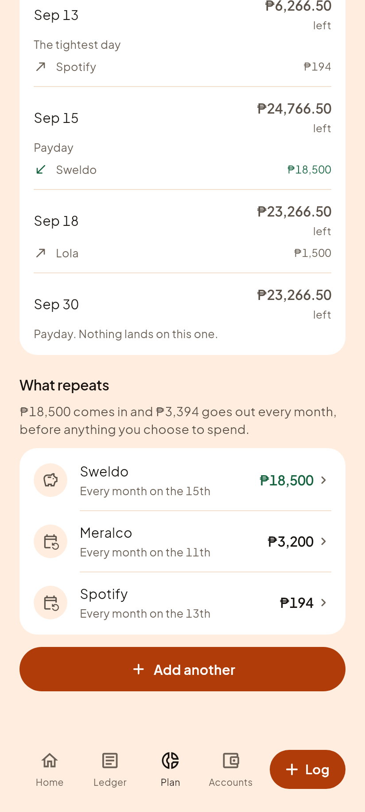
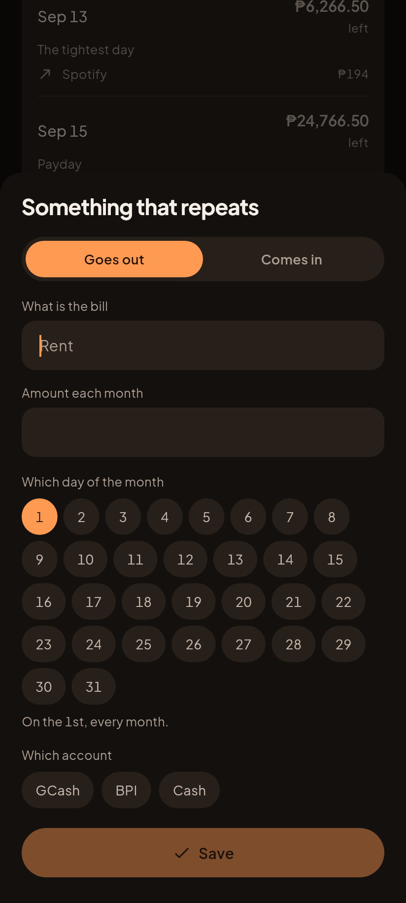
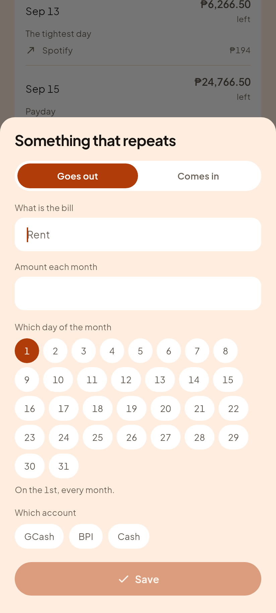

# C13, What repeats

Founder direction, 2026-09-15: "recurring first", chosen over finishing Phase 3
with app lock and onboarding.

## Why this came before app lock

**There was no way to tell Salapify about your rent.**

Not "it was basic". It did not exist. `recurring.dart` was reachable by
nothing, every bill in the app had arrived from a restored backup, and the
Upcoming segment's own empty state said "Add a bill that repeats" on a screen
where that could not be done.

That is a money defect, not a missing convenience. `upcomingCommitments` reads
`data['recurring']`, and safe to spend is liquid MINUS what it finds there. With
no bills recorded, **rent counted as spendable.** The figure was not slightly
off, it was flattering, and safe to spend is the one number in this app that
somebody spends against.

App lock protects data. This makes the headline number true.

## The list

| Gabi (dark) | Hapon (light) |
|---|---|
|  |  |

It sits at the bottom of Plan > Upcoming, under the day rows, because the days
are OCCURRENCES and these are the things that generate them. Income first, then
largest: there are usually one or two paydays and a dozen bills, and burying
the sweldo under them reads as a list of bad news.

The summary gives both directions rather than a net. "You are ₱15,000 ahead
each month" hides the size of the commitment, which is the thing somebody is
actually deciding about.

## The sheet

| Gabi (dark) | Hapon (light) |
|---|---|
|  |  |

Thirty one chips rather than a number field. A text box for a day of the month
invites 0, 45 and "15th", all of which the engine then has to interpret, and
the common answers, payday and month end, are one tap away.

Picking the 29th or later adds a line saying that a shorter month lands on its
last day instead, because the engine clamps rather than skipping and somebody
picking the 31st deserves to know what February does.

## The rule the sheet does NOT own

Add a bill on the 20th whose day is the 3rd and that money has already gone
out. Counting it against what is left before payday would make safe to spend
too low for the rest of the month, which is the opposite error and just as
wrong.

`recurringSaveLastPosted` in the golden locked engine decides that, including
the edit case where it refuses to stamp backwards past a marker already further
ahead. The sheet calls it and does not reimplement it.

## Still not wired: auto-posting

`postDueRecurring` exists, is golden locked, and is reachable by nothing. It
would post each item as a real transaction on its day and move the account
balance. It is deliberately NOT wired here, because `stampRecurringOnRestore`
is also unwired, and restoring a backup whose bills already posted would post
them a second time. That is a founder-gated decision about writing money
without a tap, not a loose end to tidy.

Without it, a bill still does its most important job: it is counted against
safe to spend, and it shows up in Upcoming on its day.
