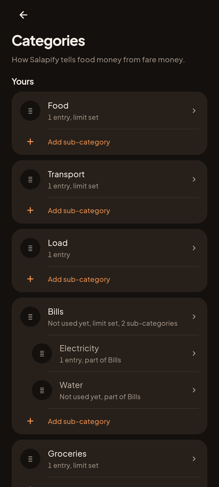
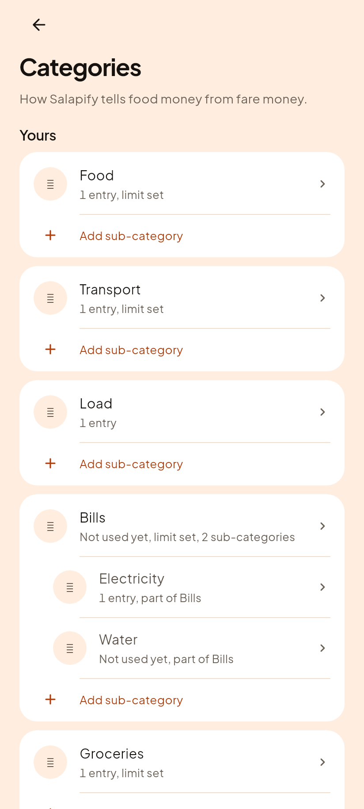
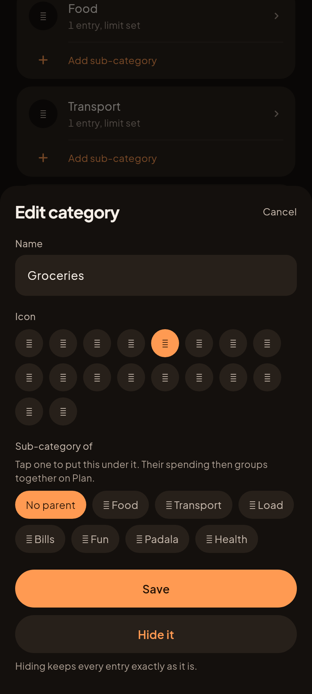
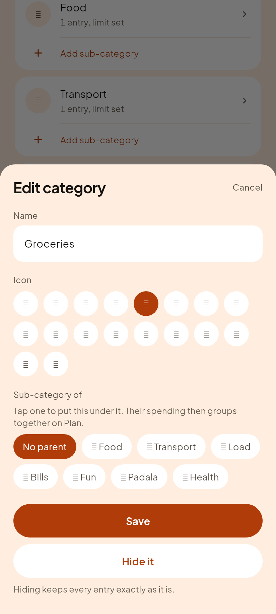
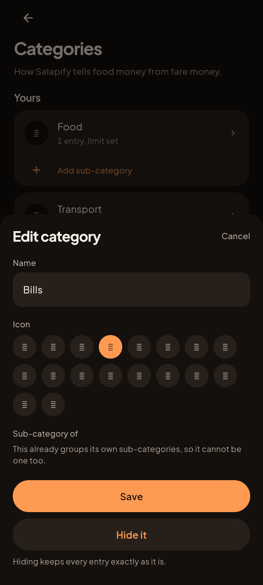
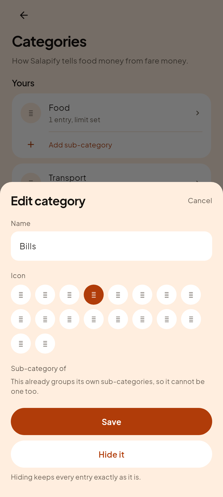
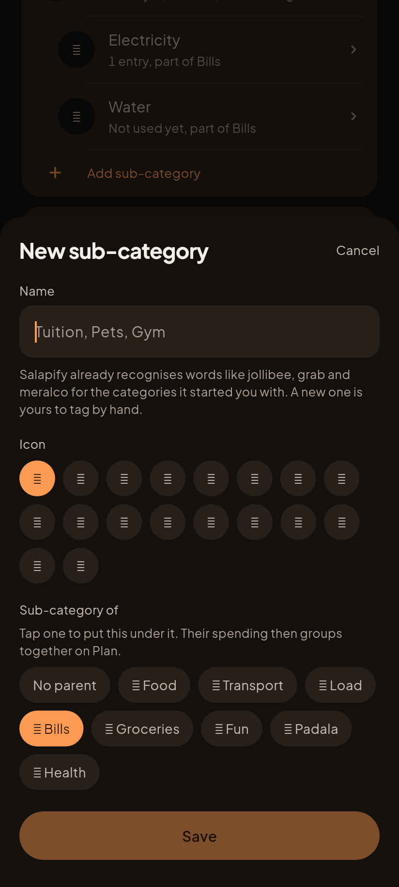
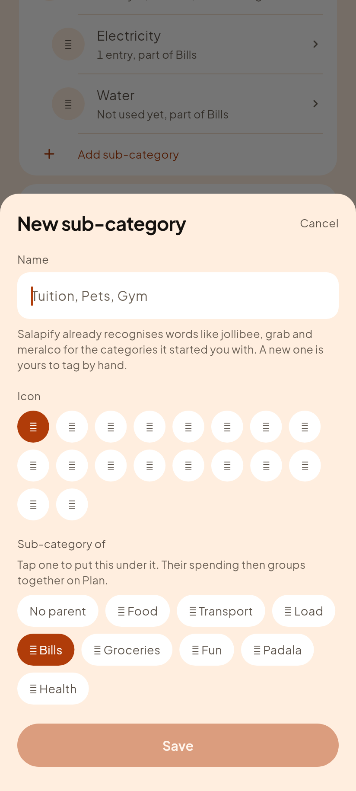

# C14, sub-categories you can actually reach

Gabi (dark) is on the left, because that is what the founder uses.

## One card per main category, each with its own way to add under it

| Gabi (dark) | Hapon (light) |
|---|---|
|  |  |

This is the SECOND shape of this screen, and the first one is worth recording
because the difference is the whole lesson. The first version drew every
category in one card, in tree order, and put the add control inside the EDIT
sheet of a category. It was correct and it was not findable. The founder, on
the create sheet with the parent picker visible in front of them: *"no add
sub category here"*, and then, on being shown where it was: *"the users might
be confused. I think its better like add main category then add sub category
right away."*

They were right, and the reason is structural rather than cosmetic. Adding a
sub-category through an EDIT sheet asks somebody to already know the tree
exists before they can build one, and to look for a create action inside a
screen about changing something that already exists. A card that visibly owns
its children, with the add line sitting on it, IS the structure. Nobody has
to be taught it.

The line is left off a card whose category is itself somebody's child, which
is the two-level rule read from this side.

The founder's report was plain: *"for categores and sub categories - nothing
happened."* It was accurate. `parentId` was already read by `categoryTree` and
by Plan's rollup (Bills over Electricity and Water, from the C4 render), and
both sat idle, because nothing anywhere ever WROTE one. The Categories screen
listed every category flat, in stored order, with no way to see a grouping and
no way to make one.

The list now renders in tree order: Bills immediately followed by Electricity
and Water, indented, in `skin.text2`, the same visual language Plan already
uses for the same idea. The caption says the relationship in words too, "2
sub-categories" on Bills and "part of Bills" on each child, so the grouping
reads even to somebody who does not know what an indent means yet.

## The editor gained the one field it was missing

| Gabi (dark) | Hapon (light) |
|---|---|
|  |  |

"Sub-category of" sits under Icon: "No parent" plus a chip per eligible
category. Groceries here can become a child of Bills, Food, or any other top
level category in one tap, and Plan draws the rollup on the very next visit
because it was already reading `parentId`, it just never had one to read.

## A category that already groups others cannot become a child

| Gabi (dark) | Hapon (light) |
|---|---|
|  |  |

This sheet carried an "Add a sub-category" link of its own for one round, and
it is gone: the list card does that job now, where somebody hunting for the
feature will actually meet it. One door, not the same action offered twice in
two places a beginner has to choose between.

## The new category arrives already grouped

| Gabi (dark) | Hapon (light) |
|---|---|
|  |  |

Tapping "Add sub-category" on the Bills card opens this. The sheet is titled
"New sub-category" rather than "New category", and Bills is already picked in
the chips, because the tap that opened it carried that fact and a generic
form would have thrown it away. Type a name, tap Save, and the Bills card
redraws with the new row inside it.

The add line appears on any live category that is not already somebody's
child, whether or not it has children yet: a parent with two sub-categories
can take a third, and a plain category can become a parent for the first
time. That test is `canBeParent`, which is the SAME rule `parentCandidates`
uses to decide who may be picked, asked from the other side. One function,
because two copies of this exact test are how the self-parent bug happened in
the first place.

The other route still exists and is unchanged: while creating any category,
the "Sub-category of" chips put it under an existing one. Its caption now
says what to TAP ("Tap one to put this under it") rather than describing the
effect, because the founder read the old line, on the sheet with the picker
on it, and reported there was no option to make a sub-category.

Bills already groups Electricity and Water. Letting it also become someone
else's child would make its own children grandchildren, the one shape nothing
in this app renders: `categoryTree` walks two levels and silently promotes
anything deeper back to the top, the same defensive fallback that keeps an
orphaned child from vanishing rather than a shape anyone should reach on
purpose. So the picker does not offer a false choice here; it says why in one
sentence instead.

The candidate list applies the same rule from the other direction: only top
level categories are offered as a parent, so picking one can never itself
create a third level.

### What stayed exactly as it was

No money moved. `parentId` already existed in the schema (`backup.dart`
normalizes it, `categoryTree` and `budgetRows` already read it) and nothing
about how a capped category sums its spend changed. The only new write is the
field itself, spread onto the existing row the same way icon and name always
were, absence-is-the-default when "No parent" is chosen, matching how
archiving already behaves in this same sheet.

`test/features/categories_test.dart` needed one honest update: Bills drawing
two extra rows pushes Groceries below the fold, so the existing "hide
Groceries" journey now scrolls to it instead of assuming it is always in the
first screenful. That is the same lesson `journeys_test.dart` already learned
this round on the Accounts screen: content that used to fit on one screen can
stop fitting the moment a real feature draws more of it, and the fix is to
scroll to the target, never to shrink the feature back to fit a fixed tap.
