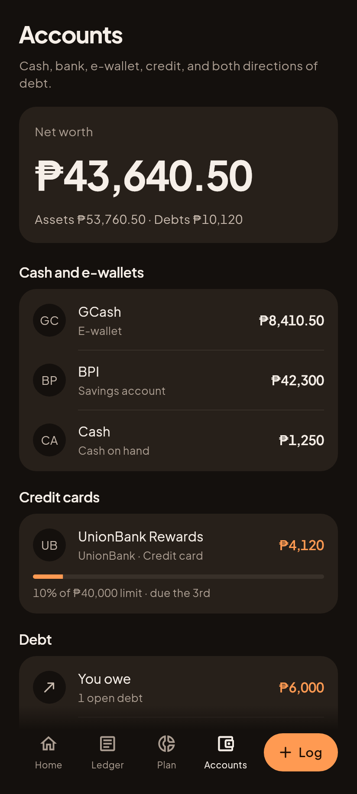
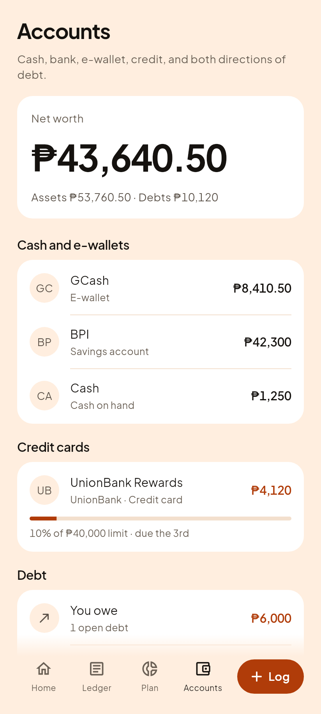
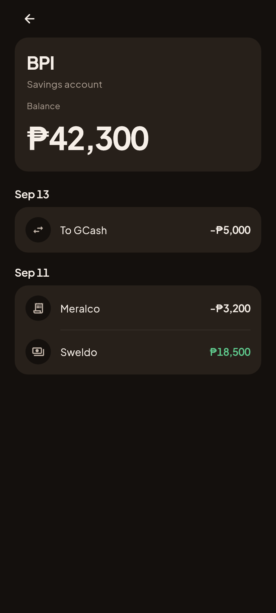
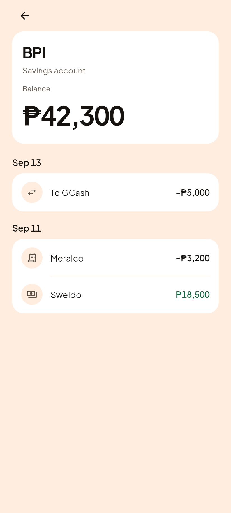

# C2, the Accounts screen

Phase 3 step 3. Question 2 of the five in `01-vision.md`: what do I own and owe?

| Gabi (dark) | Hapon (light) |
|---|---|
|  |  |

The screen leads with net worth and then answers "where is it" by kind. That
order is the point: a list of balances is a filing cabinet, one number with the
list under it is an answer.

Every figure comes from the golden locked engine. `netWorthParts` produces the
hero and its sentence, `resolveKind` decides each row's section,
`trackedRemaining` totals both directions of debt, and `initialsFor` makes the
monogram. The screen groups and paints and does no arithmetic on money.

It reconciles, which is the only way to read it honestly:

    assets       53,760.50   =  8,410.50 + 42,300 + 1,250 + 1,800 receivable
    liabilities  10,120.00   =  4,120 credit card + 6,000 loan
    net worth    43,640.50

## Four defects the first render caught, that 370 green tests did not

None of these was a screen bug. All four were the screen faithfully drawing
data that had been shaped wrong, which is exactly the class of thing a test
written from the same wrong assumption cannot see.

**A credit card was counted as cash.** `account_taxonomy.dart` puts credit,
loans and installments in `AccountStore.debts`, so a card filed under
`accounts` derives to cash on hand. It sat in "Cash and e-wallets", took no
utilisation bar, and was ADDED to assets instead of subtracted. The screen said
the founder was ₱8,240 better off than they were.

**A bank was labelled "Cash on hand".** `_kindToSubtype` maps exactly four
kinds: cash, savings, checking, ewallet. There is no `bank`, and anything
unknown derives to cash on hand, silently.

**A receivable counted as zero.** Receivables key on `amount` minus payments
and only count when `cashLeg` is true. The fixture wrote `remaining`, which
`trackedRemaining` does not read, so assets were ₱1,800 short with every test
still green.

**A loan appeared twice.** Once as its own section and once inside "You owe",
on the same screen, which is how somebody comes to believe they owe it twice.
`04-screens.md` names the kind sections exactly, "Cash and e-wallets, Bank,
Credit", so loans and installments roll into the Debt summary instead. Credit
cards keep a row on purpose: they are the only liability with a limit, so the
only one with a utilisation bar worth showing.

## What guards it now

`app/test/features/accounts_test.dart`, eleven cases, one per defect above plus
the edges. The double-count guard was proven by breaking it: forcing loans back
into their own section reddens two tests, one of them naming the reason.

    Expected: not contains 'loans'

## Account detail

Tap a row and you get that account's history. Pushed over the shell, not a
fifth tab, per `04-screens.md`.

| Gabi (dark) | Hapon (light) |
|---|---|
|  |  |

The list says what a balance IS. This says how it got there, which is why the
entries are the body of the screen rather than a footnote under a big number.

`groupByDay` and `signedAmount` are the Ledger's own, reused rather than
re-derived, so an account's history and the full ledger can never disagree
about a row's sign.

### One defect the render caught, again

The first version returned a bare `Screen` with no `Scaffold`. The shell gives
every TAB screen its Scaffold, so no tab screen carries one, and a route pushed
OVER the shell has no such parent. Every line of text came out with a yellow
double underline, which is what Flutter draws for text with no Material
ancestor, and the page had no background of its own.

It passed every test while looking like that. Two screens in a row now, and the
same lesson both times: a green suite says the rules you thought to write are
holding, and nothing at all about what is on the glass.

### Two rules the screen keeps on purpose

**The hero says the WORD, not just a colour.** "Owed" and "Balance" are the
same shape on screen and opposite in meaning, and somebody reading a number in
orange has to already know the rule to read it right.

**A transfer appears on the account it LEFT, and nowhere else.** That is the
stored shape: one row, on the source account. The screen does not invent the
mirror row, because a row the ledger does not have is money on a screen that
cannot be reconciled against it.

### The shot taps rather than pushes

The harness walks to Accounts and taps the BPI row. Pushing the route directly
would render the same picture whether or not the row is wired to it, so the
shot would look right with the tap broken.
