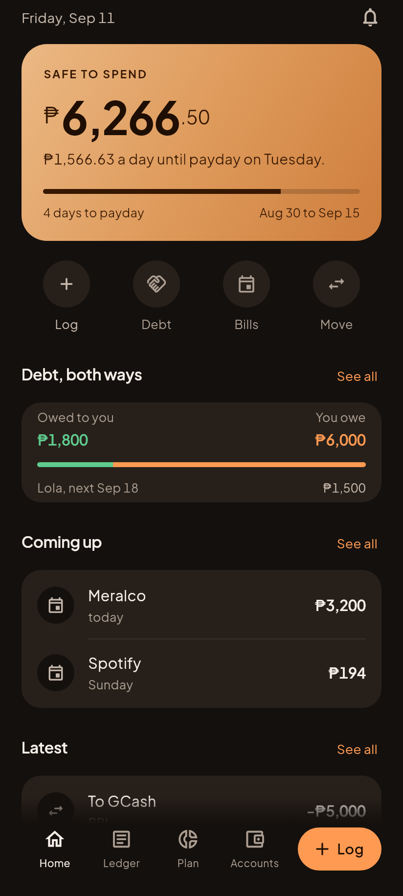
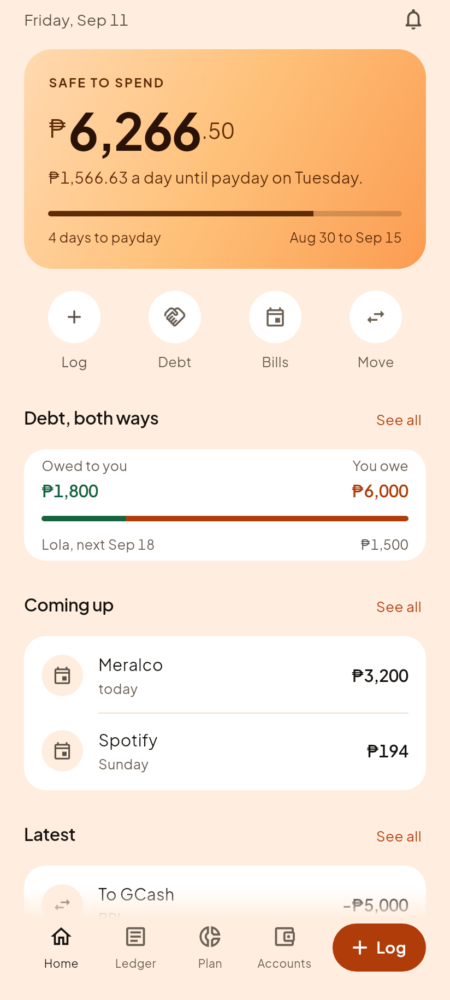
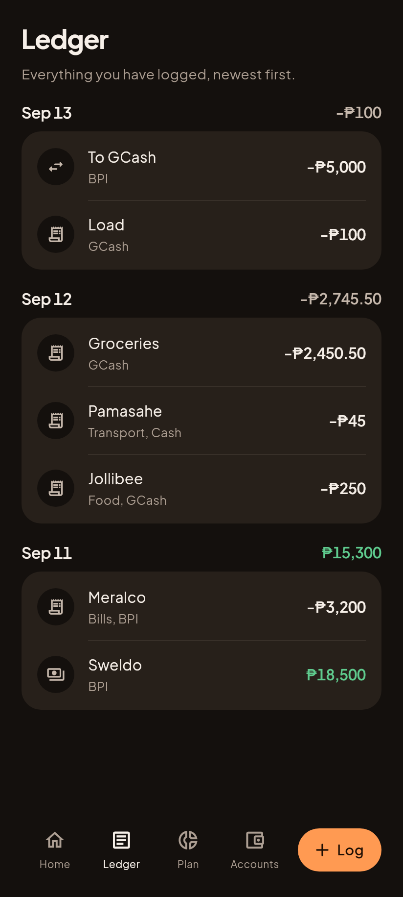
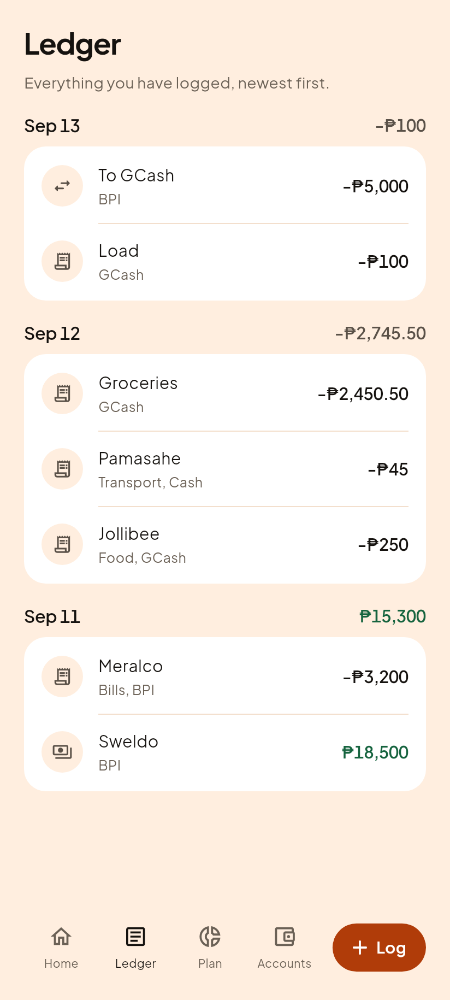

# C3, Home

Phase 3 step 4. Question 1 of the five in `01-vision.md`: am I okay right now?

| Gabi (dark) | Hapon (light) |
|---|---|
|  |  |

The ORDER is the answer to the question, and `04-screens.md` fixes it: the day,
then safe to spend with its rail, then four actions, then debt both ways, then
what is coming, then what just happened. Everything above the fold answers "am I
okay". Everything below it answers "why".

There is deliberately no net worth here. Two of three panel users read a big net
worth figure as "somebody else's phone". It lives on Accounts, one tab away.

## Every figure, and where it comes from

The screen arranges and paints. It does no arithmetic on money.

    liquid       9,660.50   safeToSpend: GCash 8,410.50 + Cash 1,250
    committed    3,394.00   upcomingCommitments: Meralco 3,200 + Spotify 194
    available    6,266.50   the hero
    perDay       1,566.63   available over 4 days
    rail         Aug 30 to Sep 15, 12 of 16 days gone
    owed to you  1,800      trackedRemaining, receivables
    you owe      6,000      trackedRemaining, the personal loan

## The savings are missing on purpose

BPI holds ₱42,300 and none of it is in the hero. `liquidKinds` in the engine is
cash, ewallet and checking, and savings is left out deliberately: the whole
point of a safe to spend figure is to protect savings from it. A screen that
added that 42,300 would be telling somebody to spend their emergency fund
because it is technically in the bank.

## The debt card looks further ahead than the bill list

"Coming up" stops at payday, because it answers "what has to come out of THIS
cycle's money". Lola on the 18th and the card on the 3rd are correctly absent.

The debt card uses a sixty day window instead, because its job is to name the
next payment whenever it lands. A card that goes quiet because the bill is a
week out is a card that goes quiet exactly when somebody is planning for it.

Both windows come from the engine (`upcomingCommitments` and `upcomingDues`),
which already knows that a credit card counts for its MINIMUM and never its
balance, and that a bank moves a due date off a weekend.

## The defect the render caught, that 396 green tests did not

The first render showed a row titled **Load** captioned **"Load, GCash"**. The
caption exists to add what the title does not already carry, and that one spent
a line saying the same word twice.

It is not an edge case. Filipino money labels collide with category names
constantly: Load, Groceries, Rent, Sweldo. Two of the five rows in the fixture
hit it.

Fixing it turned up something worse: Home and the Ledger each had their own
private copy of that caption rule, and of the entry icon rule. Two copies of one
rule drift, and the drift is invisible, because both screens keep rendering and
simply stop agreeing. They now share `entry_presentation.dart`, so the Ledger
got the same fix in the same change:

| Gabi (dark) | Hapon (light) |
|---|---|
|  |  |

"Load" now reads "GCash", while "Jollibee" still reads "Food, GCash". The rule
drops a REPEAT, never the category itself.

## What guards it now

`app/test/features/home_test.dart`, eleven cases. Two were proven by breaking
the code first and watching them fail:

The debt window, narrowed from sixty days to three so Lola falls outside it:

    Expected: not null
      Actual: <null>

The caption rule, with the de-duplication removed:

    Expected: 'GCash'
      Actual: 'Load, GCash'

## What the QA pass found, after all of the above was green

A `qa-tester` pass ran before the merge, against the real screens pumped over a
store loaded the way the app loads one. It found **five must-fix defects** and
several more worth fixing, with 397 tests green. Every one is fixed.

The reason it saw them and the tests did not is one sentence: **no test built a
widget.** The helper tests were well aimed and all of these defects live in how
the helpers are ARRANGED, which is a place a helper test cannot reach.

**"Latest" showed the five oldest entries of the day, oldest first.** A stored
date has no time in it, so everything logged today ties, and `List.sort` is not
stable. The entry somebody had just saved was the one guaranteed to be missing,
and past eight rows the sort becomes quicksort and the order goes arbitrary. The
test passed because it asserted the dates came out descending, which is true of
every wrong answer. Ties now break on stored position.

**The closing sentence double-counted money against the hero.** `available =
liquid - committed`, so "₱3,394 of that is already spoken for" named money the
figure above it had already had removed. A reader doing the subtraction the
sentence invited would put their runway at ₱2,872.50 instead of ₱6,266.50.

**A negative figure read "₱-2,394".** The panel draws the sign separately from
the digits so the two can take different sizes, and the whole part still carried
its minus. Being overcommitted before payday is a normal month here, not an edge
case. The minus now goes before the sign, which fixes every caller of the panel.

**Account detail offered more credit than the limit.** `limit - amount` with no
floor, so an overpaid card said "₱41,500 of ₱40,000 left" and an over-limit card
said "-₱5,000 left". The bar directly above it clamped correctly, so the picture
and the words disagreed.

**The hero named a weekday for a payday a month away.** On a monthly schedule it
read "payday on Friday" for a payday twenty nine days out, four lines above a
rail truthfully saying "29 days to payday". `dueWhen`, two functions down, had
this rule right the whole time; the most read line on the screen did not.

Also fixed: the rail re-derived its own payday instead of reading the engine's,
so on payday itself it drew a full bar over a zero length cycle; Home asserted a
payday for users who never set one, which `hasExplicitPaydaySchedule` exists to
prevent and Home never called; the debt card counted settled rows, so clearing
your last debt was rewarded with a card reading zero both ways; the clock was
read once at startup, so an app reopened days later was silently stale; three
"See all" links were accent coloured text with no tap target; and the account
route interpolated a stored id into a URI unencoded.

`app/test/features/home_screen_test.dart` closes the gap the pass named. It
pumps the screen and reads what it actually says.

## The clock is injected, not read

Home is the first screen whose content depends on the DATE as well as the
ledger. `AppClock` supplies "now", the app passes the real clock and the tests
and the render harness pin it to 2026-09-11. A screenshot that says "4 days to
payday" has to say that every time it is taken, or the picture is not a
baseline, and a test that passes only on the days somebody happened to run it is
not a test.

## Two journeys had to say which door they walked through

Home's "Log" quick action collides with the nav bar's "Log", and the Log sheet
is deliberately not opaque, so Home stays in the tree behind it and its entry
captions name the accounts. Five journey tests started failing on ambiguous
finders.

That ambiguity is the screens working as intended: there are genuinely two doors
to the same room, and a widget behind a scrim is genuinely still there. The
journeys now name the nav bar and the sheet rather than the bare words.
