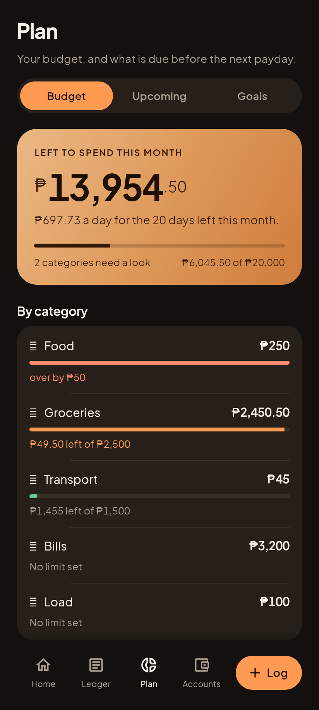
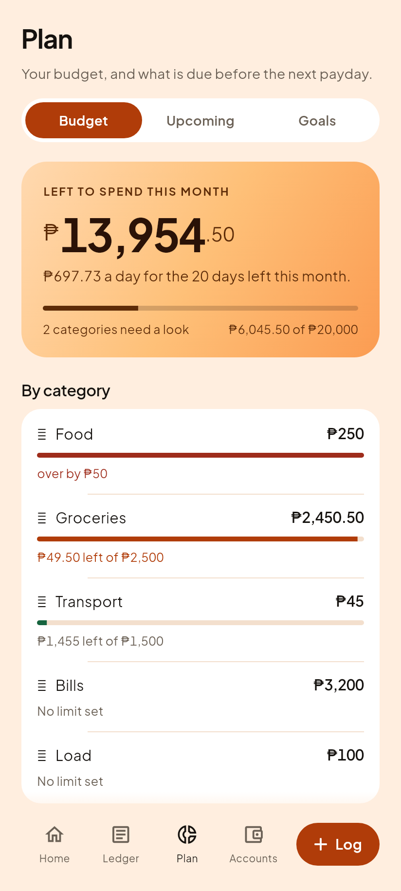

# C4, Plan and the Budget segment

Phase 3 step 5. Question 4 of the five in `01-vision.md`: where does it go?

| Gabi (dark) | Hapon (light) |
|---|---|
|  |  |

`04-screens.md`: "Plan holds Budget, Upcoming and Goals as three segments in
one screen." Budget is built. Upcoming and Goals are steps 6 and 8, and their
segments say so plainly rather than drawing an empty screen that looks broken.

## Every figure, and where it comes from

    limit        20,000.00   settings.monthlyLimit, via budgetSummary
    spent         6,045.50   every expense this month, via budgetSummary
    left         13,954.50   the hero
    per day         697.73   dailyRoom, over the 20 days left in September
    needs a look          2  Food (over) and Groceries (49.50 of 2,500 left)

The hero is the golden locked `budgetSummary` and `dailyRoom`, untouched. The
month rule is `isThisMonth` from the golden locked `statements.dart`, not a
second date rule, because two month rules that disagree is exactly the defect
nothing would catch.

## The one piece of new derivation, said plainly

The engine ships ONE budget figure: a single monthly limit for everything. It
does not ship the per category view this screen needs, so `budget_rows.dart`
derives it. It **invents no money**: the cap is `monthlyCap`, a field the
schema has carried for twelve versions and the user sets, and the spend is this
month's expenses tagged to that category.

A test asserts the two can never disagree: the category rows count only tagged
expenses and the hero counts all of them, so the rows may total less than the
hero and must never total more. If they ever did, one of the two is double
counting.

It lives in the feature folder rather than `core/money`, because `core/money`
is byte identical to the shipped app's engine file for file and this has no
counterpart there to be identical to. `debtTotals` on Accounts sits in the
feature layer for the same reason.

## Rows are ordered by what needs deciding

Not alphabetically. A budget screen is read when somebody is about to spend, so
the category nearest its limit is at the top and the comfortable one is at the
bottom. Categories with no limit follow the capped ones, largest spend first,
because they are information rather than a decision.

Proved by breaking it: reversing the comparison puts the comfortable category
first and sinks the one that is over.

    Expected: 'Food'
      Actual: 'Transport'

## Four row states, and each says the word as well as taking the colour

Somebody reading a bar in orange has to already know the rule. The caption does
not ask them to.

- **over by ₱50**, in the bad colour, bar full. Clamped on purpose: the bar says
  "full" and the caption says how far past.
- **₱49.50 left of ₱2,500**, accent, for a category down to its last quarter.
- **₱1,455 left of ₱1,500**, quiet, bar green, for one with room.
- **No limit set**, quiet, and **no bar at all**. The first render drew an empty
  track on those two rows and they read as still loading. An empty track is a
  promise that something will fill it, and nothing can: there is no limit for
  the spend to be a fraction of.

## Not gated behind Pro, and that is a decision to revisit

The shipped app treats a per category cap as a paid feature: `whereItWent`
reads `monthlyCap` only when `settings.pro` is set. That rule is untouched in
the engine, and this screen does not consult it.

Salapify 3 is being built for the founder's own daily use before anyone else's,
so there is nobody to gate it from yet. If v3 is ever offered to others, whether
this stays free is a pricing call for the founder, not one to be settled here by
a default.

## What is deferred, in writing

- **Tapping a row to change its limit.** The screen reads caps; it does not yet
  set them. That is an editor, and editors are pushed over the shell.
- **"Spent so far, last six cycles"**, the small bar chart under the list. It
  needs per month history, which is its own derivation.
- **Upcoming and Goals**, steps 6 and 8.

## A note on the pictures

The category emoji draw as boxes in these renders. That is the sandbox having
no emoji font, not a bug: they are the user's own emoji, stored in the backup
file, and they draw correctly on the phone. Salapify's own icons are Material
glyphs in the accent and they render fine, which is how you can tell the two
apart in any screenshot here.
