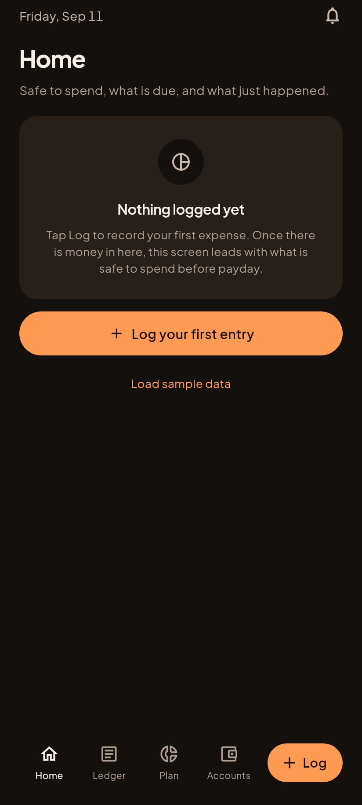
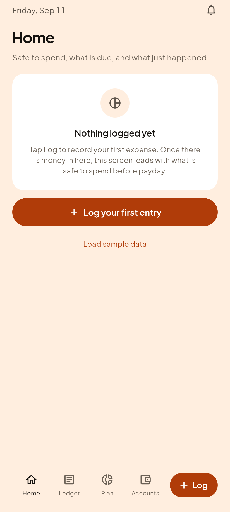

# C5, first run

The screen nothing had ever rendered, and the one every new user starts on.

| Gabi (dark) | Hapon (light) |
|---|---|
|  |  |

## Why this was missing, and what it cost

The render harness shot a LIVED-IN store, deliberately, because the shipped
app's harness spent most of its life shooting an empty one and never produced a
picture with a peso figure in it. That fix was right and it created its own
blind spot: the empty screen stopped being rendered at all.

So on 2026-09-14 the founder ran the app on an emulator, saw the real first run
for the first time, and it was telling people to **"Set your payday in Plan"**
when nothing in the app could set a payday. 418 tests passed. Every screenshot
looked right. Both ran against data that already had a payday.

The fix was one sentence of copy. The lesson is that a fixture which cannot
reach a state cannot show a defect in it, and "look at the screen" only covers
the screens something actually renders.

Both states are now rendered, every run, at both brightnesses.

## Load sample data

The quiet accent link under the button. One tap fills the app with the same
ledger the tests and every other review page use.

Three things keep it honest:

1. **It cannot reach the app store.** It is behind `kDebugMode`, a value fixed
   at build time. In a release build the branch is dead and the compiler drops
   the link and the sample ledger with it. Nothing to remember before launch,
   which matters because a step somebody has to remember is a step that gets
   missed.
2. **It cannot overwrite anything.** It only appears when the ledger is empty,
   so there is never anything to lose. That removes the risk rather than
   guarding it with a confirmation box people learn to tap through.
3. **It is dated around the app's clock**, not the day it was written, so the
   emulator shows a ledger that looks current. Reading the app's clock rather
   than `DateTime.now()` also means the data and the screen reading it can never
   disagree, in the app or under a test.

`app/test/dev/sample_data_test.dart` proves all three, including the release
gate, which tests cannot reach directly because tests always run in debug. The
widget takes the flag as a parameter for exactly that reason: a default nobody
can exercise is a default nobody has checked.

Its own month-end test then caught a real bug in the first version: a recurring
bill dated on today's day of the month is unreachable in February when today is
the 30th.
