# C6, fixing what you already logged, and creating what you could only read

Four things land here, and three of them exist because the founder opened the
app on an emulator and asked a question nobody in the repository had asked.

Gabi (dark) is on the left, because that is what the founder uses.

## The Ledger says what you can do with a row

| Gabi (dark) | Hapon (light) |
|---|---|
| 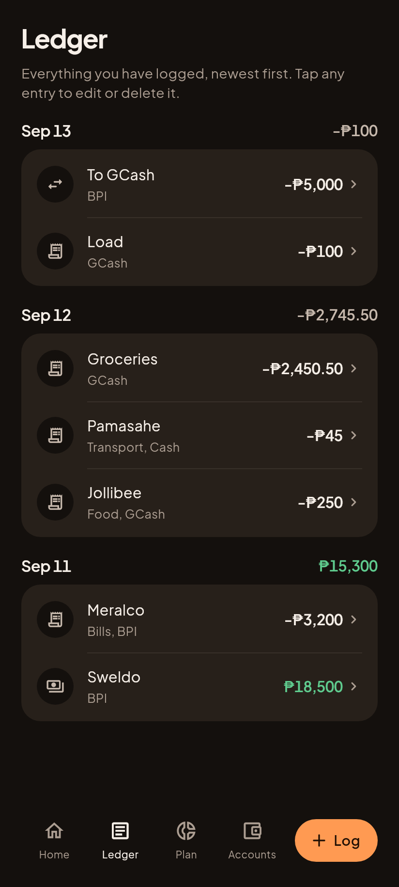 | 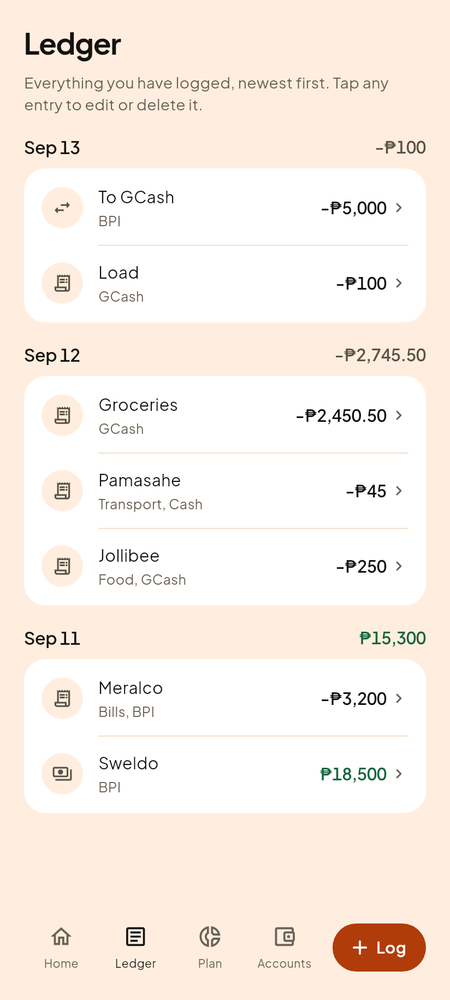 |

The rows were already tappable. Nothing on the screen said so. The founder
looked at a transaction they wanted to correct and asked:

> how the user will know if they can edit or do something on this ledger
> transaction? if there is no edit button or something

The widget's own doc comment had argued, in writing, that no marker was needed
"because in this app they all do" lead somewhere. That is a sentence written by
somebody holding the map. Two changes answer it:

1. **A chevron on every row that goes somewhere**, and on no row that does not.
   Quiet, at the outer edge, below the amount in the reading order.
2. **A sentence under the title**: "Tap any entry to edit or delete it." The
   chevron teaches somebody already hunting for a control. The sentence reaches
   the person who never thought to hunt, which is the person who asked.

A row also dims while it is held, so a press that is about to open something
feels different from a press on dead pixels. Material's ink ripple could not be
used: a splash is painted by the nearest `Material`, which is the Scaffold, and
every row sits inside a card painted on top of it. The ripple would have been
drawn underneath the card and never seen.

`app/test/design/affordance_test.dart` guards all four halves, and each was
proved by breaking it first. Inverting the chevron's condition reddened both
directions at once; pinning the press opacity to 1.0 gave
`Expected: a value less than <1.0> / Actual: <1.0>`; deleting the sentence gave
`Found 0 widgets with text containing Tap any entry to edit`.

## The entry itself

| Gabi (dark) | Hapon (light) |
|---|---|
| 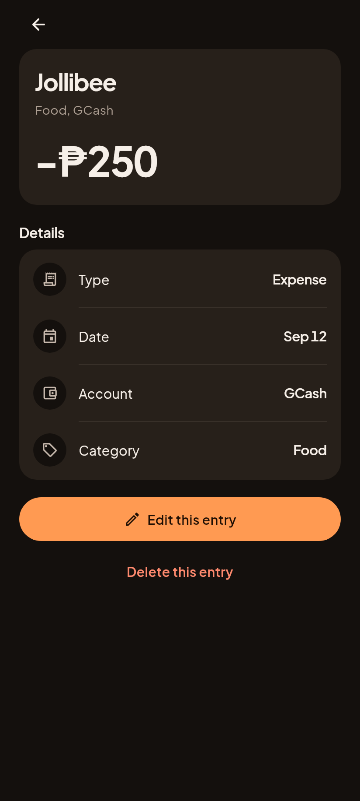 | 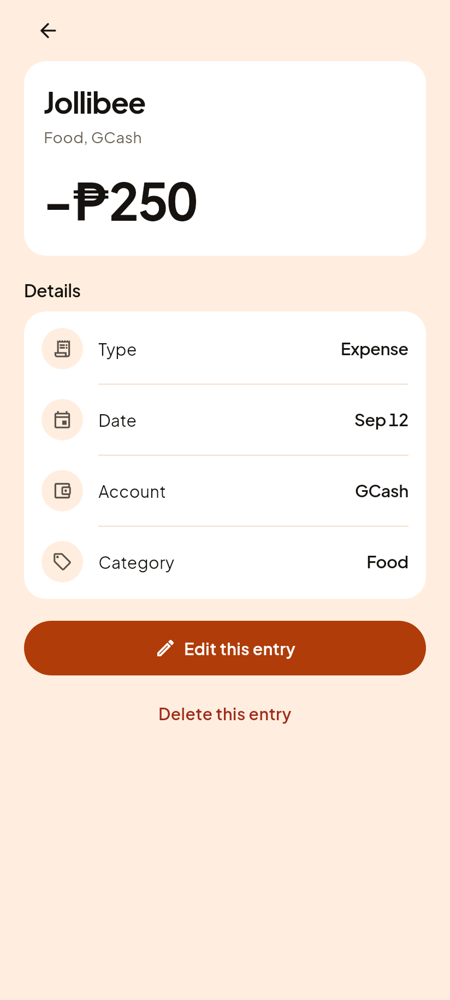 |

What the row opens. Edit the label, the amount, the category and the account;
or delete it behind a confirmation that names the amount. The edit runs through
the golden locked `updateTransaction`, which reverses the old entry's effect on
the balance and applies the new one's, so no balance is touched by this screen
directly.

Until this existed a mistyped entry could only be fixed by restoring a backup,
and the fast log parser GUESSES, so wrong entries are a normal event rather than
a rare one.

## Adding an account

| Gabi (dark) | Hapon (light) |
|---|---|
| 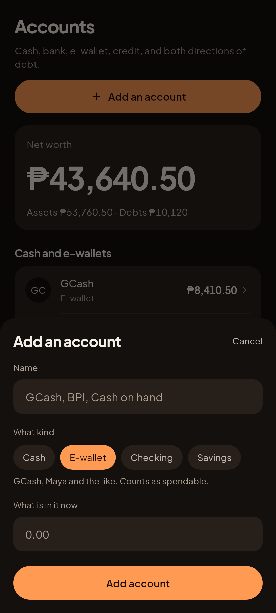 | 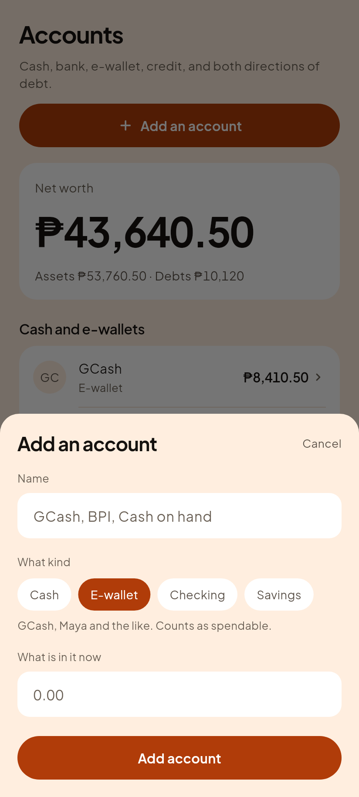 |

The Accounts empty state had been saying "Add where your money actually sits"
since the screen was built, with nothing in the app that could do it. Accounts
could arrive only through a restored backup or the debug sample data.

**Four kinds, and the list is not a simplification.** `account_taxonomy.dart`
maps exactly cash, savings, checking and ewallet, and anything else derives
SILENTLY to cash on hand. A free text field here would have shipped that defect
to every user.

The kind is a **money decision, not a label**: `liquidKinds` in the locked
engine counts cash, e-wallet and checking as spendable and leaves savings out,
because the whole point of safe to spend is to protect savings. So the sheet
names the consequence in words under the chips, and it changes as you pick.
Nobody should have to learn that rule by watching a figure move.

A blank balance means zero, which is honest for a new account. An UNREADABLE one
is refused rather than taken as zero: on an edit, silently reading "2o,000" as
zero would wipe a real balance.

## Setting a budget

| Gabi (dark) | Hapon (light) |
|---|---|
| 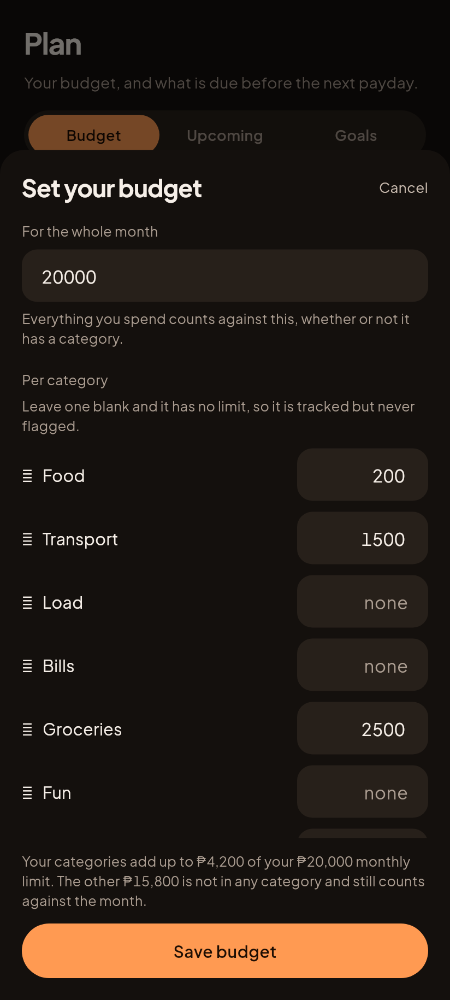 | 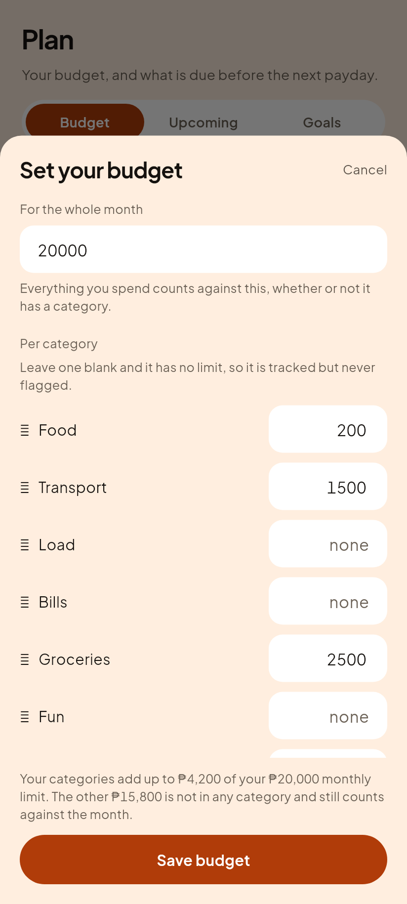 |

The wall the founder hit directly: a screen called Budget showing four rows that
all said "No limit set", with nothing anywhere that could set one. Worse than an
empty state, because empty at least explains itself.

Both fields already exist in the stored schema and have for twelve versions, so
this writes what the engine already reads and adds no new stored shape.

**FREE, not Pro.** The shipped app reads `monthlyCap` only when `settings.pro`
is set. That rule is untouched in the engine and this screen does not consult
it. A budget app whose budgets sit behind a wall fails the core-features-free
promise at the first screen a stranger opens. (Decision D19.)

Blank means "no limit" and saves zero. Unreadable is refused.

### A cap bigger than the whole month

| Gabi (dark) | Hapon (light) |
|---|---|
| 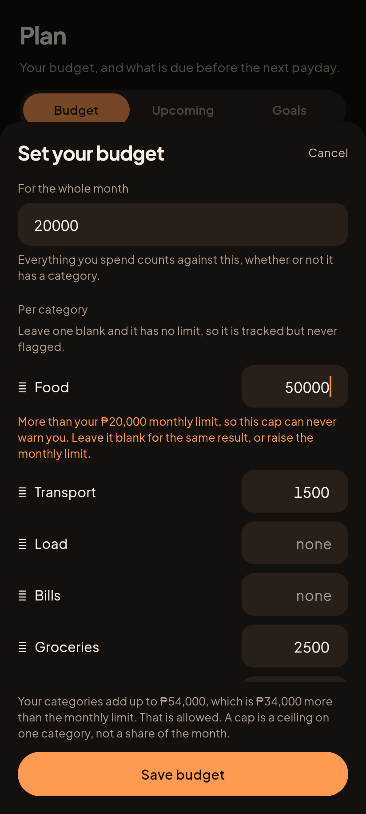 | 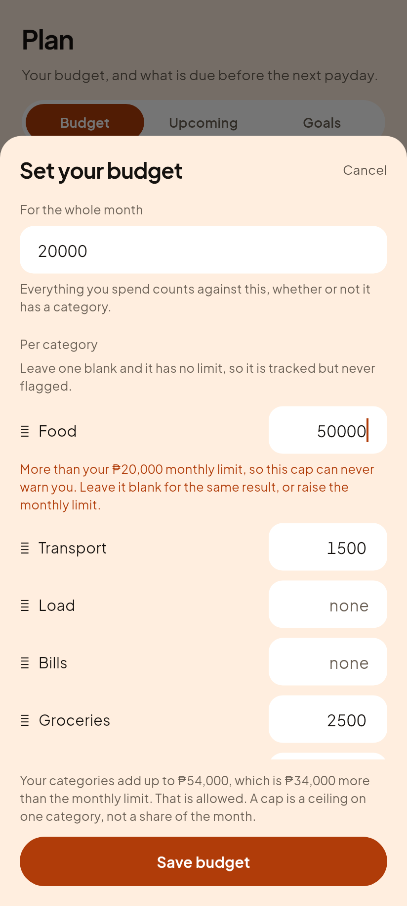 |

The founder set ₱20,000 for the month, typed ₱50,000 against one category, and
the app took it without a word. It had a warning for this. The warning could
never be seen: the save path set the message and then saved and closed the sheet
in the same frame, so the control existed in the source and nowhere a human
could read it.

Full reasoning is D21 in [../../../07-decisions.md](../../../07-decisions.md).
The short version:

**Nothing here refuses a plan.** A refusal is right when the app cannot read the
input, and wrong when the app disagrees with the plan. Blocking traps somebody
who raises a cap before raising the limit, behind a rule they cannot see.

**The sum of caps may exceed the limit, and that is not even a warning.** Not
because people leave headroom, which was the wrong reason the old comment gave,
but because `budgetSummary` counts every peso including spending with no
category at all. The caps were never a partition of the limit, so the two
figures were never meant to reconcile. The grey running total says so.

**One cap larger than the whole month IS worth a note**, in accent, not red.
`needsALook` fires at `remaining <= cap * 0.25`, so a ₱50,000 cap inside a
₱20,000 month first warns at ₱37,500 of spending: ₱17,500 past the point the
entire month is gone. It cannot fire inside the range it monitors, which makes
it a disabled control that looks armed. It also makes the hero and the row
contradict each other on the same ledger at the same moment, which is the exact
defect class `plan_screen.dart` already carries a long note about.

Deliberately not done: no block, no "are you sure", no auto clamp, and **no one
tap "raise your limit to match"**, because its effect is to delete the only
whole month control in the app and a new user taps whatever makes the orange
text go away.

## Two defects the renders caught, that tests did not

Both were invisible to 455 passing tests and obvious in a picture.

**The Save button was clipped.** The first render of the budget sheet showed a
sliver of orange at the bottom edge and nothing else: eight categories pushed
"Save budget" off the sheet, so the one control the screen exists for was
reachable only by scrolling past every field. The title and the button now sit
OUTSIDE the scroll view and only the fields scroll between them.

**The sheets opened underneath the tab bar.** The shell draws the nav bar in a
Stack on top of the tab it is showing, and a sheet opened from a tab goes into
that tab's own Navigator, which lives under the bar. The save button was drawn,
looked pressable, and the tap landed on a tab instead. `useRootNavigator: true`
puts the sheet above the whole Scaffold, bar included. A test caught this one
before the founder did, which is the only reason it is written down here rather
than suffered.

## Where they are reached from

| Gabi (dark) | Hapon (light) |
|---|---|
| 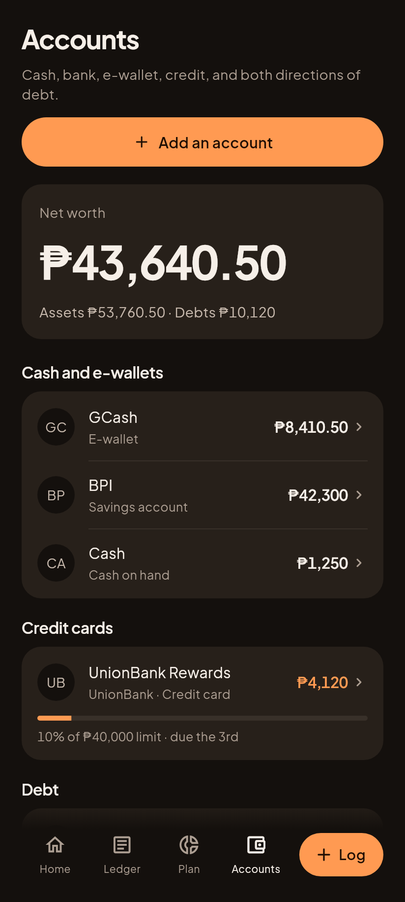 | 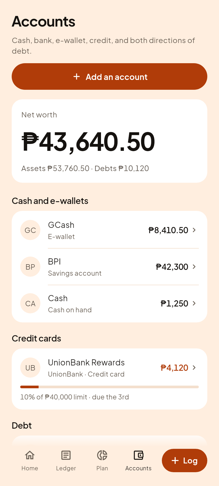 |
| 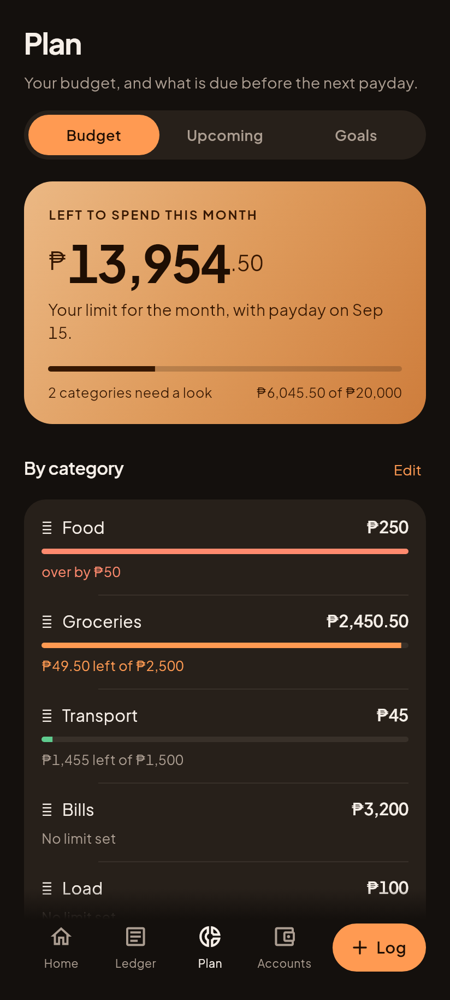 | 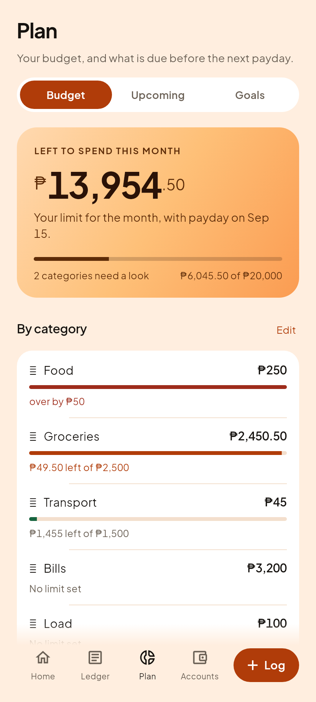 |

Accounts leads with "Add an account" above net worth, because a screen you
cannot add to is a report. Plan's "By category" heading carries "Edit" once a
limit exists and "Set limits" before that, and the empty budget state carries
its own button.

Note: the category marks in the budget sheet draw as boxes in these renders.
Those are the user's own emoji and the render sandbox has no emoji font. They
are correct on the phone, and they are deliberately NOT replaced with Salapify
icons: category icons are user data, they live in the backup file, and
overwriting them would replace a choice that was never ours.
