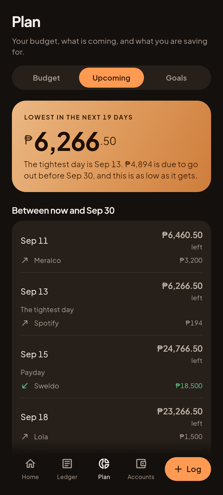
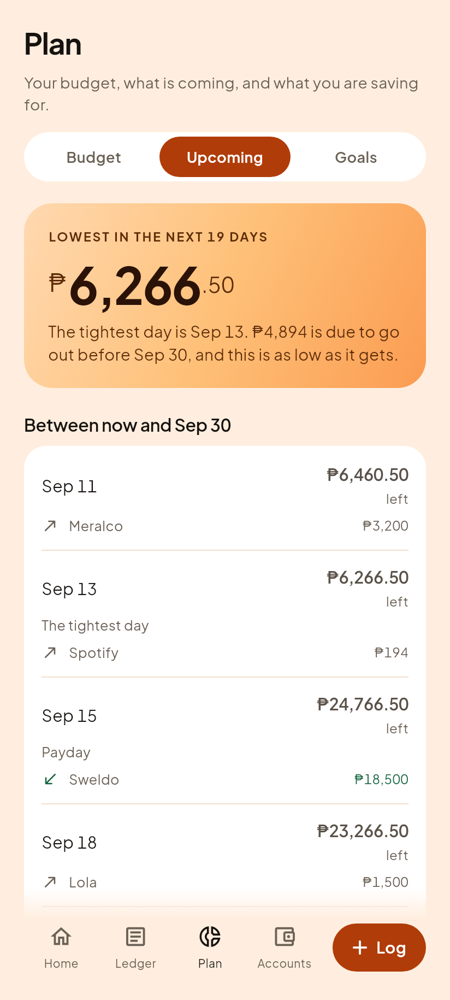
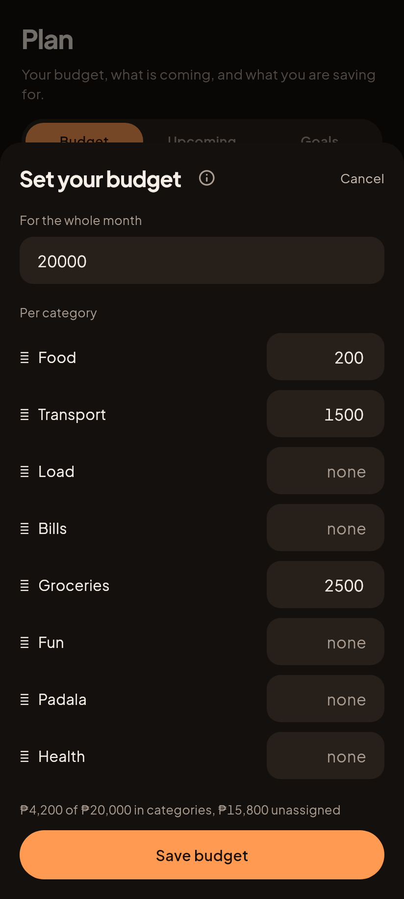
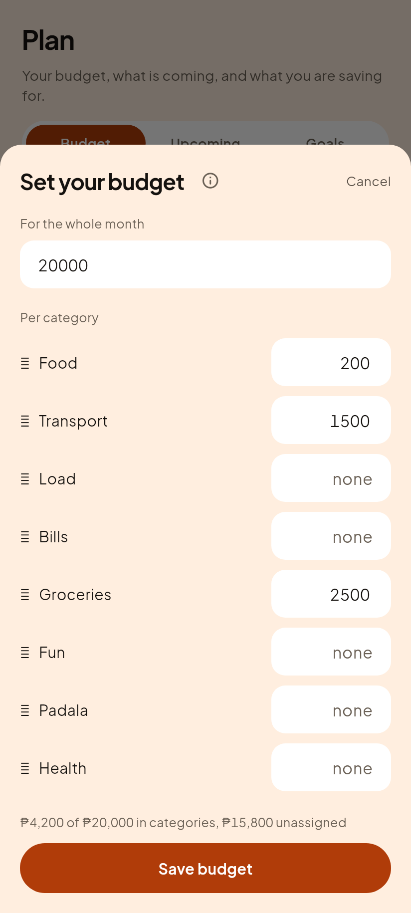
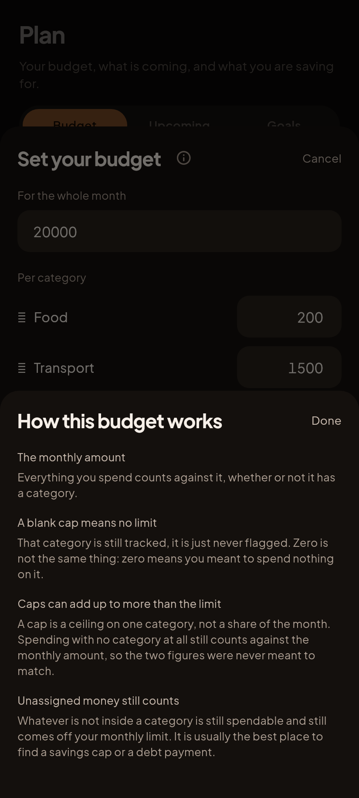
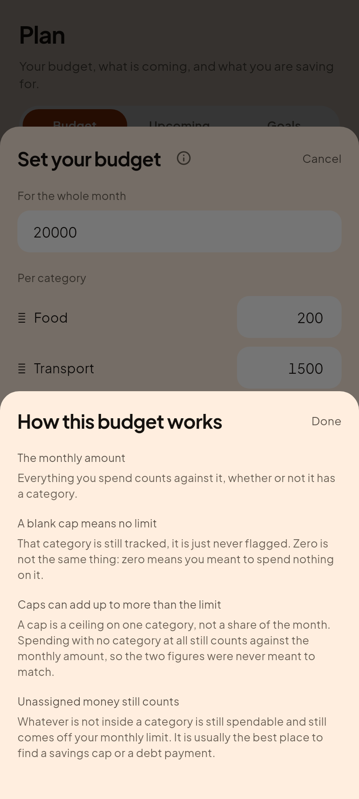

# C7, Upcoming, and a form that stopped lecturing

Gabi (dark) is on the left, because that is what the founder uses.

## Upcoming (roadmap step 6)

| Gabi (dark) | Hapon (light) |
|---|---|
|  |  |

Home answers "what is due before THIS payday". Upcoming answers the next
question a semimonthly earner actually asks: does the sweldo about to arrive
cover what is coming before the one after it.

**It computes nothing.** It calls the golden locked `sweldoTimeline`, which
already knows every hard part: every recurring occurrence in the window with
the day clamped to each month's real length, a bill skipped when its month is
already posted, debt minimums on bank-adjusted dates (a weekend or a PH holiday
pushes payment to the next banking day), and the running balance after each
event with money in ordered before money out within a day. This screen picks
the horizon and drops the empty days.

**The hero is the low point, not a total.** A list of dates says what is
coming. It does not say whether you make it, and that is the question. When the
projection goes under, the sentence says so in words rather than leaving it to
be read off a colour.

**Why two paydays and not thirty days.** A fixed thirty day window cuts the
cycle in half for anyone paid on the 15th and the 30th, and a calendar month
cuts it somewhere different every month. Stopping at the next payday would just
be Home again.

### The guard that matters most here

Home and Upcoming read the same ledger through **two different engines** over
**two different windows**. That is exactly the shape of the Home versus Plan
pacing bug: both correct on their own terms, neither wrong, and no test caught
it because no test had put the two screens in front of one store.

So `upcoming_test.dart` asserts that every bill Home names appears in Upcoming
on the same date for the same peso, and that the list is not empty (an agreement
test over two empty lists agrees perfectly and proves nothing). Proved by
breaking it: dropping bill events produced

    Home says "Meralco" is due on 2026-09-11 and Upcoming has no such day at
    all, so the two screens describe different months

### The fixture gained a sweldo, and that was a real gap

Every recurring row in the lived-in fixture was an expense, so the timeline
marked paydays from the schedule and had nothing to attach to them: **every
payday row showed a date and no money.** That is a real state, and it is what a
new user sees before telling the app what they earn, but it was the ONLY state
the fixture could reach.

Day 15 and not 30, deliberately, so the window now carries **both** shapes: the
15th has a sweldo priced, the 30th is still a bare payday saying so plainly. One
render, both cases, which is the only way to judge the one that is harder to
draw.

It moves nothing already on screen. Home reads bills through
`upcomingCommitments`, which filters to `type == 'expense'`, and `safeToSpend`
never consults income. The full suite passing unchanged is the check on that
claim, not this paragraph.

## The budget sheet stopped lecturing

| Gabi (dark) | Hapon (light) |
|---|---|
|  |  |

Founder direction, looking at the built sheet: *"it is too wordy, we can give
the user the option to view this. Like we can put an 'i' information icon where
the user can see this information?"*

They were right. Three explanatory paragraphs were stacked between the fields,
and somebody who already knows what a budget is had to read past all of them
every time they changed one number. Help that is always on stops being help and
becomes noise. All eight categories now fit without scrolling.

| Gabi (dark) | Hapon (light) |
|---|---|
|  |  |

**What did NOT move behind the icon: the figures.** D21 exists because the thing
this sheet needed to say was set with `setState` and then thrown away in the
same frame, so nobody ever saw it. Hiding the numbers behind an icon would be
that same defect wearing a nicer hat. So the running total kept every peso and
lost only the sentence explaining them:

| Before | After |
|---|---|
| Your categories add up to ₱4,200 of your ₱20,000 monthly limit. The other ₱15,800 is not in any category and still counts against the month. | ₱4,200 of ₱20,000 in categories, ₱15,800 unassigned |

The unassigned figure stays on the form on purpose. A semimonthly earner builds
the monthly limit out of two sweldos, and the remainder nothing is assigned to
is exactly where a savings cap or a debt payment belongs.

The per-row note when one cap exceeds the whole month also stays inline, because
it is contextual rather than always-on: it appears only when it is true.

Its test was updated to match, and the update is the point: it now asserts the
**figures** (`₱54,000`, a total only reachable by actually adding the caps up)
rather than the prose. A test matching the sentence would have gone green on a
sheet that had quietly stopped showing the numbers.
