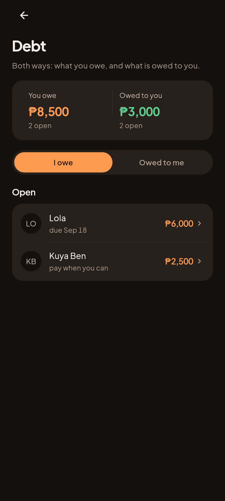
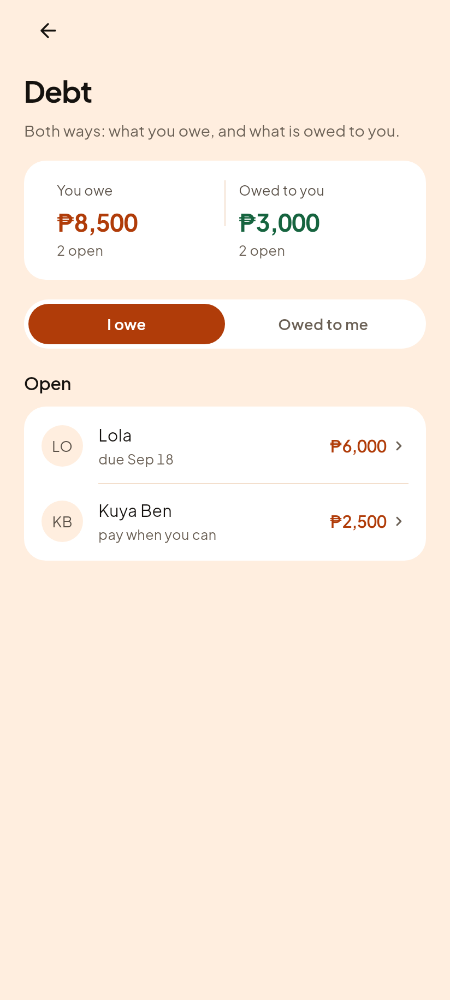
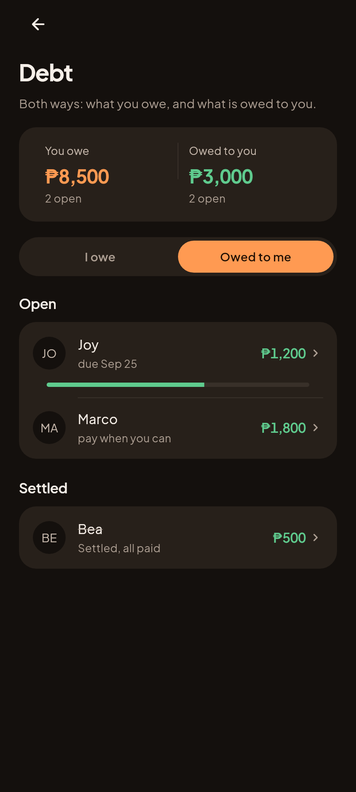
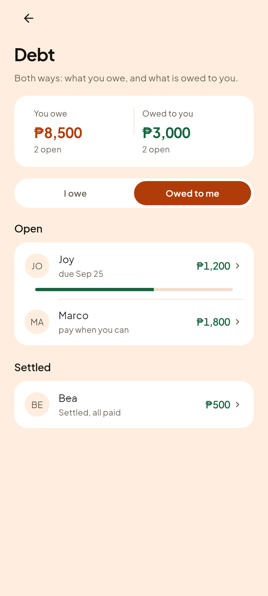
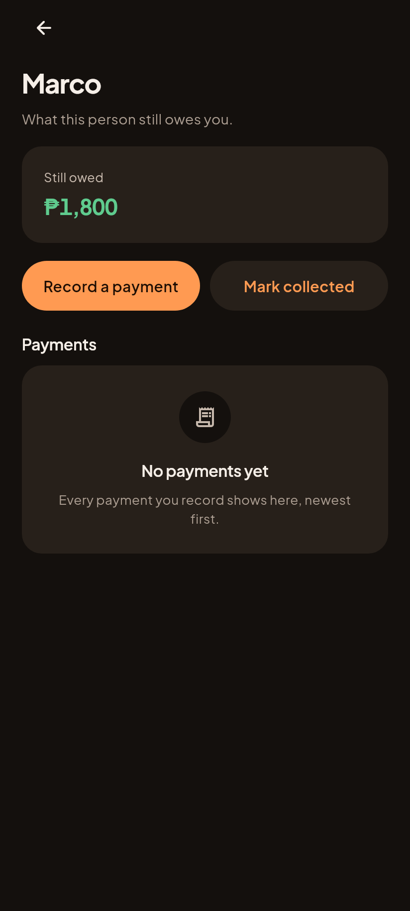
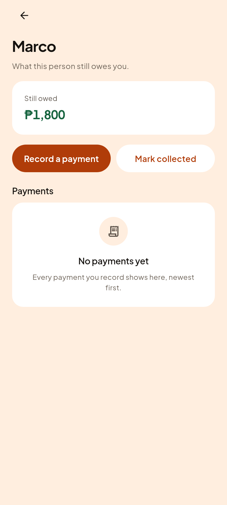
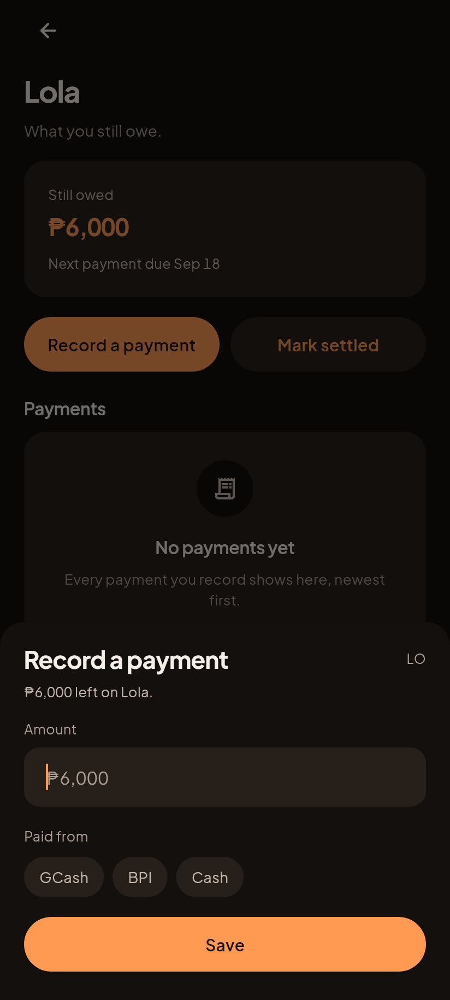
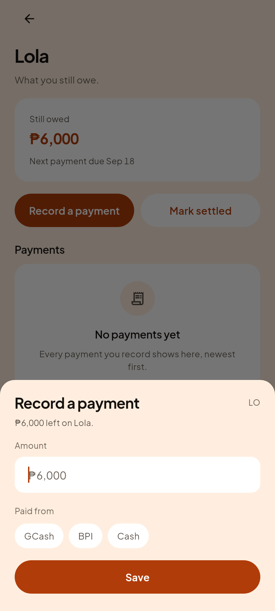

# C8, Debt both ways

Roadmap step 7. What you owe, and what is owed to you, on one screen.

Until this landed, Home showed a "Debt, both ways" card and its Debt button was
wired to nothing: a dead control on the flagship screen.

## The list, I owe

| Gabi (dark) | Hapon (light) |
|---|---|
|  |  |

Lola is a personal loan. Kuya Ben is an informal payable that arrived from an
older backup. The credit card is deliberately absent: it has its own section
under Credit in Accounts, and counting it here as well would show the same card
twice with nothing on either screen saying it was one card.

## The list, owed to me

| Gabi (dark) | Hapon (light) |
|---|---|
|  |  |

Joy has repaid 1,800 of 3,000, so she gets a progress bar and Marco does not.
Bea is settled: struck through, green, and showing what was settled rather than
zero.

## One debt

| Gabi (dark) | Hapon (light) |
|---|---|
|  |  |

## Recording a payment

| Gabi (dark) | Hapon (light) |
|---|---|
|  |  |

**The account picker in that sheet is the most important control in this batch,
and it exists because of a bug that nearly shipped.**

The engine function that records a loan payment, `applyDebtPayment`, debits the
account whose id you hand it and debits **nothing at all** when you hand it
none. The first version of this screen handed it none. The debt would have gone
down, no money would have left any account, and net worth would have risen by
the size of every payment the founder recorded.

Nothing would have crashed. Nothing would have looked wrong. The Debt screen
would have shown a shrinking balance and the founder would simply have been
told they were richer than they were, once per payment, forever.

Two things now stop it. The sheet cannot return an amount without an account,
and "Mark settled" on a loan goes through this same sheet rather than a bare
confirm, so there is no path to clearing a debt that does not say where the
money came from. The guard was proved by disabling it and watching the test go
red with the sentence it was written for: *"the payment saved with no account
chosen, so the debt fell, no money left, and the founder is richer than they
were"*.

## What looking at these pictures caught

Three defects that 500 passing tests did not, which is the whole argument for
the rule:

1. **Every untouched debt drew an empty grey progress bar** under its row, a
   flat line that reads as a loading state or a broken control. A bar needs
   something actually paid, not merely a debt that exists.
2. **A settled row showed PHP 0.** `remaining` is zero by definition once a debt
   is paid, so the row said nothing at all next to a struck-through name. It now
   shows what was settled.
3. **A loan said "No payments yet"** and would have gone on saying it after ten
   payments, because a `debts` row keeps no payment list of its own: the engine
   appends to a separate top level collection. The screen was reading the wrong
   place.

## And one claim of mine that measurement disproved

Joy's caption wrapped onto a second line, orphaning the day number. Shortening
it fixed that at 412dp and not at 320dp, so the next move was to shorten it
again, until the account row's own shipped caption was measured: **"BPI, Savings
account" is also two lines at 320dp.** Captions wrap there throughout the app.
Holding this one screen to a stricter bar would have meant inventing a rule no
other list obeys, on the strength of a number nobody had checked.
