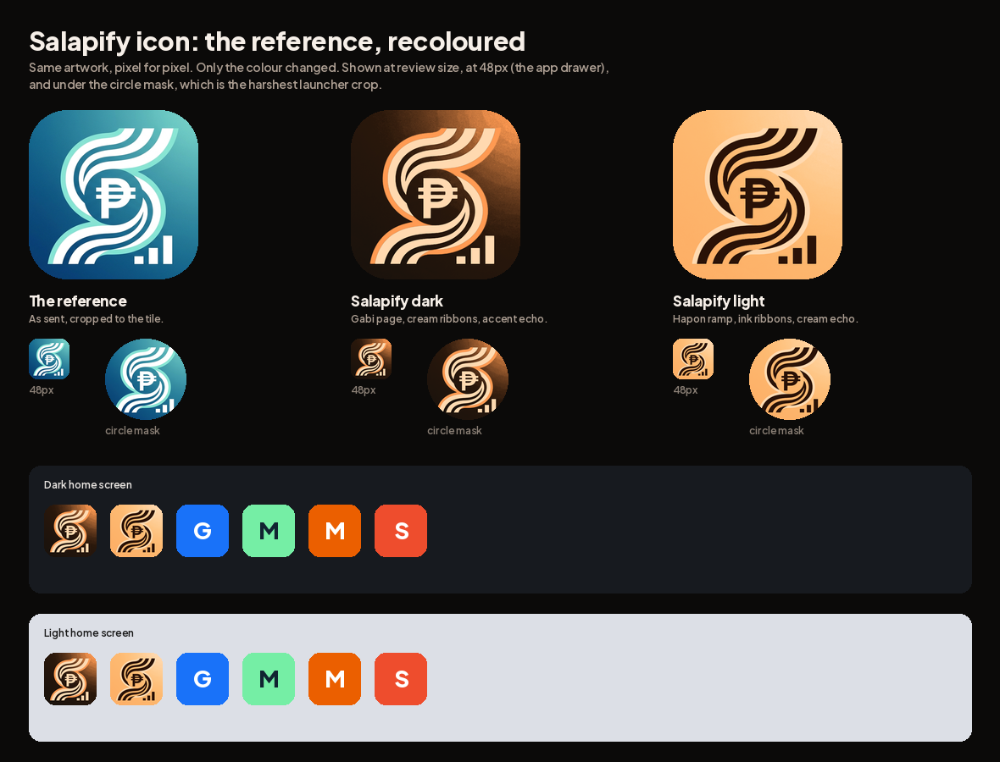
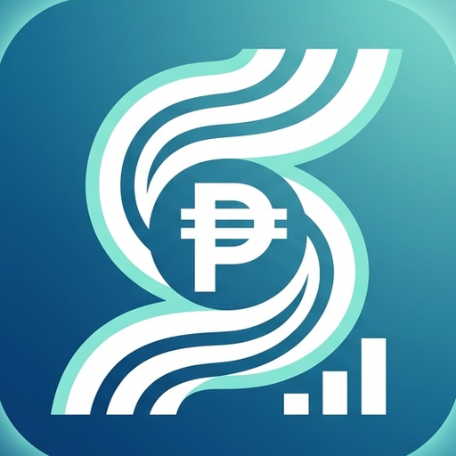
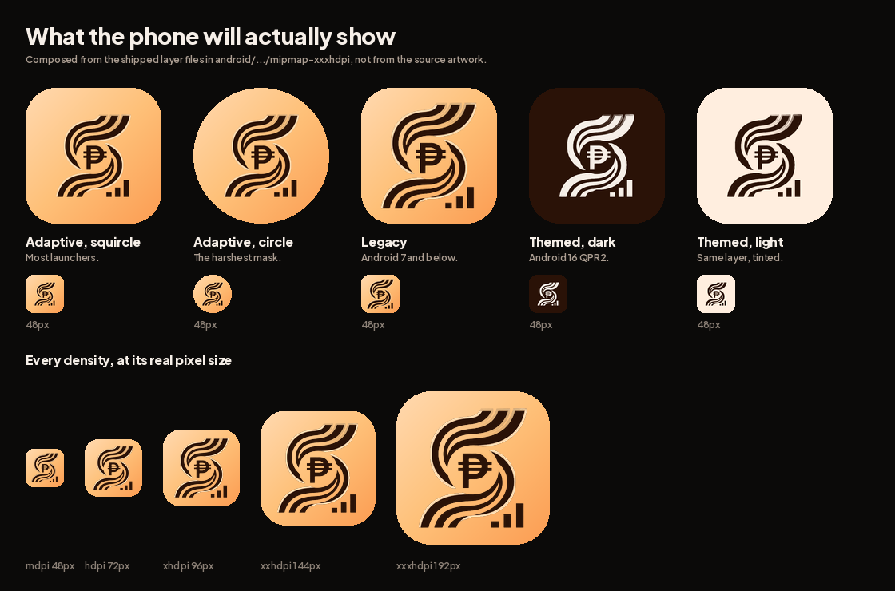

# The Salapify app icon

## Where this landed: the founder's own artwork, recoloured

Founder direction, 2026-09-13, verbatim: **"use the same icon just change the
color. make it the same do not change anything but the colot to fit the theme"**.

So that is what this is. The geometry is untouched, pixel for pixel: the ribbon
S, the peso coin at the letter's waist, the three bar chart in the corner. Only
the colour changed.

| The reference | Salapify dark | Salapify light |
|---|---|---|
|  |  |  |

Both are 512 square, sRGB, and well under Play's 1024KB, so either can go
straight to the store listing.

## How the colour was mapped, and why not a hue rotation

The obvious move is to spin the hue from blue to orange. It does not work here,
and the reason is worth writing down.

The reference separates its three elements **by hue**: deep blue ground, mint
echo, white ribbon. Salapify's palette is monochromatic warm and separates
**by value**: ink at 0.01 relative luminance, accent at 0.45, cream at 0.74, all
at roughly the same hue. Rotating blue to orange sends the mint to pink, which
is not in the theme.

So each element is classified and mapped to its Salapify counterpart, with
anti-aliased pixels blended rather than snapped so no edges fringe:

| Reference | Salapify dark | Salapify light |
|---|---|---|
| deep blue ground | `#14100D` to `#6B2E06`, Gabi's page | `#FB9C52` to `#FEC078`, the hero ramp |
| white ribbon | `#FFD9B0` cream | `#2A1207` ink |
| mint echo | `#FF9A52` accent | `#FFD9B0` cream |

Every one of those is already a token in `app/lib/design/tokens.dart`. No new
colour was invented. `recolour.py` in this folder reproduces both files.

## What the size tests say, honestly

- **48px, the app drawer.** All three, the reference included, are busy at this
  size. The S and the coin still read; the bar chart becomes a smudge and the
  peso becomes a dot. That is the reference's own composition rather than
  anything the recolour did, and it is the one thing worth knowing before this
  ships.
- **The circle mask**, the harshest launcher crop: both survive, and the chart
  in the bottom right is the part that gets clipped.
- **The home screen grid**, against measured competitor colours: the dark tile
  is clearly distinct from everything in the row. The light tile is closer to
  MariBank and Shopee in hue but far apart in value, so it still separates. That
  value gap is the real asset: Salapify's deepest ramp stop has a relative
  luminance of 0.449 against MariBank's 0.258 and Shopee's 0.237.

## One thing to decide before it ships

The peso glyph is the most documented visual cue of the Philippine quick cash
lending category, and Salapify must never be filed under that. The founder's
reference has one, and it is kept here because the direction was explicit. It is
flagged, not argued: worth a second look before the store listing goes live, and
easy to drop later since it is one element.

## DECIDED: light. And it is built.

Founder chose the light version, so the real assets exist in the app now.

That picture is composed from **the files the APK actually carries**, not from
the source artwork. A preview made from the source would prove nothing about
what shipped, which is the point of rendering it this way.

### What is in the app

    android/app/src/main/res/
      drawable/ic_launcher_background.xml        the hero ramp, as a VECTOR gradient
      mipmap-anydpi-v26/ic_launcher.xml          background, foreground, monochrome
      mipmap-anydpi-v26/ic_launcher_round.xml    the same, for round launchers
      mipmap-{m,h,xh,xxh,xxxh}dpi/
        ic_launcher.png                          legacy, 48 to 192
        ic_launcher_foreground.png               adaptive foreground, 108 to 432
        ic_launcher_monochrome.png               themed icon layer, 108 to 432

    docs/revamp/mockups/hapon/icon/play-store-icon.png    512, for the listing

`app/tool/build_icons.py` builds every one of them from the committed reference,
and `app/tool/preview_icons.py` renders the sheet above from the built files.

### Three decisions inside that build worth knowing

**The background is a vector, not a bitmap.** The launcher scales and
parallax-shifts the background independently of the foreground, so a bitmap gets
resampled at sizes it was never exported for. A gradient the system draws is
sharp at every density and weighs nothing. Its three stops are byte identical to
`heroGradient` in `app/lib/design/tokens.dart`, and a test fails if they drift.

**The foreground is scaled to 0.61, which is the exact limit rather than a
comfortable guess.** The mark is taller than it is wide, so its extreme points
are top and bottom centre. At xxxhdpi that is 432 x 0.61 / 2 = 132 from centre,
and the guaranteed circle's radius is 33/108 x 432 = 132. The first build used
0.58 and the preview showed why not to: the mark sat in a lake of empty ramp.

**The monochrome layer is authored, not left to the system.** Android 16 QPR2
forces themed icons and apps cannot opt out; where no monochrome layer is
supplied the system invents one from the artwork and nobody chose what it looks
like. Both tints are in the sheet above.

### The one thing that took real work

Separating the mark from the ground has to happen on the **original** reference,
not the recoloured one. In the light recolour the mark is ink and the ground is
the ramp, but the cream echo and the light ground are too close in value for any
threshold to split them. In the original they are different hues.

Except for one pixel-exact collision: the reference's own backdrop glow bleeds
inside the tile at the top right and measures `#8BE7D9`, which is the same
colour as the mint echo. No hue or saturation threshold can keep one and drop
the other, and the first build put a dark ink cloud in that corner. The echo is
separated by **position** instead, since it only ever runs alongside a ribbon
and the glow never does: the ribbon mask is dilated by six pixels and used as a
gate.

### The guard

`app/test/design/icon_assets_test.dart` checks every density carries every
layer at the right pixel size, that both adaptive XMLs declare all three layers
including monochrome, that the background still holds the hero ramp's exact
stops, and that the manifest points at both the square and the round icon.

A missing density is invisible without it: Android silently upscales the nearest
one, so the only symptom is a slightly soft icon on one class of phone, which
nobody reports. Both halves were proven by breaking them on purpose:

    Missing android/.../mipmap-hdpi/ic_launcher_monochrome.png. Android would
    silently upscale a neighbouring density and only that class of phone would
    look wrong. Run: python3 tool/build_icons.py

    ic_launcher has no monochrome layer, so Android will generate a themed icon
    from the artwork and the result is not ours to predict

### Still to do before the store

- Play masks the listing icon at **30 percent** and adds its own drop shadow, so
  `play-store-icon.png` is a full square with no rounded corners and no shadow
  of its own. That is correct as built; it just needs uploading.
- This is a **native change**. It needs a real build to reach a phone, which
  Phase B does not do yet, so nothing about it is live anywhere.

## The four rounds before this

Kept short, because the direction above supersedes all of them.

1. Six flat symbols centred on plain tiles. All rejected: one idea, six times.
2. Eleven references, eight compositional devices. Rejected with "make it
   related to Salapify or Pan atleast".
3. Seven directions from Salapify's own material. The founder picked **Buto**, a
   coffee bean whose crease is an S. This round also found what Pan actually is
   (a panda cradling a cup of **kapeng Barako**), which is why the palette is
   warm: the theme system is named after coffee.
4. Five refinements of Buto, answering "the S is too hidden". Green and
   delivered, and superseded by the reference above.

Two findings from those rounds still bind and are kept here because they cost
real time to learn:

- **Never clear a shape with `BlendMode.clear` in single layer icon artwork.**
  It does not reveal what is underneath, it punches a hole through the whole
  tile, so the shape takes the wallpaper's colour: near black on a dark home
  screen, white on a light one. Round three shipped that defect through every
  render and nobody saw it until the two home screens were compared.
- **A contrast ratio is about two flat colours meeting, and a Play tile is not
  two flat colours meeting.** Orange measures 1.61 against Play's white listing
  page, and three rounds concluded from that number that an orange tile loses
  that surface. It does not: Play adds its own drop shadow and the shadow
  supplies the edge the colour does not. Only a near black tile genuinely loses
  a surface, and it is the dark one it loses.

## The vector harness

`app/test/shots/icon_preview.dart` still renders vector candidates at review
size, at 48px, under the circle mask, in both home screen grids and in a Play
search result on both of Play's surfaces:

    cd app
    flutter test test/shots/icon_preview.dart --update-goldens
