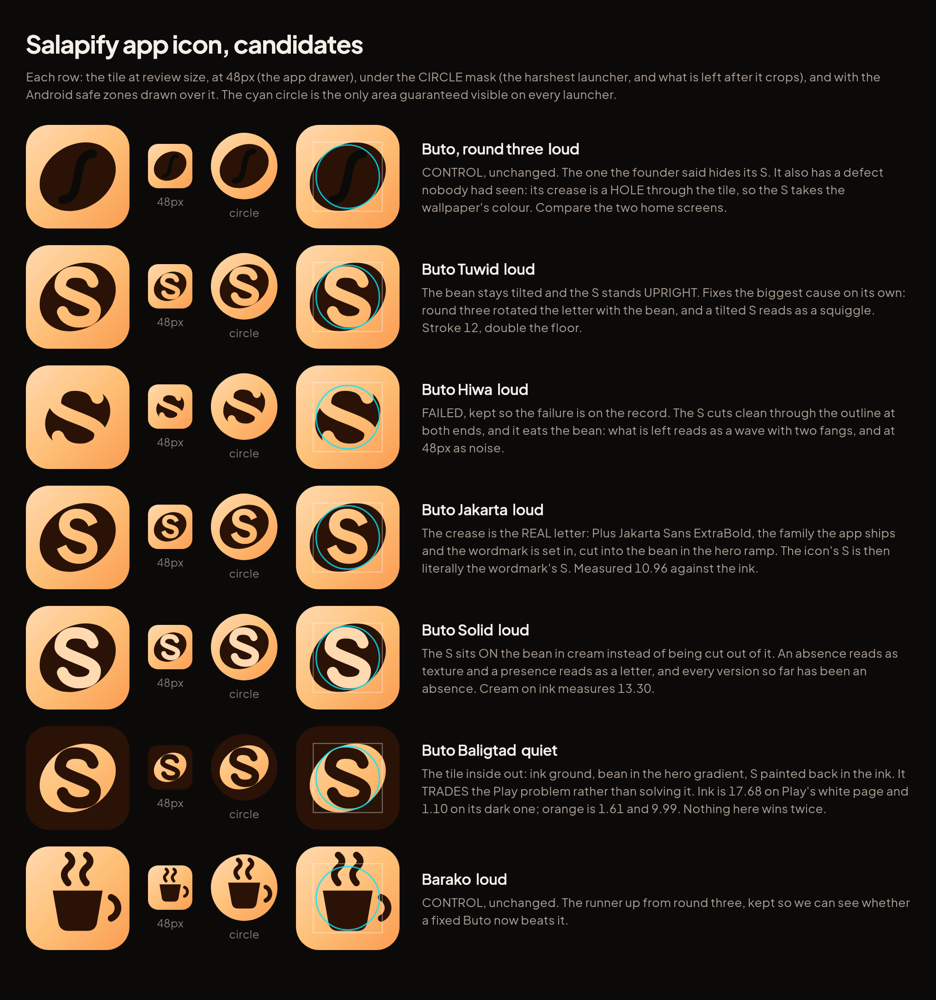
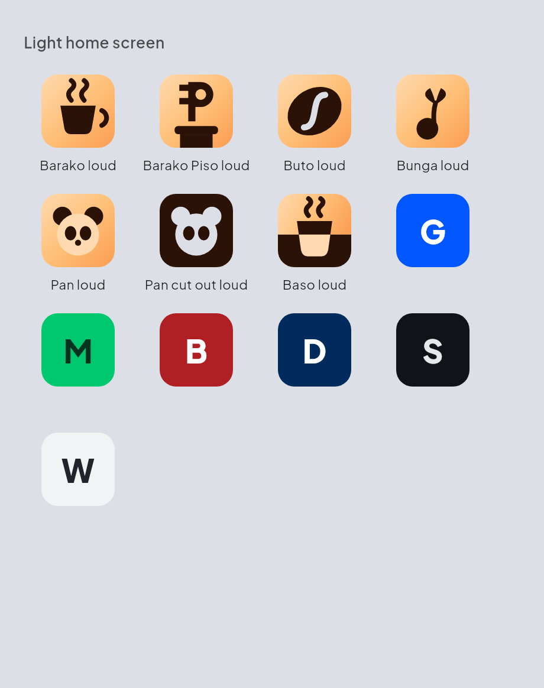
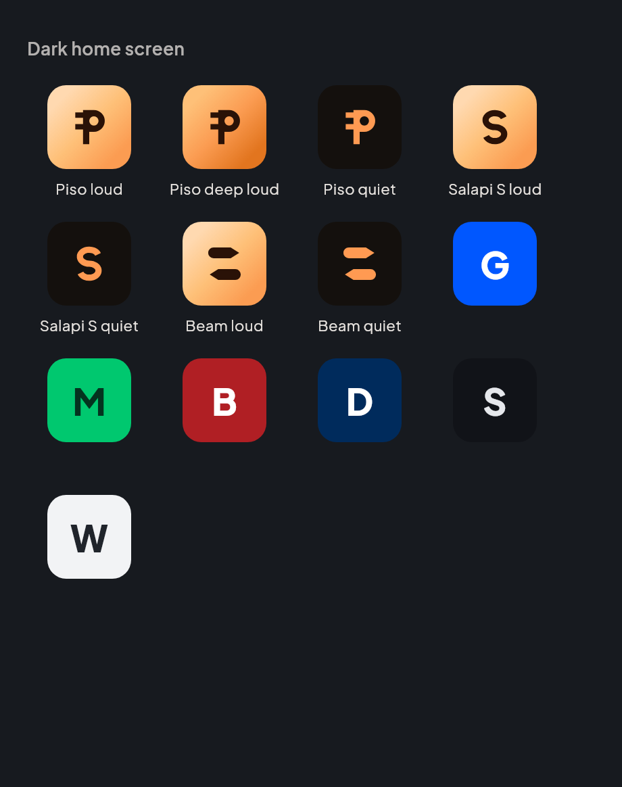
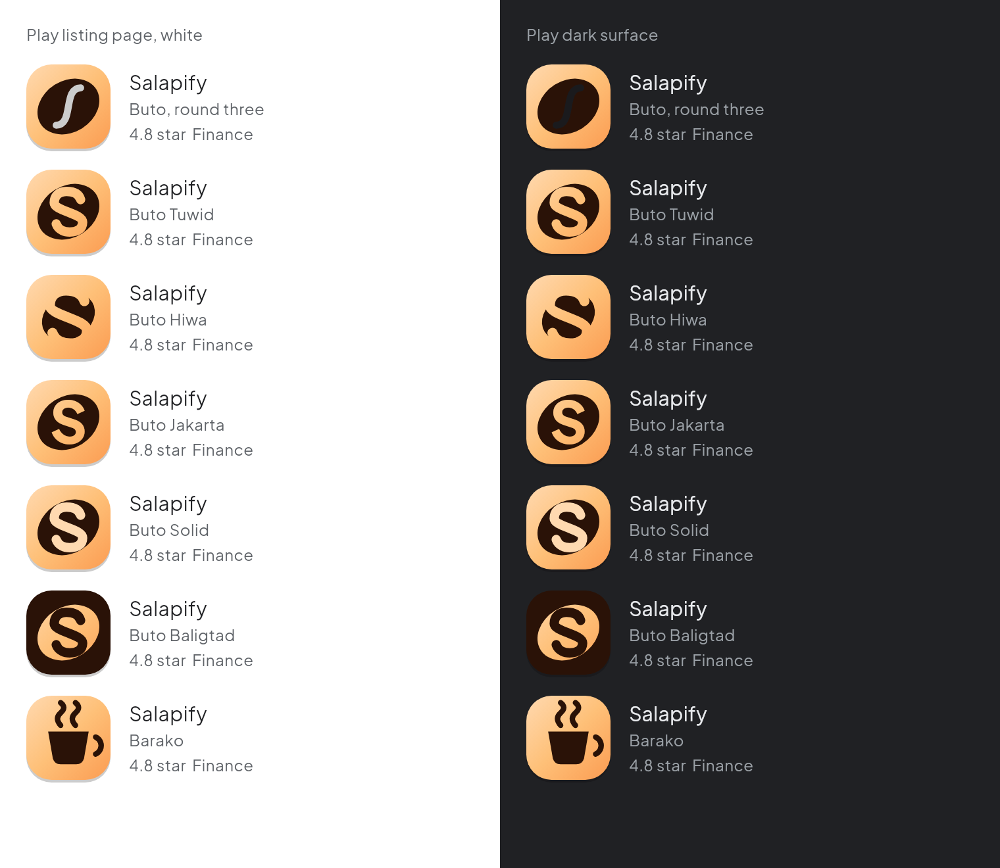

# The Salapify app icon

## There isn't one yet

Verified 2026-09-13. Both the shipped app and the rebuild carry the **stock
Flutter logo**, byte for byte identical across all five mipmap densities, and
neither has an adaptive icon.

## Where the direction landed

**Round one** was six candidates and the founder rejected all of them. The
honest fault: all six were the SAME IDEA, a flat symbol centred on a plain
tile. Part of that was imagination and part was the harness, which could only
draw a mark ON a ground, so negative space and layering were not rejected, they
were unavailable.

**Round two** fixed the composition problem. Eleven real references studied for
their compositional DEVICE, eight genuinely different directions. The founder's
answer was the note both rounds deserved: *"make it related to Salapify or Pan
atleast."*

**Round three** went and found out what Pan actually is. From
`flutter/lib/widgets/pan_mascot.dart`, Pan is a chibi panda "who cradles his cup
of **kapeng Barako**, with a **peso sign rising in the steam** and a
coffee-cherry sprout on his head." That sentence explains something the revamp
docs never wrote down: **the warm orange palette is coffee.** The theme system
is named Barako, after Philippine coffee. Seven directions came out of it, and
the founder picked one with one note:

> **"Buto but the S is too hidden."**

**Round four, below, is that one note.** Buto only, plus two controls.

## Round four

| Light home screen | Dark home screen |
|---|---|
|  |  |

### The Play search result, on both of Play's surfaces

This view is new, and it immediately corrected something this page had been
repeating for three rounds. The measurement is real: orange is **1.61** against
Play's white listing page. The conclusion drawn from it, that an orange tile
therefore loses that surface, is **wrong**, because Play adds its own drop
shadow to every listing icon and that shadow supplies the edge the colour does
not. Rendered with the shadow, the orange tiles hold the white page perfectly
well. The dark tile really does lose the dark surface, exactly as measured.

The lesson is worth more than the finding: a contrast number is about two flat
colours meeting, and Play's tile is not two flat colours meeting. Three rounds
of reasoning rested on a number nobody had drawn.

The candidate sheet also gained a **circle mask** column, the harshest launcher
crop, showing what is actually left rather than where the crop would fall. The
safe-zone overlay predicts; this one shows. Barako loses its handle to it.

## Why the S was hidden

Read off the round three render rather than guessed. Four causes, and they
compounded:

1. **The crease was rotated with the bean.** The same 32 degree matrix was
   applied to both, so the letter was tilted off its own axis. A tilted S stops
   being parsed as a letter and becomes a squiggle. The biggest single cause.
2. **The curve was one shallow cubic.** An S needs two real bowls and hooked
   terminals. A wave is not an S.
3. **The stroke was 9 units** against a bean 84 wide. Barely over the 6 unit
   floor, so it read as a thin slot in a large mass.
4. **Both terminals stopped inside the bean**, so it read as an enclosed slit
   rather than a stroke that shapes the form.

Contrast was never one of them.

## And a fifth cause the render found

The crease was **cleared** with `BlendMode.clear`, which does not reveal the
gradient underneath. It punches a **hole through the entire tile**, so the S
takes the colour of whatever is behind the icon. The same artwork therefore
showed a near black S on a dark home screen and a white one on a light one, and
the dark case is precisely the one that hides it. An adaptive icon's background
layer would catch such a hole, but this artwork is one layer, so a launcher
would show wallpaper through it.

Every refinement below **paints** the S instead. The tile is opaque everywhere
and looks identical on both wallpapers, which the two home screen renders now
show. The round three control still has the hole, deliberately, so the
difference is visible rather than described.

## What the renders say, honestly

### Buto Jakarta, the recommendation

The crease is the **real letter**: Plus Jakarta Sans ExtraBold, the family the
app ships and the wordmark is set in, cut into the bean in the hero ramp. It is
the cleanest letterform of the five because it was drawn by a type designer
rather than by hand, it still reads as a bean with a crease rather than a badge
with a monogram, and the icon's S is then literally the wordmark's S. Measured
**10.96** against the ink. Holds at 48px.

### The two that also work

**Buto Solid.** The S sits ON the bean in cream instead of being cut out of it,
and it is the loudest and most legible of the five. An absence reads as texture
and a presence reads as a letter. Cream on ink measures **13.30**. The cost is
that the bean stops reading as a bean and becomes a dark badge behind a
monogram, so it wins on legibility and loses the coffee story.

**Buto Baligtad.** Ink ground, bean in the hero gradient, S painted back in the
ink. Reads well and is the only dark tile. It **trades** the Play problem rather
than solving it, though, and the numbers say so: ink is 17.68 against Play's
white listing page and 1.10 against its dark surface, while orange is 1.61 and
9.99. Nothing here wins twice. It also lands close to the plain dark neighbour
tile in the home screen grid.

### The one that improved but is not there

**Buto Tuwid.** Upright S, stroke 12, groove painted in the ramp. It fixes the
founder's note on its own and proves cause 1 was the main one. Next to Jakarta
though, the hand-drawn letter is visibly less resolved.

### The one that failed

**Buto Hiwa.** The S was meant to cut clean through the outline at both ends so
the bean became two interlocking halves. It eats the bean instead. What is left
reads as a wave with two fangs, and at 48px it is noise. Kept in the sheet so
the failure is on the record.

### The control

**Barako**, the runner up from round three, unchanged. Still a good icon. The
question the sheet answers is whether a fixed Buto beats it, and at 48px and in
the home grid it now does: Buto is one shape where Barako is four, and one
shape survives shrinking better.

## The measurements that still bind

- Ink `#2A1207` against the hero ramp: **13.30** on the cream stop, **10.96** on
  the mid, **8.40** on the deep. All far past the bar.
- Two hero-ramp tones cannot be told apart: `#FFD9B0` on `#FB9C52` is **1.58**,
  under the 3.0 bar. Ink stays near black, and cream can never sit on orange.
- A one-value tile cannot hold an edge on both Play surfaces. Only a split tile
  does, and no Buto variant is one.
- The 48px floor: 108 units at 0.667px each, so **nothing thinner than 6 units
  and no gap under 6**. Every stroke here is 12 or 13.
- The S sits inside the guaranteed circle: height 52 plus a 12 stroke reaches 32
  units from centre, and the circle is 33.
- Play: 512 square, submitted flat, because Play masks at **30%** and adds its
  own shadow.

## How these are made

    cd app
    flutter test test/shots/icon_preview.dart --update-goldens
