# Pan on the empty states: reference renders

Target look for Phase 1 of [pan-handoff.md](../../pan-handoff.md).

These are **reference pictures, not the app.** They were rebuilt in HTML from
the real values in `app/lib/design/` (`tokens.dart`, `type.dart`, `kit.dart`)
and the copy in each screen file, then rendered with Plus Jakarta Sans at 3x.
The "before" column matches the committed Salapify 3 reference in
`docs/revamp/mockups/hapon/c1/`. Icons are close stand-ins for the Material
glyphs, so judge layout and Pan, not icon shapes.

When Phase 1 is built, the real renders from `test/shots/screens_shot.dart`
replace this page as the evidence.

## What the change is

- `EmptyState` gains an optional Pan. When set, a **96 x 96** Pan replaces the
  52 icon disc. The gap below him is 10 instead of 16, because the art has its
  own air at the top.
- Title, body, card, padding and the button underneath are unchanged.

## Dark (Gabi), before and after

| Screen | Before | After | Pan |
|---|---|---|---|
| Home | 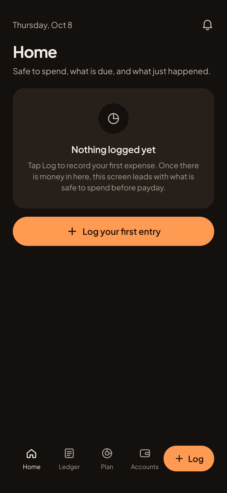 | 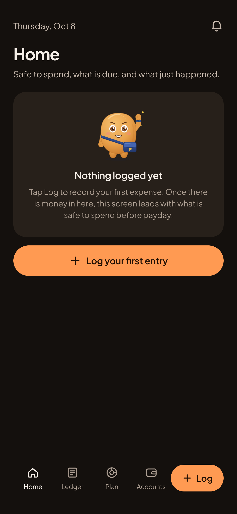 | wave |
| Ledger | 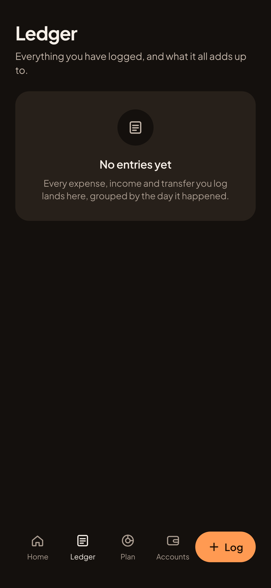 | 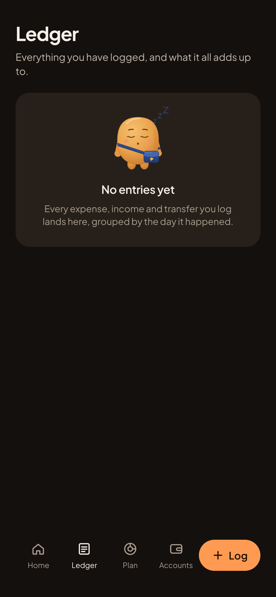 | sleep |
| Plan, Budget | 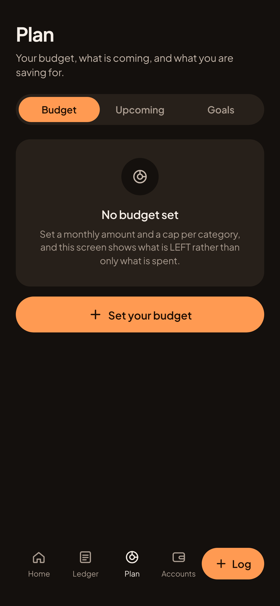 | 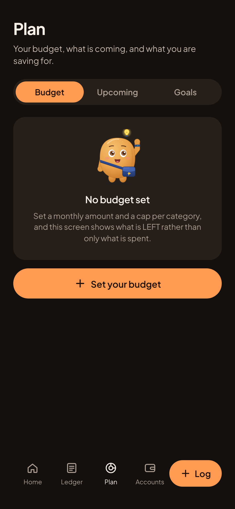 | idea |
| Plan, Goals | 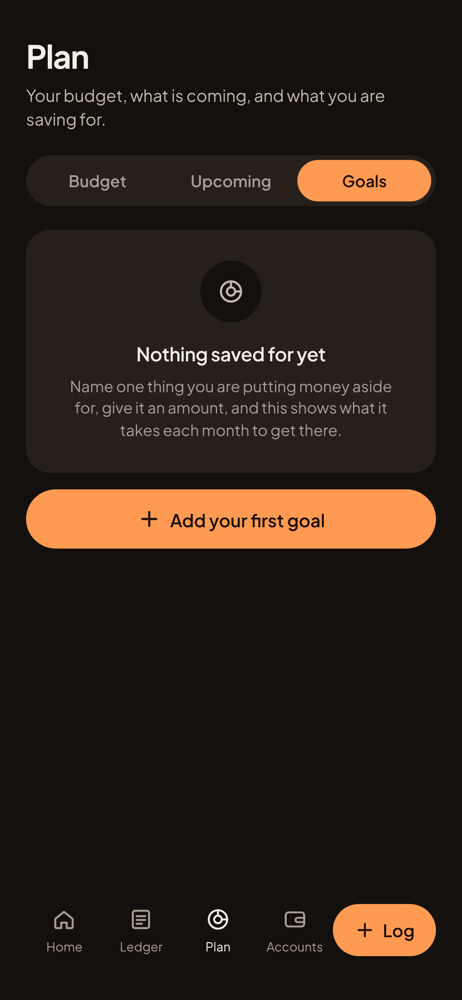 | 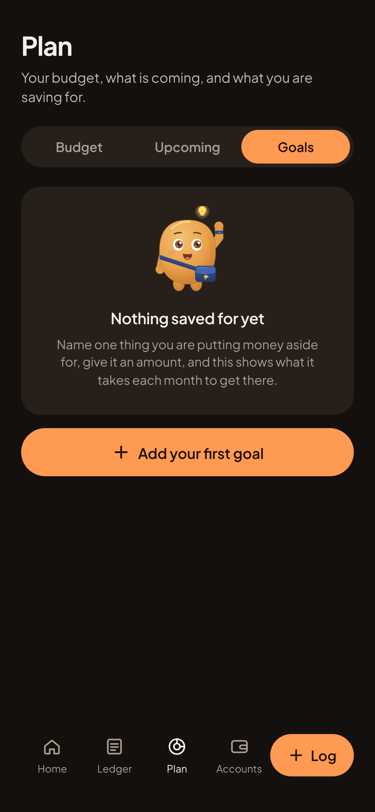 | idea |
| Accounts | 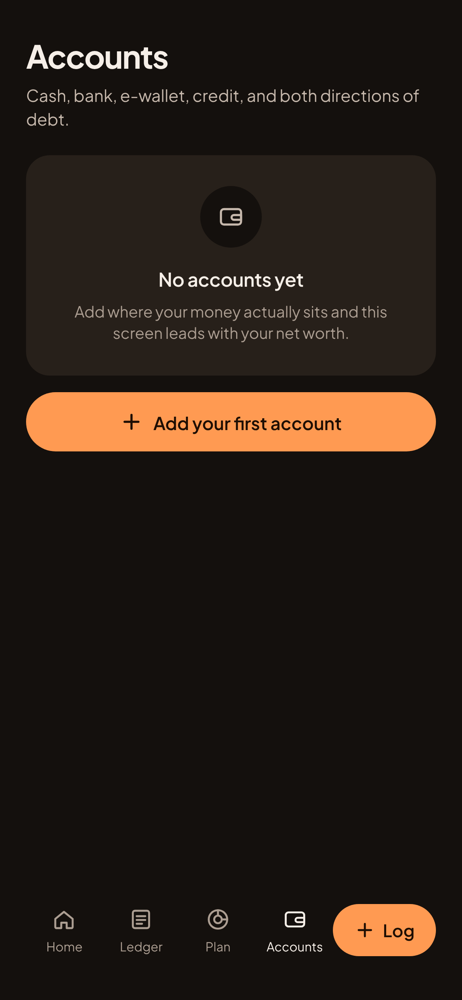 | 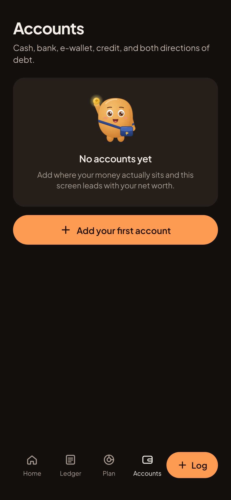 | coin |
| Debt |  | 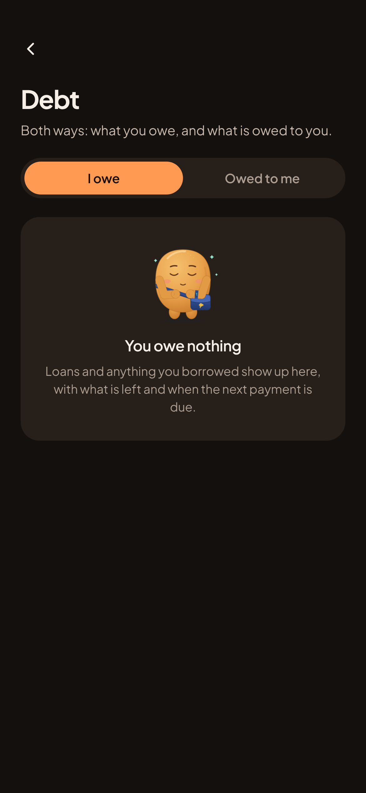 | calm |
| Insights |  |  | thinking |

## Light (Hapon), after

| Home | Ledger | Plan, Budget | Accounts |
|---|---|---|---|
| 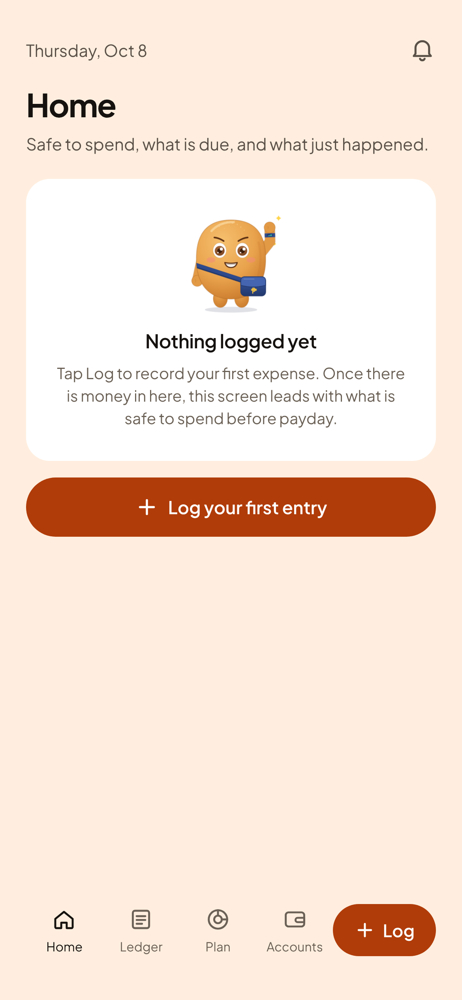 | 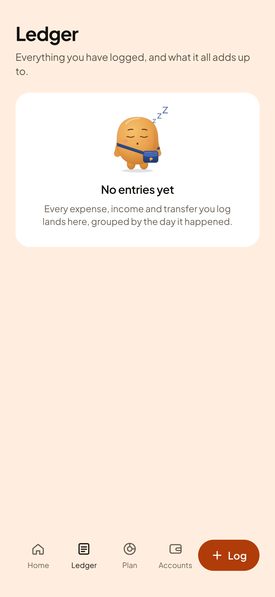 | 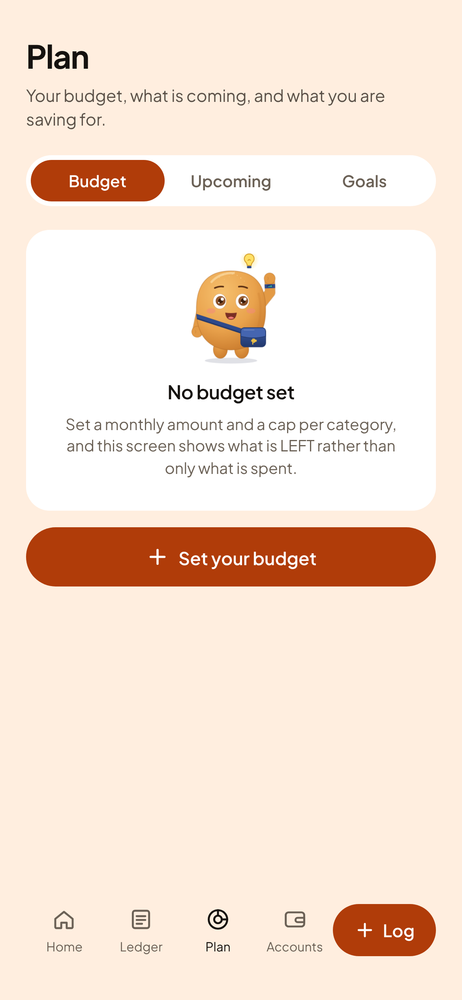 | 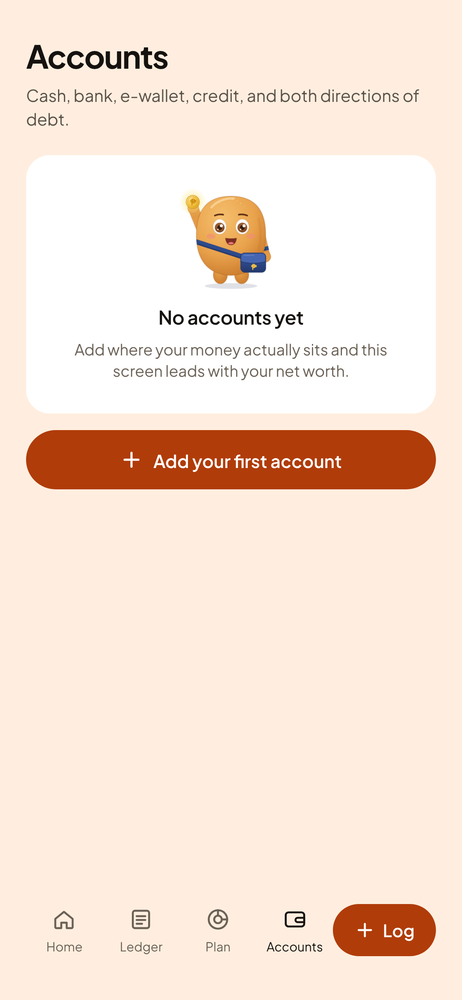 |

| Plan, Goals | Debt | Insights |
|---|---|---|
| 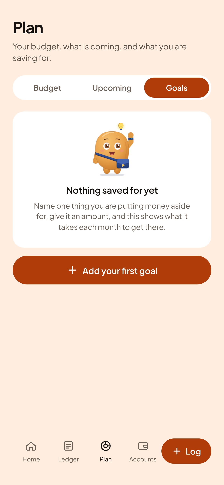 | 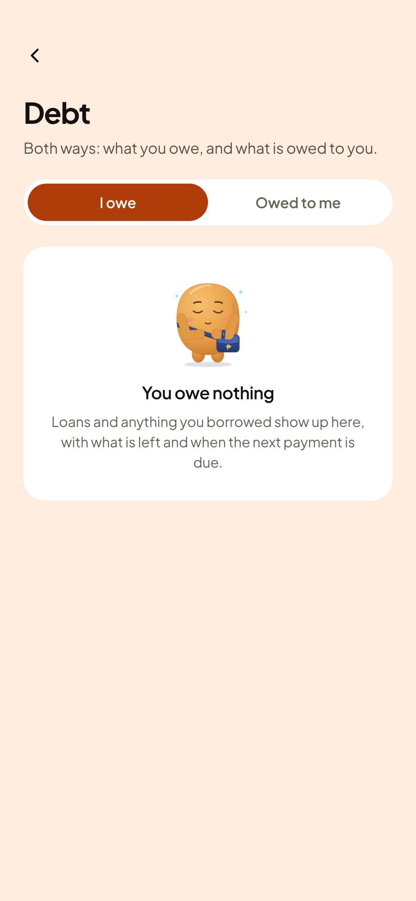 | 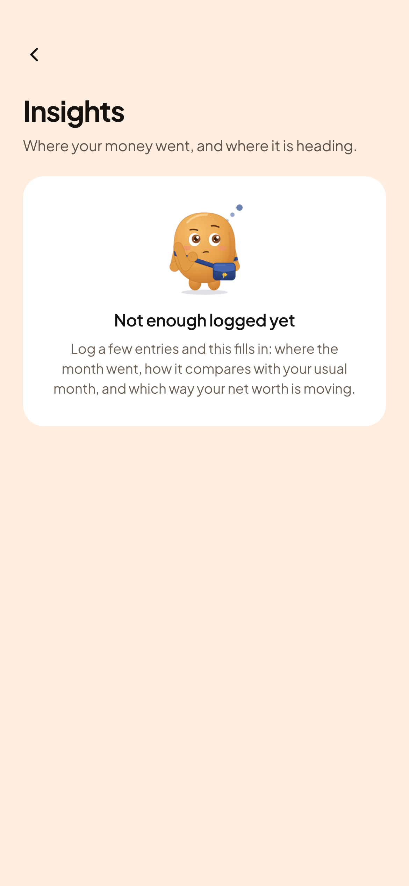 |

## Motion, Phase 2

Spec: [pan-motion.md](../../pan-motion.md). Open
[motion-preview.html](motion-preview.html) in a browser from a checkout of
the repo to watch every mood move with the real images.

Home entrance, frozen at set times:

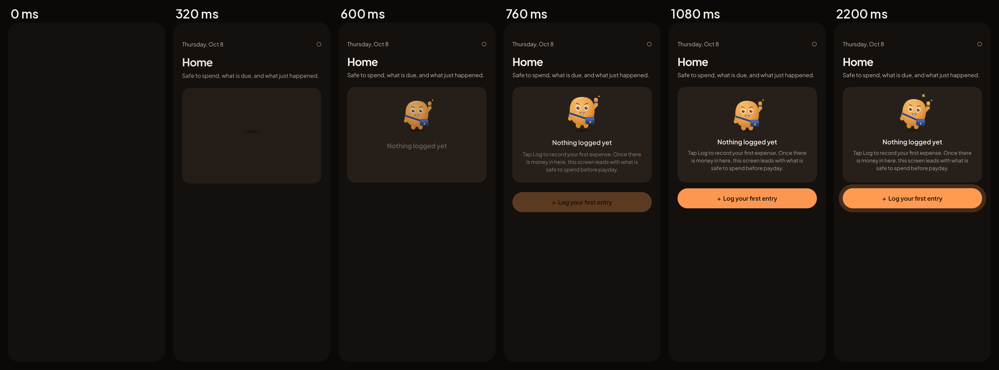

All six moods mid-idle:

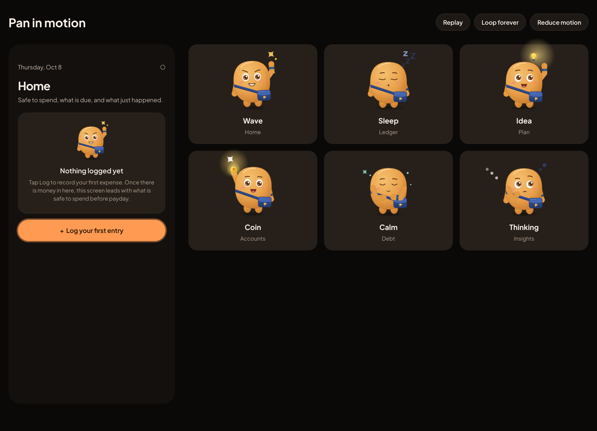

## Not shown on purpose

The other Upcoming and category-limit empty states, plus error and "not found"
states, keep their icons in Phase 1.
