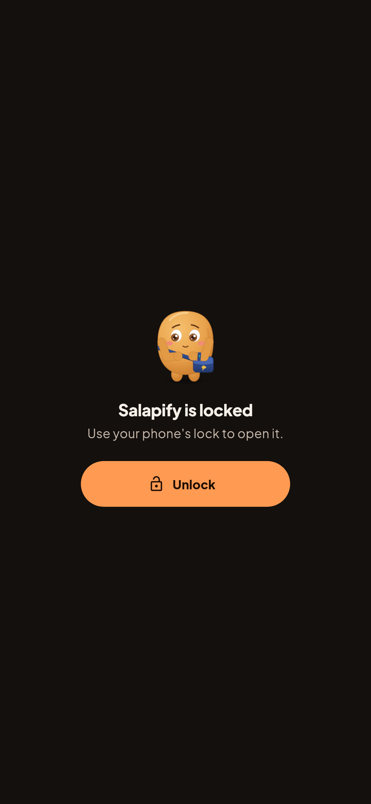
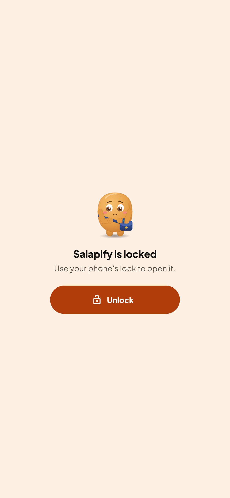
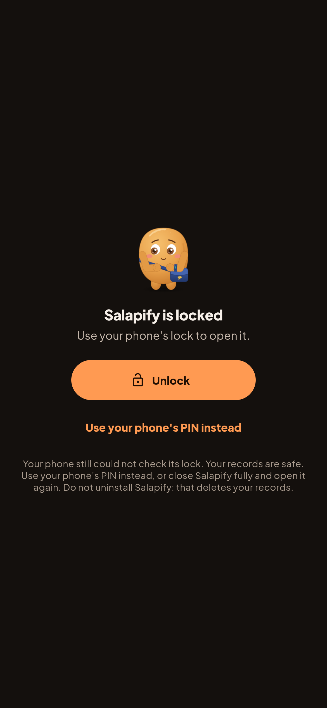
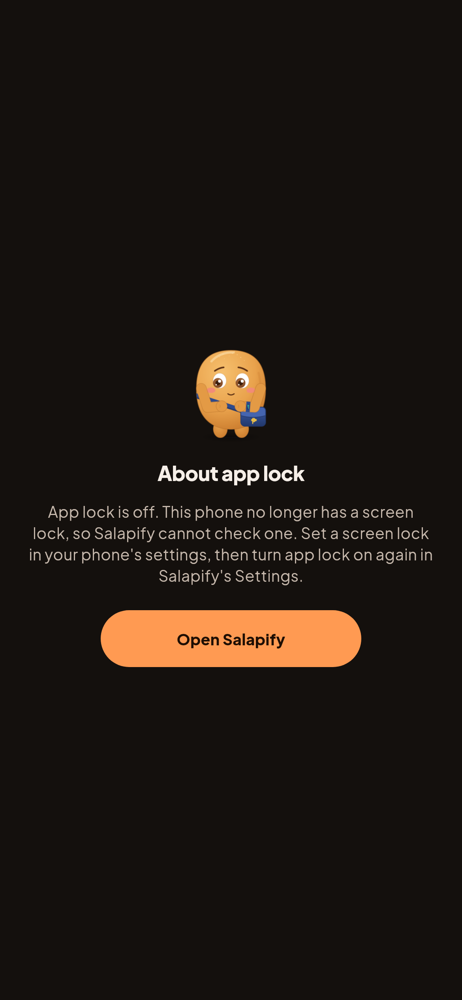
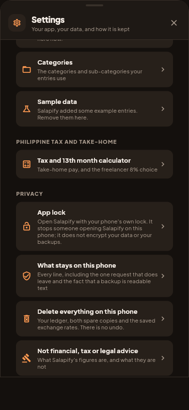
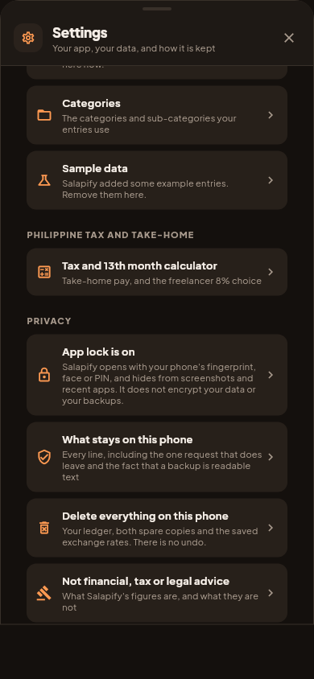

# App lock: real renders

Real renders from `app/test/shots/screens_shot.dart` (`appLockShots`), on the
example data. Review note: [../app-lock.md](../app-lock.md).

## The lock screen, dark (Gabi) and light (Hapon)

Shown after the phone's automatic prompt was backed out of.

| Dark | Light |
|---|---|
|  |  |

## When something goes wrong (dark)

| The phone's prompt failed twice | The phone lost its screen lock |
|---|---|
|  |  |
| A second way in through the phone's own PIN screen, and a warning not to uninstall. | App lock turned itself off so nobody is locked out, and this stays up until it is read. |

## Settings, Privacy

| Off | On |
|---|---|
|  |  |
