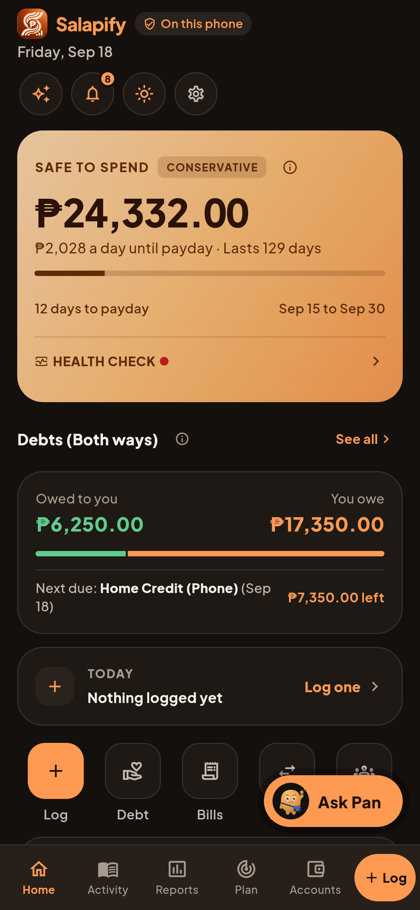
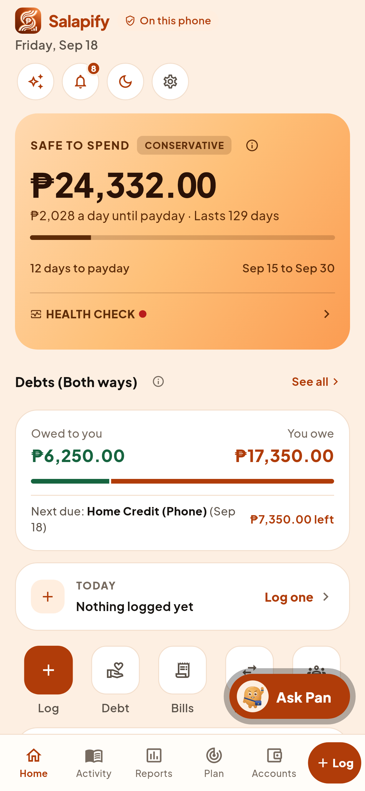
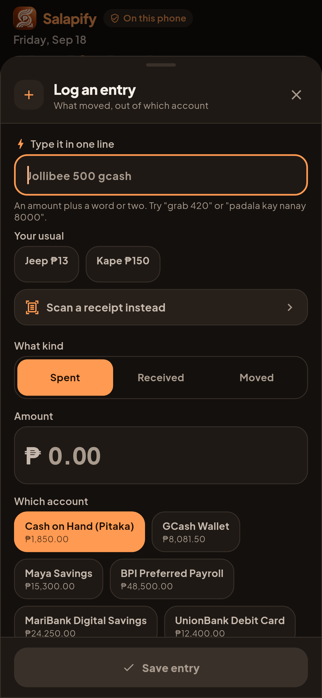
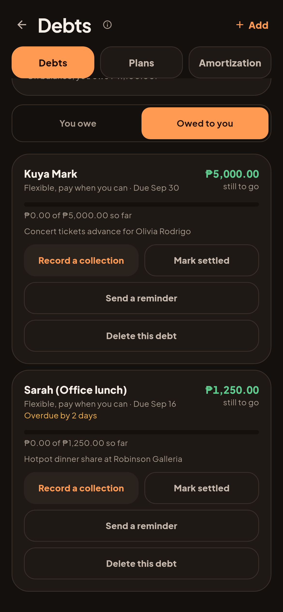
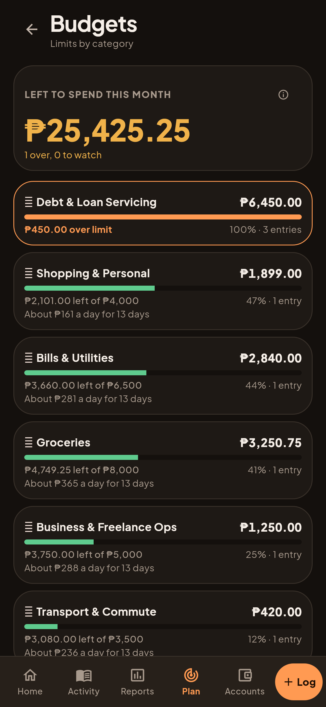

# D31 Batch 1: real renders

From `app/test/shots/screens_shot.dart` (`d31Shots`), on the example data,
dark first. Decisions: `docs/revamp/07-decisions.md`, D31.

| Home: Debt under Safe to Spend, shortcuts moved up | Home, light |
|---|---|
|  |  |

| Log: "Your usual" chips, keyboard up | Debts owed to you: overdue line, Send a reminder | Budgets: a daily figure |
|---|---|---|
|  |  |  |

Known and raised with the founder, not changed: the floating Ask Pan button
covers the Move and Split shortcuts while Home is scrolled to the top.
