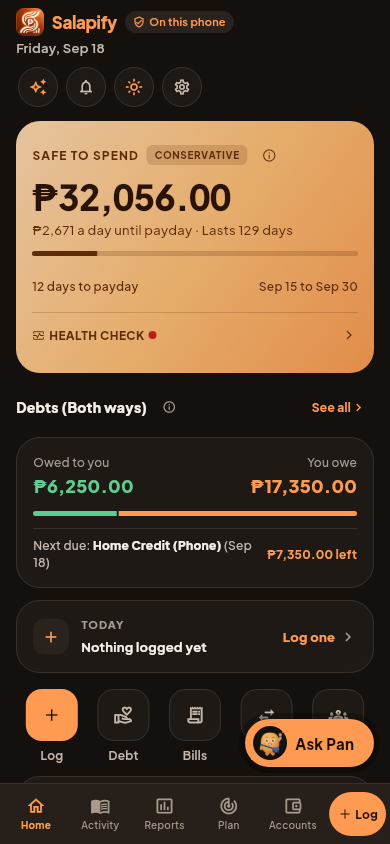
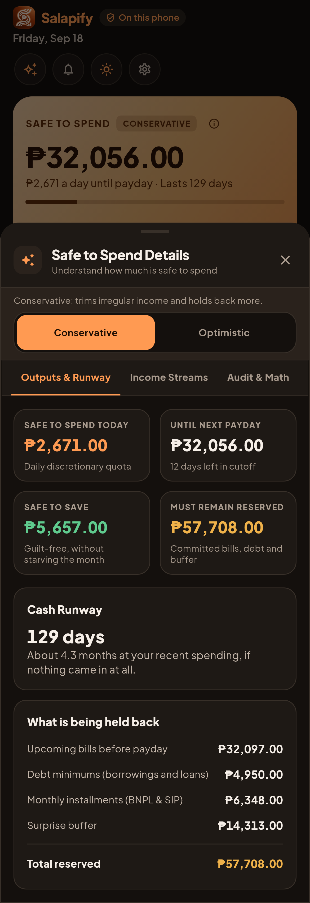
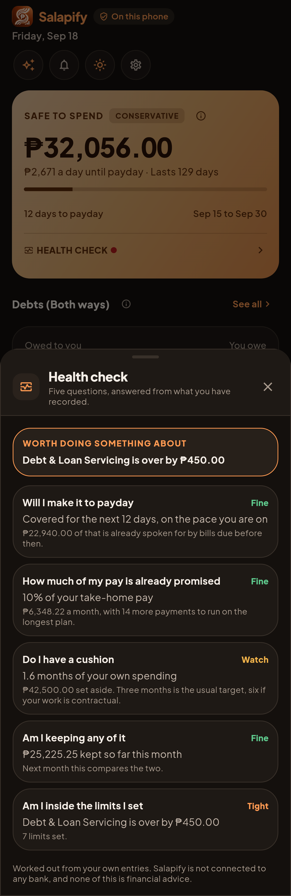
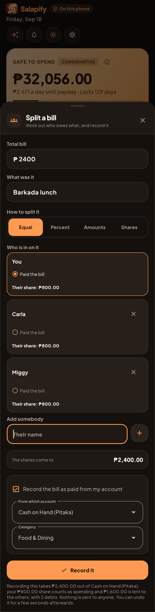
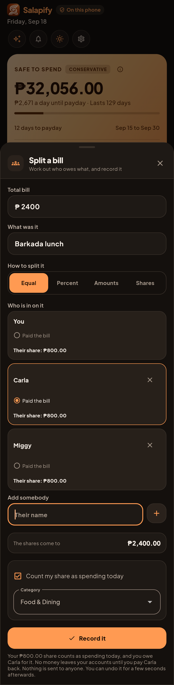
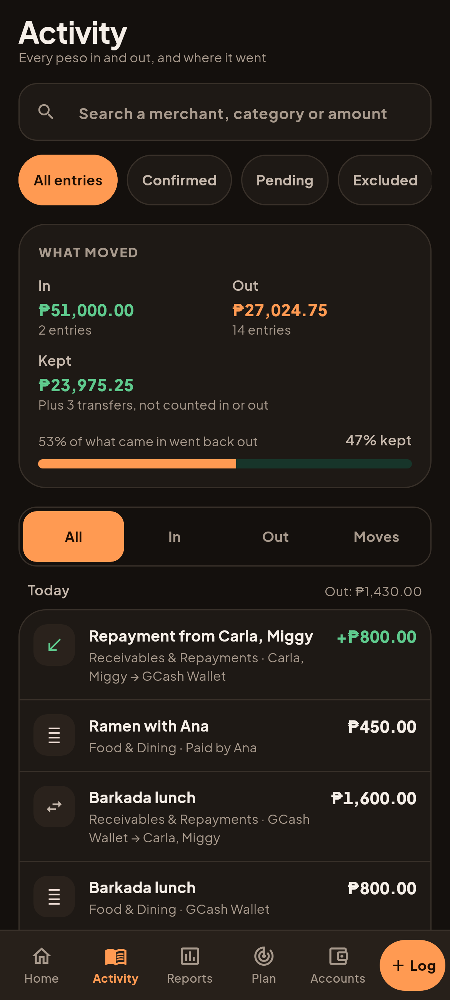

# D32 and D33: which bills Safe to Spend holds back

Dark, the example ledger on Friday, September 18, payday in 12 days.

| Home | Safe to Spend breakdown | Health check |
| --- | --- | --- |
|  |  |  |

How the figures tie:

- Safe to Spend 32,056. It was 24,332 before D32. D32 added the unpaid Spotify on
  the Bills screen (minus 224). D33 let the 8,500 tuition due October 5 wait for the
  next cycle (plus 7,948).
- "Upcoming bills before payday" 32,097 is 29,179 of bills, padded by a tenth
  in the careful scenario.
- The health check's 22,940 "due before payday" is the same bills minus the
  overdue 6,000 remittance and the 239 Spotify whose date reads "Sunday".
  Safe to Spend still holds both back, because both are still owed.

## D32.2, D34, D35: a split counts only your share

| You paid | A friend paid | Activity afterwards |
| --- | --- | --- |
|  |  |  |

- You paid 2,400 for three: 2,400 leaves the account, 800 is your spending,
  1,600 is lent to the others.
- A friend paid: your 800 is spending today, no account moves, and paying the
  friend back later is not spending again.
- In Activity a friend's repayment reads as money in from them, money lent
  reads as leaving for them, and a share a friend paid reads "Paid by Ana".
