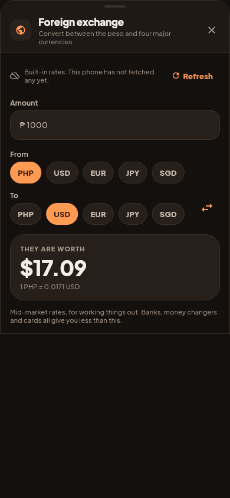

# Live FX rates: the app's first network call

Founder direction, 2026-09-19, verbatim: "Live rates for FX converter, suggest
reliable API and implement. Lets fix the data privacy later on. Lets build
first freely, we are not yet launching it in app store."

This file exists so the "later on" half is written down somewhere it will be
found, rather than rediscovered in a Play rejection.

## The API, and why

**`https://open.er-api.com/v6/latest/PHP`**, which is what the prototype
already uses (`src/components/PhilippineFeaturesModal.tsx`).

The decisive argument is that it needs **no API key**. A key is a secret to
store, a secret to rotate, a secret to keep out of a public repository, and a
thing that expires at the worst possible moment. An unauthenticated endpoint
has none of those failure modes. Using the prototype's own choice also means
the numbers match rather than merely being close.

The alternatives were checked and all three now require a key:
`exchangerate.host`, Fixer, and OpenExchangeRates.

## What actually leaves the phone

One GET, no key, no account, no identifying header, no body, no cookies. The
server learns that some device asked for today's rates. Nothing about anyone's
money, accounts or entries is sent, and there is nowhere in the request to put
it even by mistake.

## What it changes, and what has to happen before launch

| Now false | Where |
|---|---|
| "Offline Only" | the app's own header badge |
| "There is no account, no server and no network call anywhere in this app" | `lib/main.dart`'s doc comment |
| No network permission in a release build | fixed: `INTERNET` moved into the main manifest |

`android:INTERNET` was in the **debug manifest only**. That is worth noting on
its own: the live fetch would have worked perfectly on the founder's emulator
and failed silently in a real build, which is the sort of gap that gets found
by a user rather than by a test.

**Before the store, three things:**

1. Declare the network call on Play's data safety form.
2. Correct the "Offline Only" badge and `main.dart`'s claim, or scope them
   ("your data stays on this phone" is still true and is the thing people
   actually care about).
3. Decide whether the fetch should be opt-in. It is currently automatic when
   the converter opens.

None of that blocks anything today. All of it blocks the store.

## How it behaves when the network is not there

The converter opens on whatever the device already has and asks the server in
the background. That order is deliberate: the alternative is a spinner where
the answer should be, on a screen somebody opened to convert two numbers, and
an OFW checking a remittance underground has no signal anyway.

| Situation | What happens |
|---|---|
| Fetch succeeds | Live rates, "Updated just now" |
| Fetch fails, cache exists | Cached rates, "Updated 3 days ago" |
| Fetch fails, no cache | Built-in rates, "This phone has not fetched any yet" |
| Response is malformed, or based on a currency other than the peso | Refused. Whatever the app had is kept |
| A rate is zero or negative | That currency is dropped, the rest are used |

**A failure never takes away rates the app already has.** `fetch()` returns
null on every error path and null means "keep what you had".

## The one arithmetic trap, and the test that holds it

The API answers in **units per peso**; the app works in **pesos per unit**. An
inversion that goes missing turns a 58 peso dollar into a 0.017 peso dollar,
which is obviously wrong, or a 0.39 peso yen into a 2.57 peso yen, **which is
not obviously anything** and would overstate an OFW's yen savings by six and a
half times.

Broken once to prove the guard catches it:

    Expected: a numeric value within <0.1> of <58.5>
      Actual: <0.017094>

A pair with no rate returns null rather than falling back to 1. A silent rate
of 1 would report a 1,000 dollar balance as 1,000 pesos: a plausible-looking
number and a 57,500 peso error.

## Mid-market, and it says so

Rates are mid-market. Nobody transacts at them: a bank's remittance rate, a
money changer's board and a card's conversion are all worse, sometimes by
several percent. The disclaimer is **on the screen**, not behind the info dot,
because this is the exception that rule names: silence would let somebody plan
a remittance around a number no counter will give them.

| | |
|---|---|
| Offline, on built-in rates |  |
