# Pan on the empty states: real renders

Real renders from `app/test/shots/screens_shot.dart` (`panEmptyShots`), the
app on the founder's emulator, on a book with the example data cleared. They
replace the HTML reference pictures in `docs/revamp/mockups/pan/` as the
evidence. Review note: [../pan-character.md](../pan-character.md).

Each shot is taken after the idle has finished, so Pan is shown at rest.

## Every screen, dark (Gabi) and light (Hapon)

| Screen | Pan | Dark | Light |
|---|---|---|---|
| Home, first run | wave | 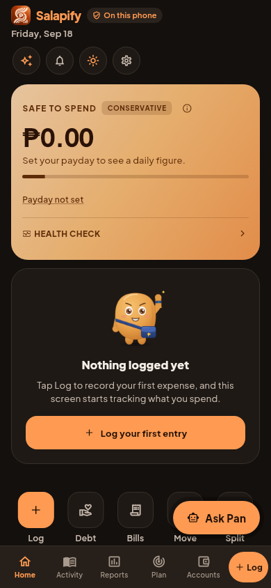 | 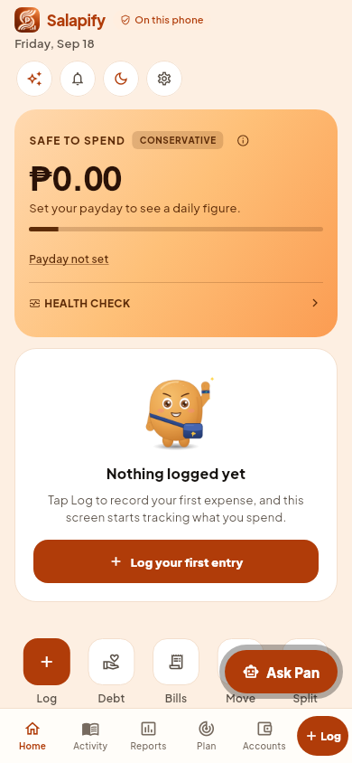 |
| Activity | sleep | 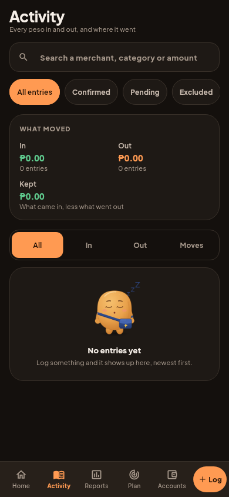 | 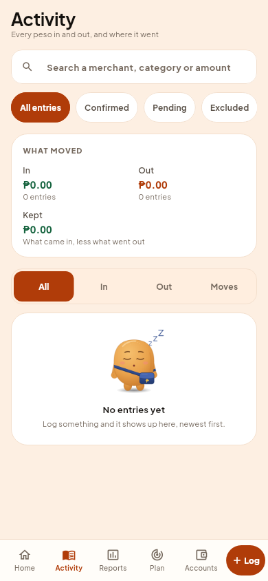 |
| Plan, Budgets | idea | 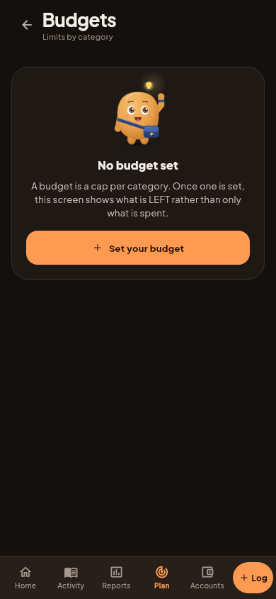 | 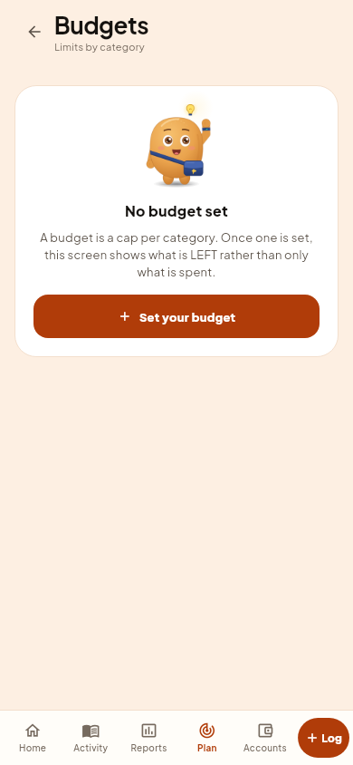 |
| Plan, Goals | idea | 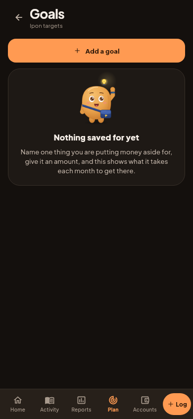 | 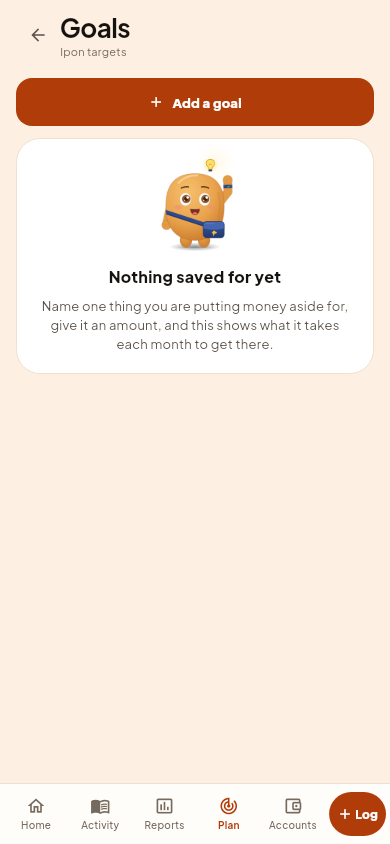 |
| Accounts | coin | 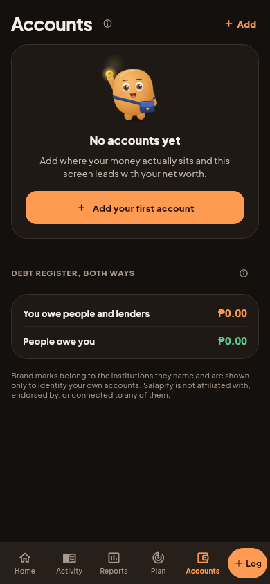 | 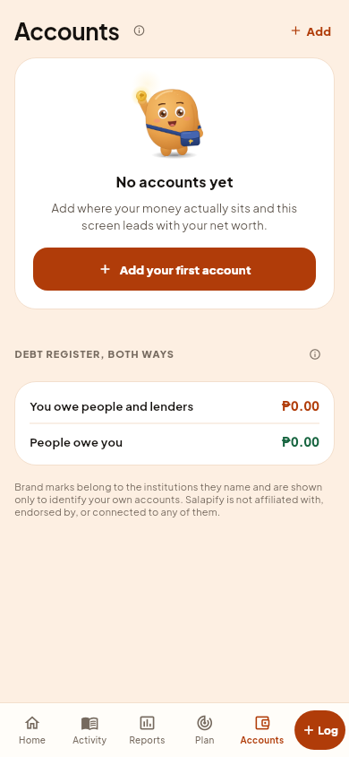 |
| Reports, Performance | thinking | 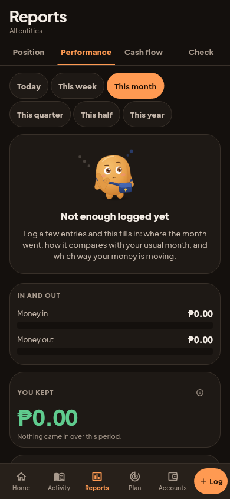 | 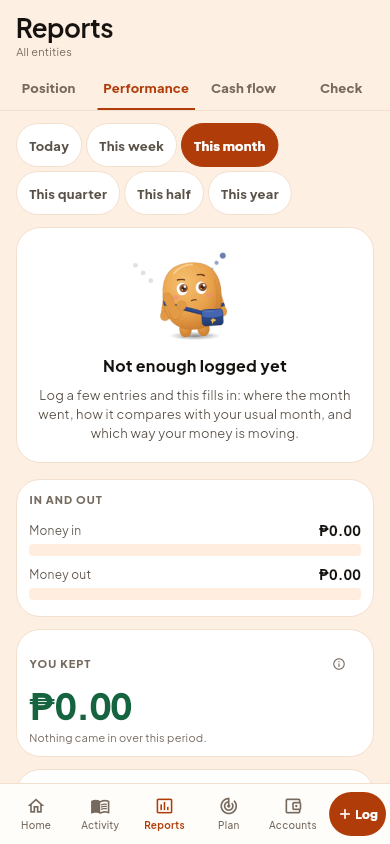 |
| Debts, You owe | calm | 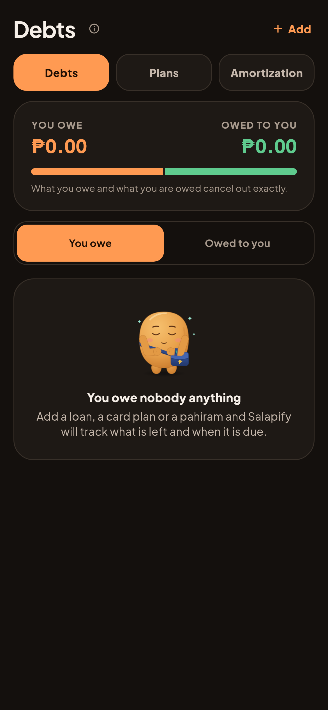 | 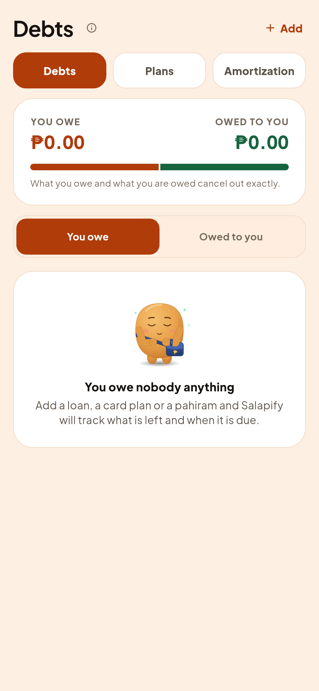 |

## The Home entrance, frozen

Rendered by pumping exactly 0, 320, 600, 760, 1080 and 2200 ms, dark.

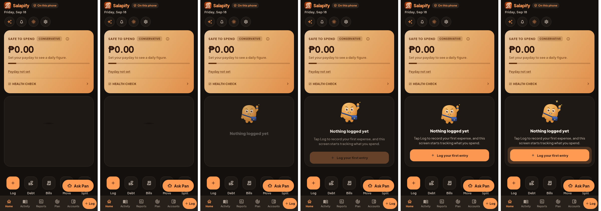

The target, from `docs/revamp/mockups/pan/motion-frames-home.png`:

What differs on purpose: in the target the whole page fades in from black
at 0 ms because it is a page demo. In the app the screen is already there, so
at 0 ms you see the card with only Pan's drawn shadow in it, which is the
target's 320 ms frame. From 600 ms on the two match: Pan mid-pop with the title
fading in, the text and button rising at 760, settled at 1080, and the button's
ring plus a sparkle at 2200.

## Add a budget, and Pan on Ask Pan (founder direction 2026-10-08)

"yes build add a budget, keep ask pan" and "can we also put mascot on it?"

Left to right: the empty Budgets card now with its button, the new sheet
(dark), the Budgets list with "Add a budget" under it, the sheet (light). The
category emoji draw as boxes here only because this machine has no emoji
font; they show on the phone.

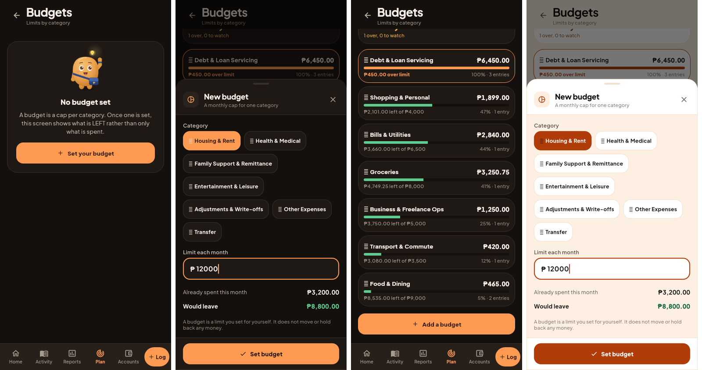

Ask Pan with Pan's face: the floating button (dark), the Ask Pan card on
Home, and the floating button (light).

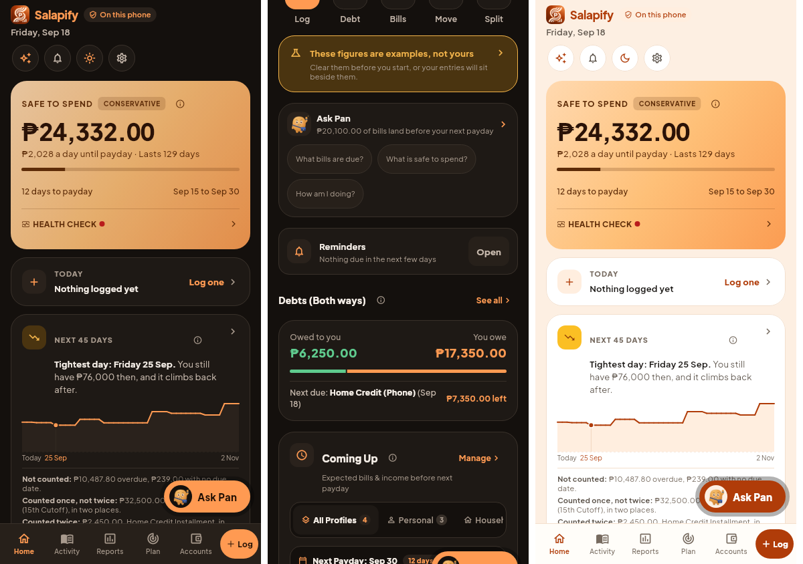
