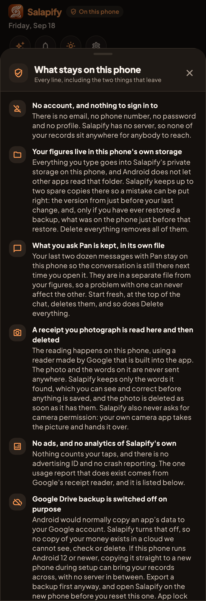
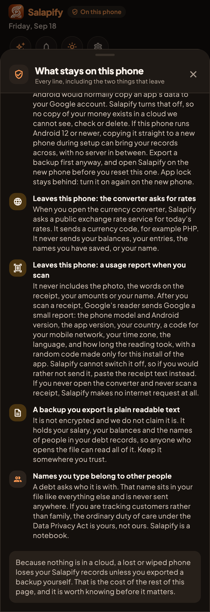
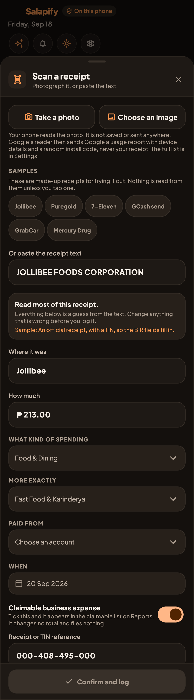
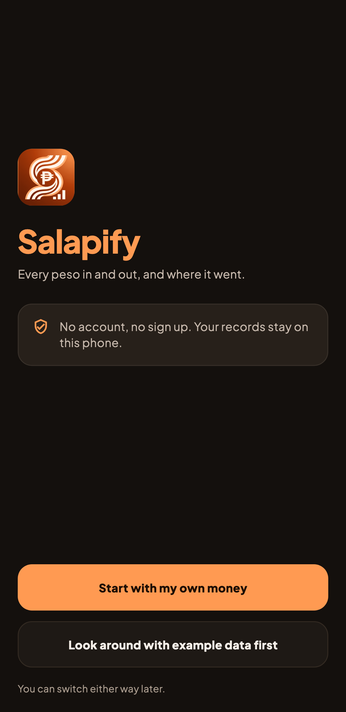

# Privacy copy, option B: real renders

The founder decided on 2026-10-10 to keep Google's receipt reader (ML Kit)
and disclose the usage report it sends after each scan. These are real
renders from `app/test/shots/screens_shot.dart`, dark, on the example data.
Why: [../mlkit-telemetry.md](../mlkit-telemetry.md). Store answers:
[../../play-data-safety.md](../../play-data-safety.md).

## Privacy screen ("What stays on this phone")

| Top: the reader line and "No ads, no analytics of Salapify's own" | Scrolled: the two things that leave the phone |
|---|---|
|  |  |

## Scan a receipt, and the welcome screen

| The notice sits beside the buttons, so it is read before the scan that sends the report | "Offline." removed from the welcome badge |
|---|---|
|  |  |

## Also changed, with no picture

- `privacy.html`: the short version, "What we collect", the Internet and
  network state permissions, a new "Receipt scanning" section, a new "Legal
  basis and your rights" section, Children, Changes, and Who is responsible.
  The Shorebird "Update delivery" section is gone, because Salapify 3 has no
  Shorebird. The exchange rate section now names the converter only, which
  is the one screen that fetches rates.
- Pan's answers to "is my data private" and about the toolkit.
- The Settings row subtitle that opens this screen.
